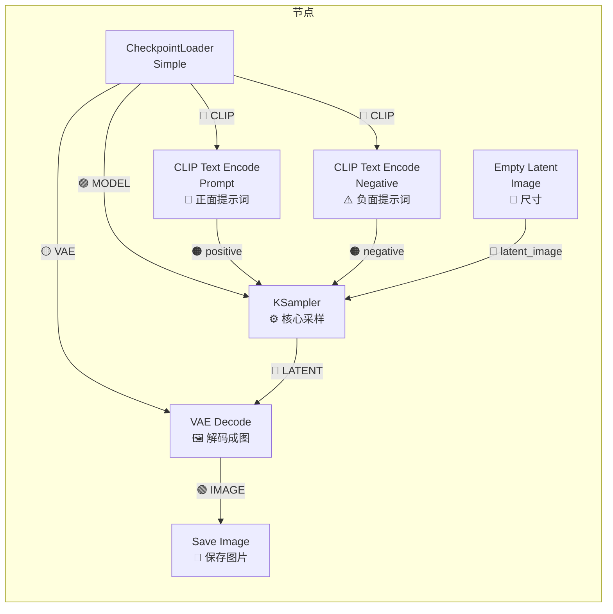

# 第一个模型下载与加载——让 ComfyUI 真正"跑起来"

目前你的 ComfyUI 已经打开了，但画布上所有的节点都是**红色的**——因为还没有下载任何模型。没有模型，AI 就无法工作。

**这一章的目标**：下载一个 SD1.5 模型，让自带的文生图工作流跑通。选择 SD1.5 而非更先进的 SDXL 或 Flux，是因为它兼容性最好、模型最小、适合入门。

---

## 一、什么是 Checkpoint？（检查点模型）

"Checkpoint"是 AI 模型训练完成后保存的"快照文件"。你可以把它理解为：

> **Checkpoint = AI 的大脑**

没有它，AI 就是空的。常见 checkpoint 格式是 `.safetensors`（安全张量格式），文件从 2GB 到 50GB 不等。SD1.5 的 checkpoint 约 2-5GB，是最小的一类。

---

## 二、下载第一个 Checkpoint

### 我们的目标：DreamShaper 8

DreamShaper 是一个广受好评的**全能型模型**，既能画写实、也能画二次元，适合入门。

### 方案 A：从 哩布哩布 下载（国内首选，不用代理）

1. 打开浏览器访问：`https://www.liblibai.com`
2. 在搜索框中输入：`DreamShaper 8`
3. 搜索结果中找到 DreamShaper 8 模型（通常被搬运多次，选下载量最高的）
4. 点击进入详情页
5. 找到下载按钮（通常在页面下方），点击下载
6. 下载得到的文件应该是 `dreamshaper_8.safetensors`（约 2-5GB）

> ⚠️ **下载时间**：2-5GB 的文件，根据你的网速，可能需要 10 分钟到 1 小时。建议吃饭或休息的时候挂着下载。

### 方案 B：从 HuggingFace 镜像站下载

```bash
# 在终端中执行（需要先激活虚拟环境）
# 设置 HuggingFace 镜像
set HF_ENDPOINT=https://hf-mirror.com

# 用 huggingface-cli 下载
huggingface-cli download stabilityai/stable-diffusion-xl-base-1.0 --local-dir ComfyUI/models/checkpoints/
```

或者直接浏览器访问 `https://hf-mirror.com`，搜索"DreamShaper"下载。

### 方案 C：从 Civitai 下载（需代理）

1. 访问 `https://civitai.com`
2. 搜索 "DreamShaper 8" 或直接访问模型页面
3. 点击 `Download` 按钮
4. 如果访问不了，使用方案 A

---

## 三、把模型放到正确的位置

下载完成后，把 `.safetensors` 文件放进 ComfyUI 的模型目录：

```
你的ComfyUI文件夹/
├── models/                ← 这是模型存放目录
│   ├── checkpoints/       ← Checkpoint 放这里！ ← 就是这里
│   │   └── dreamshaper_8.safetensors  ← 你下载的文件
│   ├── loras/             ← LoRA 文件放这里
│   ├── controlnet/        ← ControlNet 模型放这里
│   ├── vae/               ← VAE 模型放这里
│   ├── upscale_models/    ← 放大模型
│   └── clip/              ← CLIP 文本编码器
├── custom_nodes/          ← 自定义节点
├── output/                ← 生成结果保存到这里
└── ...其他文件
```

**操作方法**：

**用终端**：
```bash
# 假设下载文件在 %USERPROFILE%\Downloads\dreamshaper_8.safetensors
copy %USERPROFILE%\Downloads\dreamshaper_8.safetensors %USERPROFILE%\workspace\ComfyUI\models\checkpoints\
```

**用文件资源管理器**：
1. 打开文件资源管理器（Win + E）
2. 前往 `%USERPROFILE%\workspace\ComfyUI\models\checkpoints\`
3. 把下载的 `.safetensors` 文件拖进去

> ✅ 验证：在终端输入 `dir %USERPROFILE%\workspace\ComfyUI\models\checkpoints\`，看到你的模型文件名。

---

## 四、刷新 ComfyUI 让它"认识"新模型

把模型放入目录后，我们需要让 ComfyUI 重新扫描模型列表：

**方法 1（推荐）**：在 ComfyUI 界面中，点击菜单栏下方的 `Refresh` 按钮（如果有）

**方法 2**：刷新浏览器页面（F5 或 Ctrl+R）

**方法 3**：重启 ComfyUI（回到终端按 Ctrl+C 停止，重新运行 `python main.py`）

刷新后，所有使用 `CheckpointLoaderSimple` 节点的模型下拉框中，应该能看到刚下载的模型名称了。

---

## 五、加载自带示例工作流（你的第一次生成！）

现在你有模型了，可以真正运行了！

### 步骤 1：确保 ComfyUI 正在运行

在终端看到：
```
Prompt server running on: http://0.0.0.0:8188
```

浏览器访问 `http://127.0.0.1:8188`。

### 步骤 2：加载示例工作流

> ⚠️ **重要提醒**：新版本 ComfyUI 打开时可能是一个**空白画布**，也可能是一个示例工作流。如果是空白画布，按下面的步骤创建一个最简单的文生图工作流。

#### 如果打开是空白画布，搭建你的第一个工作流：

**第 1 个节点**：右键 → 搜索 `CheckpointLoaderSimple` → 点击添加

**第 2 个节点**：右键 → 搜索 `CLIP Text Encode (Prompt)` → 点击添加（画两个）

> 💡 一个用来写正面提示词（positive），一个写负面提示词（negative）。建议先添加一个，复制粘贴后再改不一样的地方。

**第 3 个节点**：右键 → 搜索 `Empty Latent Image` → 点击添加

**第 4 个节点**：右键 → 搜索 `KSampler` → 点击添加

**第 5 个节点**：右键 → 搜索 `VAE Decode` → 点击添加

**第 6 个节点**：右键 → 搜索 `Save Image` → 点击添加

#### 如果打开自带示例工作流：

你应该已经看到了节点图。只需在 `Load Checkpoint` 节点的下拉框中，选择你刚下载的 `dreamshaper_8.safetensors`。

### 步骤 3：设置工作流中的模型

找到 `CheckpointLoaderSimple`（或 `Load Checkpoint`）节点：
- 点击 `ckpt_name` 下拉框
- 选择 `dreamshaper_8.safetensors`（或你下载的模型文件名）

### 步骤 4：写你的第一个提示词

找到 **CLIP Text Encode (Prompt)** 节点（两个中那个标着 positive 或在上方的）：
- 在 `text` 大文本框中输入：
```
a cute cat sitting on a table, wearing a wizard hat, detailed, high quality
```

找到 **CLIP Text Encode (Negative)** 节点（标着 negative 或在下方的）：
- 输入负面提示词：
```
ugly, blurry, low quality, distorted, deformed, bad anatomy
```

### 步骤 5：设置图像尺寸

找到 **Empty Latent Image** 节点：
- `width`: 512
- `height`: 512（先跑小图，速度快）
- `batch_size`: 1

> 💡 512×512 是 SD1.5 模型的训练分辨率，跑这个尺寸效果最好。以后用 SDXL 模型可以设 1024×1024。

### 步骤 6：检查 KSampler 参数

找到 **KSampler** 节点，确认参数：
| 参数 | 建议值 | 说明 |
|:-----|:------:|:-----|
| `seed` | -1 | -1 表示每次随机种子，填入固定数字可以复现相同结果 |
| `steps` | 20 | 步数，20 是 SD1.5 的甜点值，效果和速度的平衡 |
| `cfg` | 7.0 | 提示词相关性，太高会过饱和，太低不像描述 |
| `sampler_name` | euler | 采样器算法 |
| `scheduler` | normal | 调度器 |
| `denoise` | 1.0 | 文生图用 1.0，图生图时降低 |

### 步骤 7：连线！（最关键的一步）

按照下面的连线图连接所有 7 个节点：



> ⏺ **端口颜色速记**：🟣模型 → 🩷翻译 → 🟠指令 → 🔵草稿 → 🟢成品 → 🟡桥梁

**连线操作口诀**（鼠标操作）：
1. 把鼠标移到左侧节点（如 `CheckpointLoaderSimple`）**右侧的圆点**上
2. **按住鼠标左键不放**，拖出一根线
3. 拖到右侧节点（如 `KSampler`）**左侧的圆点**上，**松开**

**正确的顺序**：从左到右。CheckpointLoaderSimple 是根节点，CLIP Text Encode 和 Empty Latent Image 是它的下一级，最后是 VAE Decode → Save Image。

> ✅ 连线验证：所有连接线应该是**白色实线**。如果某根线变成**红色**，说明你连错颜色了——检查一下连接的是不是相同颜色的端口。
>
> ❌ 常见连线错误：一个输入端口接了两根线（只有最后一根有效）；一个端口没接上（节点变红）；颜色不匹配（出现红色线）。

### 步骤 8：点击 Queue Prompt！

1. 找到界面底部（或左侧）的 `[+] Queue Prompt` 按钮
2. 点击它！
3. 你会看到：
   - KSampler 开始运行（进度条会动）
   - 等待 10-30 秒
   - 生成的图片出现了！

> 📌 **如果节点是红色**：表示缺少模型或依赖，检查一下模型文件是否放对了位置。
>
> 📌 **如果点 Queue Prompt 没反应**：打开终端查看错误信息。常见原因是某个节点的参数没有正确设置。
>
> 📌 **如果生成全黑或全绿**：VAE 连接可能不正确。

### 步骤 9：查看生成的图片

在 ComfyUI 界面中就能看到生成的图片。同时，图片也自动保存到了 `ComfyUI/output/` 目录下。

---

## 六、恭喜！你已经完成了第一个 ComfyUI 工作流

现在你已经知道：
- ✅ 模型是什么，怎么下载、怎么放
- ✅ 怎么在 ComfyUI 中搭建节点
- ✅ 怎么连接节点（同色端口配对）
- ✅ 怎么设置参数
- ✅ 怎么运行工作流生成图片

这已经是一个完整的文生图能力。所有更复杂的工作流（ControlNet、IP-Adapter、视频生成）都建立在这个基础之上。

---

## 检查清单

- [ ] 我已经下载了一个 Checkpoint（`.safetensors` 文件）
- [ ] 我已经把模型放到了 `models/checkpoints/` 目录下
- [ ] 已经刷新了 ComfyUI，模型出现在了下拉菜单中
- [ ] 我已经按步骤搭建了 7 个节点并正确连线
- [ ] 我已经写了一条简单的正向提示词
- [ ] 点击 `Queue Prompt` 后成功生成了一张图片
- [ ] 我在 `output/` 目录下找到了生成的图片
