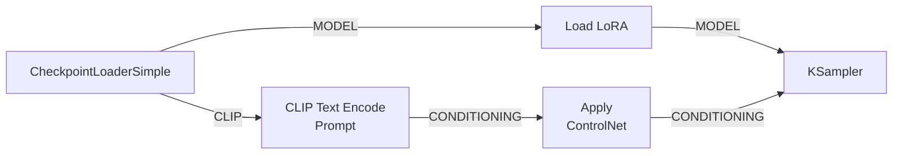
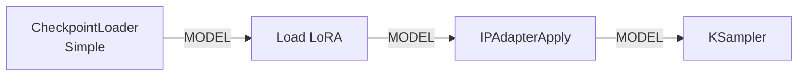
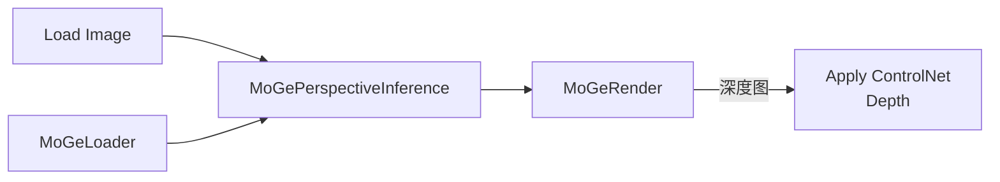

# 技术选型与组合参考

> **如何选择正确的技术和方案？** 这是一份跨文档的速查手册，汇集了图像生成篇中所有涉及技术选型、对比、共存的参考内容。当你"不知道该用什么"或"想知道两个技术能不能一起用"时，打开这篇就够了。
>
> 每节末尾的 **→ 详见** 指向各篇文档的具体章节，方便跳转阅读完整内容。

---

## 一、ControlNet vs IP-Adapter vs LoRA 技术对比

理解三种核心附加技术的本质区别，是正确选型的基础。

| 技术 | 控制内容 | 修改数据流 | 文件大小 | 需不需要训练 | 核心优势 |
|:-----|:---------|:----------:|:--------:|:------------:|:---------|
| **ControlNet** | 姿态/轮廓/深度结构 | conditioning（橙色） | ~1.5GB | ❌ 即插即用 | 精确控制构图和姿势 |
| **IP-Adapter** | 风格/身份/材质 | model（紫色） | ~100MB | ❌ 即插即用 | 任意参考图做风格迁移 |
| **LoRA** | 角色/画风/特定概念 | model（紫色） | 30-150MB | ✅ 需预训练（社区已训好） | 固定角色特征 |
| **Textual Inversion** | 单一概念 | conditioning（橙色） | 10-50KB | ✅ 需训练（很小） | 极轻量的概念嵌入 |

> **关键记忆口诀**：ControlNet 改 conditioning（橙色线），LoRA/IP-Adapter 改 model（紫色线）→ 它们走的是**不同的数据流**，所以可以共存。

> 💡 IP-Adapter 最大的优势是"即插即用"——你不需要像 LoRA 那样下载某个特定角色的模型，只要给任何一张参考图就能做出风格迁移。

→ 详见：[ControlNet 文档 §四](02-ControlNet精确姿态控制.md) | [IP-Adapter 文档 §一](03-IP-Adapter风格迁移.md) | [LoRA 文档 §一](04-LoRA堆叠与权重搭配.md)

---

## 二、什么时候用什么？——场景选型决策表

| 你想达到什么效果 | 推荐工具 | 补充说明 |
|:-----------------|:---------|:---------|
| 人物摆特定姿势 | **ControlNet (OpenPose)** | 不需要参考图风格 |
| 画面按指定构图布局 | **ControlNet (Canny/Depth)** | 保留场景轮廓/深度 |
| 把一张图的美术风格迁移到新图 | **IP-Adapter (style_transfer)** | 即插即用，给任何图都能做 |
| 保持人脸保持一致 | **IP-Adapter (face model)** | 最好用正面清晰照片 |
| 固定角色特征（脸+服装+画风） | **LoRA** | 需要提前下载/训练 |
| 换衣服/换脸/保持内容改风格 | **IP-Adapter** | |
| 从一张图提取"感觉"迁移到另一张 | **IP-Adapter** | 最擅长这个 |
| 同时控制姿势和风格 | **ControlNet + IP-Adapter** | 兼容，互不冲突（见下节） |
| 在风格基础上固定角色特征 | **LoRA + IP-Adapter** | LoRA 先加载（见下节） |
| 同时控制姿势和固定角色 | **ControlNet + LoRA** | 不冲突（见下节） |

→ 详见：[ControlNet 文档 §十](02-ControlNet精确姿态控制.md#十controlnet-与-ip-adapter--lora-对比什么时候用什么) | [IP-Adapter 文档 §九](03-IP-Adapter风格迁移.md#九ip-adapter-vs-controlnet-vs-lora-选型总结)

---

## 三、组合共存接线方案

### 通用接线原理

```
模型流（紫色）：Checkpoint.MODEL → LoRA → IP-Adapter → KSampler.model
条件流（橙色）：CLIP Text → Apply ControlNet → KSampler.positive
```

- ControlNet 改 **conditioning（橙色）**，LoRA/IP-Adapter 改 **model（紫色）**
- 两者作用于**不同的数据流**，所以**互不冲突，可以同时使用**

### 3.1 ControlNet + LoRA



> **要点**：LoRA 在 model 流上串联，ControlNet 在 conditioning 流上并联。两个维度互不干扰。

### 3.2 IP-Adapter + ControlNet

```
模型流：Checkpoint.MODEL → IPAdapterApply → KSampler.model
条件流：CLIP Text → Apply ControlNet → KSampler.positive
```

两者可以独立使用，因为作用于不同数据流。

### 3.3 LoRA + IP-Adapter



> **顺序很重要**：**LoRA 在先**（建立角色/风格特征），**IP-Adapter 在后**（注入参考图风格）。如果反过来，IP-Adapter 的风格会被 LoRA 覆盖。

### 3.4 LoRA + Textual Inversion

Textual Inversion 修改的是 conditioning（橙色），和 LoRA 也不冲突。TI 通常在 CLIP 之前加入：

```
Load LoRA.CLIP → CLIP Text Encode (Prompt) → KSampler.positive
                                 ↑ 在 prompt 中引用 TI 的嵌入词
```

### 3.5 ControlNet + MoGe（高精度深度控制）

MoGe 输出高质量深度图，可直接用作 ControlNet Depth 的输入：



→ 详见：[ControlNet 文档 §八](02-ControlNet精确姿态控制.md#八controlnet--lora--ip-adapter-组合) | [IP-Adapter 文档 §七](03-IP-Adapter风格迁移.md#七高级技巧) | [LoRA 文档 §五](04-LoRA堆叠与权重搭配.md#五lora--其他技术共存)

---

## 四、模型架构与参数对照

### 4.1 SDXL vs SD3.5 vs Flux 架构对比

| 组件 | SDXL | SD3.5 | Flux |
|:-----|:-----|:------|:-----|
| **底层架构** | UNet | **MMDiT (Transformer)** | MMDiT + DoubleStream |
| **文本编码器** | CLIP-L (77 tokens) | **CLIP-L + CLIP-G + T5-XXL** | CLIP-L + T5XXL |
| **文本长度** | 77 tokens | **512 tokens** | 256 tokens |
| **模型加载** | CheckpointLoaderSimple（一体式） | **CheckpointLoaderSimple**（一体式） | UNETLoader（分体式） |
| **特殊节点** | — | **ModelSamplingSD3** | FluxGuidance |
| **分辨率规则** | 64 的倍数 | **64 的倍数** | 16 的倍数 |
| **文字渲染** | ❌ 较差 | ✅ **优秀** | ❌ 较差 |
| **显存效率** | 高（4-8GB） | 中（8-32GB） | 低（12-32GB） |
| **VLM 质量** | 可接受 | **优秀** | 标杆 |

### 4.2 Flux vs SDXL 参数对照

| 方面 | SDXL | Flux |
|:-----|:-----|:------|
| loading | CheckpointLoaderSimple（一体） | DualCLIPLoader + UNETLoader + VAELoader（三分体） |
| 文本长度 | 77 tokens | 256 tokens |
| steps | 20-30 | 20-30 (dev) / 4-8 (schnell) |
| CFG | 7.0 | **1.0**（用 FluxGuidance 替代） |
| negative prompt | 很重要 | **效果微弱** |
| scheduler | normal / karras | **必须 sgm_uniform** |
| 分辨率规则 | 64 倍数 | **16 倍数** |
| 推荐分辨率 | 1024×1024 | 1024×1024 |
| 中文 prompt | 差 | 好（T5 多语言） |
| LoRA 生态 | 非常丰富 | 快速增长中 |

> 💡 选择哪个模型？看你的需求：
> - **SDXL**：显存要求最低，LoRA 生态最丰富——适合普通用户和 4-8GB 显卡
> - **SD3.5**：文字渲染能力极佳，适合海报/封面/Logo——新手友好（一体式 checkpoint），8-32GB 显卡
> - **Flux**：质量最高，分体式加载需要更多操作——追求极致质量，12GB+ 显卡

→ 详见：[SD3.5 文档 §二](10-SD3.5文生图工作流.md#二sd35-与-sdxlflux-的架构差异) | [Flux 文档 §六](09-Flux文生图工作流.md#六flux-vs-sdxl-参数对照表)

### 4.3 采样器名称对照（Civitai → ComfyUI）

| Civitai 标签 | ComfyUI 参数 |
|:-------------|:-------------|
| Euler | sampler_name=euler |
| Euler a | sampler_name=euler_ancestral |
| DPM++ 2M Karras | sampler_name=dpmpp_2m, scheduler=karras |
| DPM++ 2M SDE Karras | sampler_name=dpmpp_2m_sde, scheduler=karras |
| DPM++ 2M SDE | sampler_name=dpmpp_2m_sde, scheduler=normal |
| DPM++ SDE Karras | sampler_name=dpmpp_sde, scheduler=karras |
| DPM++ 3M SDE | sampler_name=dpmpp_3m_sde, scheduler=exponential |
| DPM2 Karras | sampler_name=dpm_2, scheduler=karras |
| DDIM | sampler_name=ddim |

→ 详见：[社区资源获取指南 §二](05-社区资源获取指南.md#二从图片反推工作流参数)

---

## 五、通用参数速查

### 5.1 KSampler 7 参数

| 参数 | 说明 | 推荐值（SD1.5/SDXL） | 推荐值（Flux） |
|:-----|:------|:---------------------|:---------------|
| seed | 随机种子。固定可复现，-1 每次不同 | -1 或固定值 | -1 |
| steps | 去噪步数，越多越精细越慢 | 20-30 | 20-30 (dev) / 4-8 (schnell) |
| cfg | 提示词遵循度，越高越严格 | 7.0 (SDXL) / 3.0-5.0 (SD1.5) | **1.0**（用 FluxGuidance） |
| sampler_name | 采样器算法 | euler / dpmpp_2m | euler / sgm_uniform |
| scheduler | 调度器 | normal / karras | **sgm_uniform** |
| denoise | 去噪强度（图生图时使用） | 0.3-0.7 | 0.3-0.6 |

### 5.2 Denoise 场景参数表

| 应用场景 | denoise 值 | 效果 |
|:---------|:----------:|:------|
| **大幅修改**（改变构图、内容） | 0.7-0.9 | 保留较少原图 |
| **中等修改**（调整风格、颜色） | 0.5-0.7 | 平衡原图和新内容 |
| **微调细节**（润色、增强质感） | 0.3-0.5 | 高度保留原图 |
| **图像放大后精修** | 0.2-0.4 | 放大后修复细节 |
| **Inpaint 局部重绘** | 0.6-1.0 | 取决于重绘区域大小 |

→ 详见：[文生图工作流 §二](01-文生图工作流-完整新手教学.md#二逐个节点详解) | [图生图工作流 §四](06-图生图工作流.md#四核心参数denoise) | [Inpaint 文档 §四](07-局部重绘Inpaint.md#四核心参数-denoise)

---

## 六、模型分类与选型参考

### 6.1 文件大小 → 模型类型映射

| 文件大小 | 大概率是 | 说明 |
|:---------|:---------|:------|
| **2-50GB** | Checkpoint（完整模型） | SD1.5/SDXL/Flux/SD3.5 |
| **~1.5GB** | ControlNet | 姿态/轮廓/深度控制器 |
| **30-150MB** | LoRA | 角色/画风模型 |
| **~100MB** | IP-Adapter | 风格/身份编码器 |
| **10-50KB** | Textual Inversion | 极轻量概念嵌入 |

### 6.2 各技术模型下载汇总

各篇文档的模型下载表：

| 技术 | 文档章节 |
|:-----|:---------|
| ControlNet | [ControlNet §二](02-ControlNet精确姿态控制.md#二前置准备安装节点和下载模型) |
| IP-Adapter | [IP-Adapter §二](03-IP-Adapter风格迁移.md#二前置准备安装节点和下载模型) |
| LoRA | [LoRA §九](04-LoRA堆叠与权重搭配.md#九lora-下载与选型指南) |
| 社区资源 | [社区资源获取指南](05-社区资源获取指南.md) |
| Flux | [Flux §一](09-Flux文生图工作流.md#一flux-模型家族选型) |
| SD3.5 | [SD3.5 §一](10-SD3.5文生图工作流.md#一sd35-模型家族选型) |
| 放大模型 | [图像放大 §二](08-图像放大Upscale.md#二ai-放大工作流) |

→ 详见：[社区资源获取指南](05-社区资源获取指南.md)
