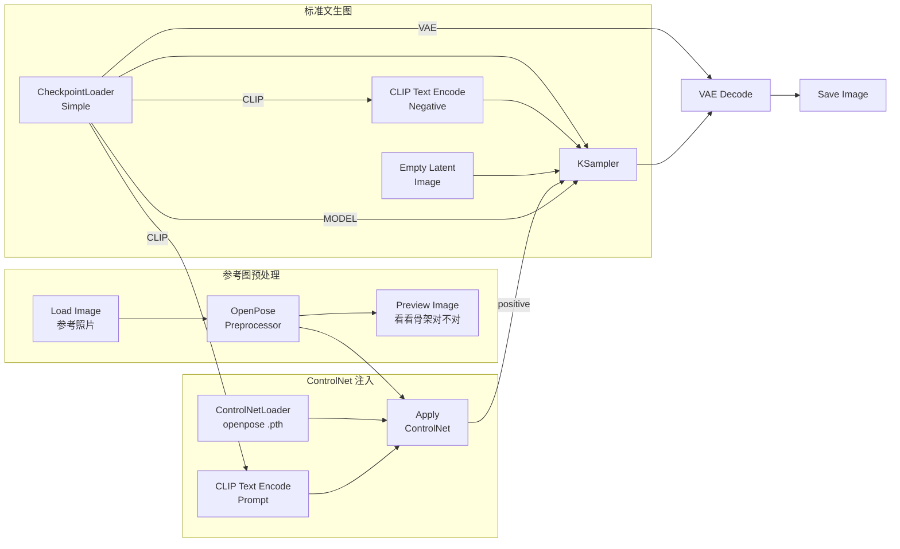
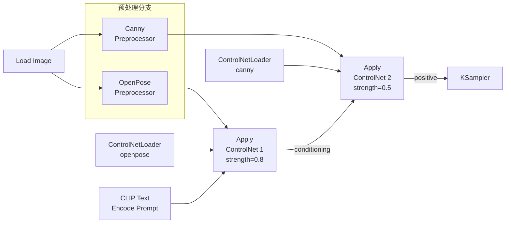
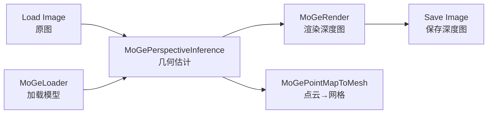
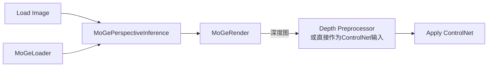

# ControlNet 精确姿态/构图控制——从入门到精通

> **前置**：你已成功跑通文生图工作流。ControlNet 是在那基础上的"精准控制"能力——你给 AI 一张参考图，告诉它"按这个姿势/轮廓/深度来画"，但细节让 AI 自由发挥。
>
> **一句话理解 ControlNet**：文生图 = "画什么就看 prompt"；ControlNet = "画什么看 prompt，但必须套在参考姿势/轮廓里"。
>
> **适用场景**：人物姿态控制、构图复现、场景结构保持、转绘（把一张图的内容风格化但保留布局）。

---

## 一、ControlNet 是什么？为什么要用？

### 白话版

普通的文生图你只能通过文字描述来控制画面，但"描述姿势"非常困难：

```
"a person standing with left arm raised 45 degrees, right hand on hip,
legs shoulder-width apart, head slightly tilted"
```

写了这么长，AI 生成的姿势可能完全不一样。

**ControlNet 解决这个问题**：你找一张参考图 → 提取"骨架"（OpenPose）或"轮廓"（Canny）或"深度"（Depth）→ AI 严格按照这个骨架/轮廓来画图，但材质、颜色、背景、光照全部重新生成。

### 三种最常见的 ControlNet 类型

| 类型 | 输入图示例 | 控制什么 | 什么时候用 |
|:----:|:----------|:---------|:-----------|
| **OpenPose** | 一张带人物的照片 → 提取⚡火柴人骨架 | 人物姿态（四肢、头、手的位置） | 你需要特定姿势：跳舞、战斗、T 台走秀 |
| **Canny Edge** | 任意照片 → 提取边界线 🌊 | 物体的轮廓和构图 | 你需要保留场景布局：建筑照片、Logo 设计、构图迁移 |
| **Depth（深度图）** | 任意照片 → 提取深度灰度图 🏔️ | 空间纵深关系和物体形状 | 你需要保留场景的"3D 结构"：室内设计、风景构图 |

### 其他 ControlNet 类型（了解即可）

| 类型 | 作用 |
|:-----|:------|
| MLSD | 检测直线（适合建筑、室内设计） |
| Scribble | 手绘草稿控制 |
| SoftEdge | 软边缘（比 Canny 更柔和的轮廓控制） |
| Normal Map | 法线贴图（比 Depth 更精细的 3D 表面控制） |
| Inpaint | 局部重绘专用 |

> **新手建议**：从 OpenPose（人物姿势）和 Canny（构图）入手。这两个最常用，效果最直观。

---

## 二、前置准备——安装节点和下载模型

### 2.1 安装自定义节点

```bash
cd /d %USERPROFILE%\workspace\ComfyUI\custom_nodes\
git clone https://gitclone.com/github.com/Fannovel16/comfyui_controlnet_aux.git
pip install -r requirements.txt

# 国内 pypi 镜像
# pip install -r requirements.txt -i https://pypi.tuna.tsinghua.edu.cn/simple
```

> **comfyui_controlnet_aux 是什么？** 它包含 OpenPose、Canny、Depth 等所有预处理器的代码。没有它，你无法把一张照片变成"骨架图"。

### 2.2 下载 ControlNet 模型

```bash
# 设置 HuggingFace 镜像
set HF_ENDPOINT=https://hf-mirror.com

# 或直接下载以下文件：
```

| 模型文件 | 大小 | 存放路径 | 下载 URL（hf-mirror） |
|:---------|:----:|:---------|:----------------------|
| `control_v11p_sd15_openpose.pth` | ~1.5GB | `models/controlnet/` | hf-mirror.com/lllyasviel/ControlNet-v1-1 |
| `control_v11p_sd15_canny.pth` | ~1.5GB | `models/controlnet/` | 同上 |
| `control_v11f1p_sd15_depth.pth` | ~1.5GB | `models/controlnet/` | 同上 |
| `control_v11e_sd15_ip2p.pth` | ~1.5GB | `models/controlnet/` | 同上（instruction-to-pose）|

完成后：**刷新 ComfyUI**（F5 或重启）。

### 2.3 验证安装

```
正确目录结构：
ComfyUI/models/
├── controlnet/
│   ├── control_v11p_sd15_openpose.pth
│   └── control_v11p_sd15_canny.pth

ComfyUI/custom_nodes/
└── comfyui_controlnet_aux/
```

在 ComfyUI 右键搜索"ControlNetLoader" → 下拉框中能看到上述模型文件 → ✅ 安装成功。

---

## 三、完整工作流总览（带 Mermaid 连线图）

### 单个 ControlNet（OpenPose 示范）



### 双 ControlNet（OpenPose + Canny 串联）



> ⏺ **核心区别**：ControlNet 不改变 KSampler 的 MODEL 或 latent，它**修改的是 conditioning（橙色线）**——在 CLIP 的输出上叠加 ControlNet 的控制信号。这就是为什么 ControlNet 可以和 LoRA、IP-Adapter 共存的原因。

---

## 四、节点详解

### 4.1 Load Image（加载参考图）

| 参数 | 说明 |
|:-----|:------|
| 操作 | 右键 → 搜索 "Load Image" |
| 作用 | 加载你的参考照片（或者任何你想提取姿态/轮廓的图片） |
| 输出 | IMAGE（🟢 绿色）→ 分叉到预处理器 |

> 💡 **图片选择建议**：参考图上的人物姿势越清晰越好，不要有遮挡关键关节的衣物。Canny 参考图需要轮廓分明。

### 4.2 OpenPose Preprocessor（姿态预处理器）

**它做了什么**：从照片中提取人体骨骼关键点（鼻子、肩膀、肘、手腕、髋、膝、踝），输出一张"火柴人"骨架图。

| 参数 | 推荐值 | 范围 | 说明 |
|:-----|:------:|:----:|:------|
| `detect_hand` | enable | on/off | 检测手指关键点。人物手势重要时开启 |
| `detect_body` | enable | on/off | 检测躯干（默认开启） |
| `detect_face` | disable | on/off | 面部关键点。只有你需要控制表情方向时才开 |
| `resolution` | 512 | 256-1024 | 预处理分辨率。越高越精细，越慢 |

> 📌 **输出预览**：在 OpenPose Preprocessor 后加一个 `Preview Image` 节点，可以看到生成的"火柴人"骨架图。如果骨架变形或关键点错位，说明参考图不理想或分辨率不够。

### 4.3 Canny Preprocessor（边缘预处理器）

**它做了什么**：检测照片中亮度变化剧烈的像素，输出一张"黑白线稿"。

| 参数 | 推荐值 | 范围 | 说明 |
|:-----|:------:|:----:|:------|
| `low_threshold` | 100 | 0-255 | 低阈值。越低→越多的细节被视为边缘 |
| `high_threshold` | 200 | 0-255 | 高阈值。越高→只有最强的边缘被保留 |

> ⚡ **threshold 调优法则**：
> - 想保持更多构图细节 → 降低 low_threshold（50-80）
> - 只想保留主要轮廓 → 提高 low_threshold（120-150）
> - 通常保持 `low = high/2` 的比例

### 4.4 Depth Preprocessor（深度预处理器——略有不同）

Depth 有两种主流方式：

| 预处理方式 | 节点名称 | 特点 | 适用场景 |
|:-----------|:---------|:-----|:---------|
| MiDaS | MiDaS Depth Approximation | 速度快，通用 | 大多数场景 |
| Zepth | Zepth | 更精细 | 复杂室内场景 |

### 4.5 MoGe：3D 几何估计——从单张图到三维点云（ComfyUI v0.22.0+）

> **MoGe**（Monocular Geometry Estimation）是微软开源的 3D 几何估计算法，**从单张 2D 图片**直接推断出三维深度和点云。ComfyUI v0.22.0 将其内置为核心节点。

#### MoGe 能做什么？

| 场景 | 说明 |
|:-----|:------|
| **3D 深度估计** | 给一张图，输出每个像素的 3D 坐标（点云），比传统 Depth 更精确 |
| **全景球面推理** | 支持 equirectangular 全景图的 12 视图 icosahedron 拆分 + 多尺度泊松缝合 |
| **点云转网格** | 内置 `point-map-to-mesh` 节点，一键生成 3D 网格 |
| **三维控制** | 深度图的精度远超传统 MiDaS/DPT，可用于高质量 Depth ControlNet |

#### 内置节点一览（无需自定义节点）

| 节点名 | 功能 |
|:-------|:------|
| **MoGeLoader** | 加载 MoGe 模型（复用 ComfyUI 内置的 DINOv2 backbone） |
| **MoGePerspectiveInference** | 标准透视投影推理，输出深度图 + 点云 |
| **MoGeEquirectangularInference** | 全景球面投影推理（12 视图拆分） |
| **MoGeRender** | 渲染深度图/法线图/3D 视图 |
| **MoGePointMapToMesh** | 将点云转换为网格模型 |

#### 基本使用流程



#### 典型组合：MoGe 深度图 + ControlNet



> 💡 **什么时候用 MoGe 而不是传统 Depth ControlNet？**
> - 需要**高精度三维结构** → MoGe 的深度图精度远超传统 Depth 预处理器
> - 需要**3D 导出**（点云/网格）→ MoGe 内置导出节点
> - 只是简单控制构图 → 传统 Depth ControlNet 就够了（更快更省显存）

| 对比 | ControlNet Depth (MiDaS/DPT) | MoGe |
|:-----|:----------------------------:|:----:|
| 深度精度 | 中等 | **高** |
| 3D 点云输出 | ❌ | ✅ |
| 全景支持 | ❌ | ✅ |
| 速度 | 快 | 中等（需加载额外模型） |
| 显存占用 | ~500MB | ~1.5GB |
| 适用场景 | 日常构图控制 | 高质量三维重建/3D 生成 |

### 4.6 ControlNetLoader（加载 ControlNet 模型）

| 参数 | 说明 |
|:-----|:------|
| 操作 | 右键 → 搜索 "ControlNetLoader" |
| 参数 | `control_net_name` → 下拉选择你已下载的 .pth/.safetensors 文件 |
| 注意事项 | 每个 ControlNet 类型需要单独的 ControlNetLoader |

### 4.6 Apply ControlNet（应用 ControlNet）—— 核心节点

这是 ControlNet 工作流的"灵魂"节点。

| 参数 | OpenPose | Canny | Depth | 说明 |
|:-----|:--------:|:-----:|:-----:|:------|
| `strength` | 0.7-1.0 | 0.5-0.9 | 0.6-0.9 | 控制强度。越高→越严格遵循参考 |
| `start_percent` | 0.0 | 0.0 | 0.0 | 从第几步去噪开始应用 (0.0=最开🔥始) |
| `end_percent` | 1.0 | 1.0 | 1.0 | 到第几步去噪结束 (1.0=直到结束) |

#### strength 详解

```
strength
  │
  ├── 0.0 ─ 完全不用 ControlNet，纯文生图（和没加一样）
  ├── 0.3 ─ 轻微参考，AI 可能偏离骨架
  ├── 0.5 ─ 一般参考，大致骨架保留但细节可能改变
  ├── 0.7 ─ 较强控制，骨架基本保留，细节自由发挥 ✅ OpenPose 起点
  ├── 0.9 ─ 强控制，骨架严格保留 ✅ OpenPose 推荐
  └── 1.0 ─ 完全控制，骨架锁死（可⚡能导致画面僵硬变形）
```

**OpenPose 和 Canny 的 strength 差异**：
- OpenPose 需要高 strength（≥0.8），因为骨架只是"火柴人"——你希望 AI 严格遵循这个姿势
- Canny 需要中 low strength（0.5-0.7），因为边缘线已经包含了很多信息——如果 strength 太高，AI 会直接复制参考图的轮廓，失去了"自由发挥"的空间

#### start_percent / end_percent 详解

这两个参数控制 ControlNet 在去噪过程的哪个阶段生效：

```
去噪进度：0% ─────────────────────────────────── 100%
          |  阶段1：构图    |  阶段2：细节     |  阶段3：精修  |
start=0.0 ───────────────────────────────────── end=1.0  全程生效
start=0.0 ─────────── end=0.6   仅在构图阶段生效
start=0.4 ───────────────── end=1.0   只在细节阶段生效
```

**典型用法**：
- `start=0.0, end=1.0` → 全程控制（默认，最常用）
- `start=0.0, end=0.6` → 只在构图阶段控制姿态，后面让 AI 自由发挥细节
- `start=0.3, end=1.0` → 先用纯文生图确定基础构图，再用 ControlNet 调整姿态

---

## 五、单 ControlNet 手把手操作（以 OpenPose 为例）

### Step 1：搭建标准文生图基础（4 个节点）

1. 右键添加 `CheckpointLoaderSimple` → 选择你的模型（推荐 SD1.5 如 DreamShaper 8）
2. 右键添加 2 个 `CLIP Text Encode (Prompt)` → 一个写正面、一个写负面
3. 右键添加 `Empty Latent Image` → 设 width=512, height=768
4. 右键添加 `KSampler` → steps=20, cfg=7, sampler=euler
5. 右键添加 `VAE Decode` + `Save Image`

### Step 2：添加 ControlNet 参考图部分（3 个节点）

6. 右键添加 `Load Image` → 选择一张人物照片作为参考
7. 右键添加 `OpenPose Preprocessor` → 参数保持默认
8. （可选）右键添加 `Preview Image` → 连接 OpenPose 输出 → 看看骨架提取效果

### Step 3：添加 ControlNet 加载和应用（2 个节点）

9. 右键添加 `ControlNetLoader` → 选择 `control_v11p_sd15_openpose.pth`
10. 右键添加 `Apply ControlNet` → strength=0.8, start=0.0, end=1.0

### Step 4：连线

```
Load Image.IMAGE → OpenPose Preprocessor.images
OpenPose Preprocessor.IMAGE → Apply ControlNet.controlnet_in
ControlNetLoader.CONTROL_NET → Apply ControlNet.control_net

CLIP Text Encode (Prompt).CONDITIONING → Apply ControlNet.conditioning
Apply ControlNet.CONDITIONING → KSampler.positive

（其余连线同标准文生图）
```

### Step 5：写提示词

正面提示词：
```
a young woman in a red dress, standing confidently, city street background,
cinematic lighting, detailed face, high quality, realistic
```

负面提示词：
```
worst quality, low quality, blurry, distorted, ugly, bad anatomy,
deformed, disfigured, watermarked, text, logo, cropped, jpeg artifacts
```

> **关键**：提示词中描述**外貌和背景**，懒姿态由 ControlNet 控制。不需要用文字描述姿势。

### Step 6：运行

点击 Queue Prompt → 生成的图片中，人物的姿势应该和参考图的"火柴人"骨架一致，但外貌、服装、背景按你的 prompt 生成。

---

## 六、双 ControlNet 手把手操作（OpenPose + Canny）

### 为什么用双 ControlNet？

| 场景 | 只用 OpenPose | 只用 Canny | 双 ControlNet |
|:-----|:-------------:|:----------:|:-------------:|
| 人物姿态 | ✅ 准确 | ❌ 可能变 | ✅ 准确 |
| 构图/轮廓 | ❌ 自由发挥 | ✅ 保留 | ✅ 保留 |
| 创造力 | 高 | 低 | 中 |

双 ControlNet = 人物姿态听 OpenPose 的 + 轮廓构图听 Canny 的。

### 节点增加

在单 ControlNet 基础上再增加：

11. 第二个 `Canny Preprocessor`（Load Image 的 IMAGE 分叉过去）
12. 第二个 `ControlNetLoader` → 选择 `control_v11p_sd15_canny.pth`
13. 第二个 `Apply ControlNet` → strength=0.5（比 OpenPose 低！）

### 连线关键——串联 conditioning

```
CLIP Text (正面) → Apply ControlNet (OpenPose, strength=0.8)
                 → Apply ControlNet (Canny, strength=0.5)
                 → KSampler.positive
```

顺序不要搞反！OpenPose 在前（控制人物姿态骨架），Canny 在后（在已有姿态基础上微调轮廓）。

### 参数速查

| 参数 | OpenPose | Canny |
|:-----|:--------:|:-----:|
| strength | 0.8-1.0 | 0.4-0.6 |
| start_percent | 0.0 | 0.0 |
| end_percent | 1.0 | 0.7-0.8 |

---

## 七、场景参数速查表

| 场景 | ControlNet 类型 | strength | start | end | steps | cfg |
|:-----|:----------------|:--------:|:-----:|:---:|:-----:|:---:|
| 🧑 **人物姿态复刻** | OpenPose | 0.9 | 0.0 | 1.0 | 25 | 7 |
| 🎨 **线稿上色** | Canny | 0.7 | 0.0 | 1.0 | 30 | 5-7 |
| 🏠 **室内设计保留布局** | Depth | 0.8 | 0.0 | 1.0 | 25 | 7 |
| 🏃 **动作场景双控** | OpenPose + Canny | 0.8+0.5 | 0.0 | 0.7(Canny) | 30 | 7 |
| 🫸 **只参考构图不锁死** | Canny | 0.4 | 0.0 | 0.6 | 20 | 9 |
| 🎬 **照片转真人画风** | OpenPose | 0.8 | 0.0 | 1.0 | 25 | 7 |
| 🎭 **换脸保留姿势** | OpenPose | 1.0 | 0.0 | 1.0 | 30 | 7 |

---

## 八、ControlNet + LoRA / IP-Adapter 组合

| 技术 | 影响维度 | 能否共存 | 共存方式 |
|:-----|:---------|:--------:|:---------|
| **ControlNet** | 姿态/轮廓/深度 | ✅ | 修改 conditioning（橙色）|
| **LoRA** | 画风/角色特征 | ✅ | 修改 model（紫色） |
| **IP-Adapter** | 风格/质感 | ✅ | 修改 model（紫色）|

**实际连线示例**（ControlNet + LoRA）：

```
CheckpointLoaderSimple
    ├── MODEL → Load LoRA (角色) → Load LoRA (风格) → KSampler.model
    └── CLIP → CLIP Text Encode → Apply ControlNet → KSampler.positive
```

因为 ControlNet 和 LoRA 影响的是不同的端口（controlnet = conditioning / orange, lora = model / purple），所以它们完全独立，不冲突。

---

## 九、常见问题排查

| 问题 | 原因 | 解决 |
|:-----|:-----|:------|
| 🔴 **姿态完全不对** | strength 太低 | 提高到 0.9-1.0 |
| 🔴 **画面僵硬变形** | strength 太高 | 降低到 0.7 以下 |
| 🔴 **预处理器报错** | 预处理器模型缺失 | 下载 `comfyui_controlnet_aux` 并安装依赖 |
| 🔴 **ControlNetLoader 为空** | 模型没放对目录 | 检查 `models/controlnet/` |
| 🔴 **融合效果太弱** | start_percent > 0 | 设为 0.0 |
| 🔴 **融合效果太过（参考图轮廓完全被复制）** | strength 或 end_percent | 降低 strength 或 end_percent 设 0.6-0.7 |
| 🔴 **人物骨架变形** | 参考图人物不清晰或被遮挡 | 换一张清晰无遮挡的参考图 |
| 🔴 **双 ControlNet 第二个没效果** | 第二个 Apply ControlNet 的 conditioning 输入没接上 | 确认第一个的输出连接到了第二个的输入 |
| 🔴 **Apply ControlNet 的 conditioning 输入红线** | 接线错误 | 应该接 CLIP Text 的 CONDITIONING（橙色）输出 |
| 🔴 **人物姿势对了但身体构图崩了（缺胳膊少腿）** | 同时使用 OpenPose+重绘或其他冲突节点 | 先只用一个 ControlNet 测试 |
| 🔴 **预处理器在 OpenPose 定位不到人物** | 多人图或人物太小 | 使用单人、人物占画面 1/3 以上的参考图 |
| 🔴 **OpenPose 和 Canny 冲突** | 两者 strength 都太高 | 降低 Canny 的 strength 到 0.4，给 OpenPose 让步 |

---

## 十、ControlNet 与 IP-Adapter / LoRA 对比——什么时候用什么？

| 你需要 | 用哪个 |
|:-------|:-------|
| 人物摆特定姿势 | **ControlNet (OpenPose)** ✅ |
| 画面按指定构图布局 | **ControlNet (Canny / Depth)** ✅ |
| 换衣服/换脸/保持内容改风格 | **IP-Adapter** |
| 固定角色特征/画风 | **LoRA** |
| 同时控制姿势和风格 | **ControlNet + LoRA** ✅（不冲突） |
| 从一张图提取"味道"迁移到另一张 | **IP-Adapter** |
| 严格控制场景三维结构 | **ControlNet (Depth)** ✅ |

---

## 十一、检查清单

在点击 Queue Prompt 前确认：

- [ ] `comfyui_controlnet_aux` 已安装并重启
- [ ] ControlNet 模型文件在 `models/controlnet/` 下
- [ ] OpenPose/Canny Preprocessor 后接了 Preview Image 确认预处理正确
- [ ] Apply ControlNet 的 conditioning 连接正确（橙色连橙色）
- [ ] strength 在推荐范围内（OpenPose 0.7-1.0, Canny 0.4-0.7）
- [ ] CLIP Text 的 CONDITIONING → Apply ControlNet → KSampler.positive 顺序正确
- [ ] CheckpointLoaderSimple.CLIP 连接到了 CLIP Text Encode
- [ ] 参考图片分辨率与最终生成分辨率比例匹配
- [ ] 双 ControlNet 时第一个的 conditioning 输出连接到了第二个的 conditioning 输入
- [ ] 没有红色连线或红色节点

---

> **进阶小贴士**：跑通后尝试同一张参考图、同一个 prompt，改变 strength（0.3/0.6/0.9）比较输出差异——这是理解 ControlNet 强度控制最好的练习。
