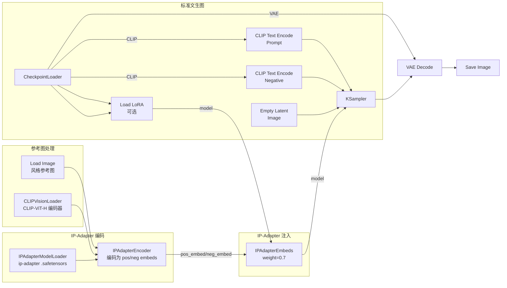

# IP-Adapter 风格迁移与身份保持——从入门到精通

> **前置**：已成功跑通文生图工作流。IP-Adapter 是在那基础上的"参考图风格/特征迁移"能力。
>
> **一句话理解 IP-Adapter**：你给 AI 一张参考图（比如梵高的星空、一张人像照片、一个产品的包装风格），AI 提取这张图的"风格特征"或"身份特征"，应用到新内容上。
>
> **和 ControlNet 的根本区别**：ControlNet 控制"形状和姿态"（骨架/轮廓/深度），IP-Adapter 控制"风格和质感"（笔触、色彩、光影、材质）。两者互补不冲突。

---

## 一、IP-Adapter 是什么？什么时候用？

### 白话版

文生图的 prompt 只能描述"是什么"，但很难描述"怎么画的"。比如你说"带梵高星空风格的城市夜景"，AI 可能完全不知道梵高的笔触是什么样的。

**IP-Adapter 解决这个问题**：你把梵高的《星月夜》图直接喂给模型——不需要训练 LoRA，不需要复杂的 prompt——IP-Adapter 提取图片的风格特征，应用到新生成的图片上。

### 三种核心用途

| 用途 | 输入参考图 | 输出效果 | 典型场景 |
|:-----|:-----------|:---------|:---------|
| 🎨 **风格迁移** | 一张名画/特定风格图 | 新内容带有该风格的笔触和色调 | 照片→水彩画、油画、赛博朋克 |
| 🧑 **身份保持** | 一张人像照片 | 新生成的图片人脸特征与参考人一致 | 换脸、保持角色一致性 |
| 📦 **内容迁移** | 一张产品/物品图 | 新内容保留原图的"内容特征" | 衣服图案迁移、产品设计延续 |

> 💡 **想知道 IP-Adapter 与其他技术的对比？** → 详见 [技术选型与组合参考](00-技术选型与组合参考.md#一 controlnet-vs-ip-adapter-vs-lora-技术对比)

---

## 二、前置准备——安装节点和下载模型（2025 修正）

### 2.1 安装自定义节点（三种方式）

#### 方式 A：使用 ComfyUI Manager（推荐新手）

1. 打开 ComfyUI Manager → 点击 "Install Custom Nodes"
2. 搜索 `IPAdapter` 或 `ComfyUI_IPAdapter_plus`
3. 点击 Install → 重启 ComfyUI

#### 方式 B：手动 git clone（国内网络环境）

```bash
# Windows (PowerShell)
cd $HOME\workspace\ComfyUI\custom_nodes\
git clone https://github.com/cubiq/ComfyUI_IPAdapter_plus.git

# macOS/Linux
cd ~/workspace/ComfyUI/custom_nodes/
git clone https://github.com/cubiq/ComfyUI_IPAdapter_plus.git
```

> ⚠️ **重要**：`gitclone.com` 镜像已失效（返回 502），请直接用 GitHub 官方地址。如果 GitHub 访问慢，可以使用以下替代方案：
> - 使用代理/VPN
> - 使用 Gitee 镜像（如果有）
> - 使用 comfy-cli 自动处理网络问题

#### 方式 C：手动下载 ZIP

1. 访问 https://github.com/cubiq/ComfyUI_IPAdapter_plus
2. 点击 "Code" → "Download ZIP"
3. 解压到 `ComfyUI/custom_nodes/ComfyUI_IPAdapter_plus/`

安装后**必须重启 ComfyUI**。

---

### 2.2 下载 IP-Adapter 模型

#### 模型存放路径

```
ComfyUI/models/ipadapter/
```

如果 `ipadapter` 文件夹不存在，请手动创建。

#### SD1.5 模型（适用于 DreamShaper、Realistic Vision 等）

| 文件名 | 用途 | 大小 | 下载链接 |
|:-------|:-----|:----:|:---------|
| `ip-adapter_sd15.safetensors` | 基础版，中等强度 | ~100MB | [下载](https://huggingface.co/h94/IP-Adapter/resolve/main/models/ip-adapter_sd15.safetensors) |
| `ip-adapter-plus_sd15.safetensors` | Plus 版，更强效果 | ~100MB | [下载](https://huggingface.co/h94/IP-Adapter/resolve/main/models/ip-adapter-plus_sd15.safetensors) |
| `ip-adapter-plus-face_sd15.safetensors` | 人脸专用 | ~100MB | [下载](https://huggingface.co/h94/IP-Adapter/resolve/main/models/ip-adapter-plus-face_sd15.safetensors) |
| `ip-adapter-full-face_sd15.safetensors` | 更强人脸 | ~100MB | [下载](https://huggingface.co/h94/IP-Adapter/resolve/main/models/ip-adapter-full-face_sd15.safetensors) |

#### SDXL 模型（适用于 SDXL Base、Juggernaut XL 等）

| 文件名 | 用途 | 大小 | 下载链接 |
|:-------|:-----|:----:|:---------|
| `ip-adapter_sdxl_vit-h.safetensors` | SDXL 基础版 | ~100MB | [下载](https://huggingface.co/h94/IP-Adapter/resolve/main/sdxl_models/ip-adapter_sdxl_vit-h.safetensors) |
| `ip-adapter-plus_sdxl_vit-h.safetensors` | SDXL Plus 版 | ~100MB | [下载](https://huggingface.co/h94/IP-Adapter/resolve/main/sdxl_models/ip-adapter-plus_sdxl_vit-h.safetensors) |
| `ip-adapter-plus-face_sdxl_vit-h.safetensors` | SDXL 人脸专用 | ~100MB | [下载](https://huggingface.co/h94/IP-Adapter/resolve/main/sdxl_models/ip-adapter-plus-face_sdxl_vit-h.safetensors) |

#### 国内下载加速

```bash
# 设置 HuggingFace 镜像（Windows PowerShell）
$env:HF_ENDPOINT="https://hf-mirror.com"

# 或 macOS/Linux
export HF_ENDPOINT=https://hf-mirror.com
```

使用镜像后的下载链接示例：
```
https://hf-mirror.com/h94/IP-Adapter/resolve/main/models/ip-adapter_sd15.safetensors
```

---

### 2.3 下载 CLIP Vision 模型（⚠️ 关键修正）

CLIP Vision 模型用于编码参考图，**文件名必须准确**，否则 Unified Loader 无法识别。

#### 存放路径

```
ComfyUI/models/clip_vision/
```

#### 模型文件

| 用途 | **正确文件名** | 下载链接 |
|:-----|:--------------|:---------|
| SD1.5 用 | `CLIP-ViT-H-14-laion2B-s32B-b79K.safetensors` | [下载](https://huggingface.co/h94/IP-Adapter/resolve/main/models/image_encoder/model.safetensors) |
| SDXL 用 | `CLIP-ViT-bigG-14-laion2B-39B-b160k.safetensors` | [下载](https://huggingface.co/h94/IP-Adapter/resolve/main/sdxl_models/image_encoder/model.safetensors) |

> ⚠️ **注意**：下载后需要**重命名**文件！原始下载的文件名是 `model.safetensors`，必须按上表重命名。

---

### 2.4 验证安装

#### 检查目录结构

```
ComfyUI/models/
├── ipadapter/
│   ├── ip-adapter_sd15.safetensors
│   ├── ip-adapter-plus_sd15.safetensors
│   └── ip-adapter-plus-face_sd15.safetensors
├── clip_vision/
│   ├── CLIP-ViT-H-14-laion2B-s32B-b79K.safetensors
│   └── CLIP-ViT-bigG-14-laion2B-39B-b160k.safetensors

ComfyUI/custom_nodes/
└── ComfyUI_IPAdapter_plus/
    ├── __init__.py
    ├── IPAdapterPlus.py
    └── ...
```

#### 检查节点

1. 重启 ComfyUI
2. 右键搜索 `IPAdapter` 
3. 应该能看到以下节点：
   - ✅ `IPAdapter Unified Loader`（推荐）
   - ✅ `IPAdapter Advanced`
   - ✅ `IPAdapter Model Loader`
   - ✅ `CLIP Vision Loader`

---

## 三、完整工作流总览

### 标准风格迁移工作流（使用 IPAdapterEncoder + IPAdapterEmbeds）



> ⏺ **与标准文生图的区别**：CheckpointLoaderSimple 的 MODEL 输出先经过 IPAdapterEmbeds 再进 KSampler。**IP-Adapter 修改的是模型权重（紫色流），而不是 conditioning（橙色流）。**

### 完整连接表

| 源节点 | 源端口 | 目标节点 | 目标端口 |
|:-------|:-------|:---------|:---------|
| LoadImage | IMAGE | IPAdapterEncoder | image |
| CLIPVisionLoader | CLIP_VISION | IPAdapterEncoder | clip_vision |
| IPAdapterModelLoader | IPADAPTER | IPAdapterEncoder | ipadapter |
| IPAdapterEncoder | pos_embed | IPAdapterEmbeds | pos_embed |
| IPAdapterEncoder | neg_embed | IPAdapterEmbeds | neg_embed |
| CheckpointLoader | MODEL | IPAdapterEmbeds | model |
| IPAdapterEmbeds | MODEL | KSampler | model |
| CLIP Text Encode (Positive) | CONDITIONING | KSampler | positive |
| CLIP Text Encode (Negative) | CONDITIONING | KSampler | negative |
| EmptyLatentImage | LATENT | KSampler | latent_image |
| KSampler | LATENT | VAE Decode | samples |
| CheckpointLoader | VAE | VAE Decode | vae |
| VAE Decode | IMAGE | PreviewImage | images |

---

## 四、节点详解（2025 最新版）

### 4.1 IPAdapterModelLoader（加载 IP-Adapter 权重）

| 参数 | 说明 |
|:-----|:------|
| 操作 | 右键 → 搜索 "IPAdapterModelLoader" |
| `ipadapter_name` | 选择已下载的 .safetensors 文件（如 `ip-adapter_sd15`） |
| 输出 | `IPADAPTER`（连接到 IPAdapterEncoder 和 IPAdapterEmbeds） |

### 4.2 CLIPVisionLoader（图像编码器加载器）

| 参数 | 说明 |
|:-----|:------|
| 操作 | 右键 → 搜索 "CLIPVisionLoader" |
| `clip_name` | 选择 `CLIP-ViT-H-14-laion2B-s32B-b79K`（SD1.5 用）或 `CLIP-ViT-bigG-14-laion2B-39B-b160k`（SDXL 用） |
| 作用 | 加载 CLIP Vision 模型，负责把参考图编码成"特征向量" |
| 输出 | `CLIP_VISION`（连接到 IPAdapterEncoder） |

> **为什么需要它？** IP-Adapter 的核心——用 CLIP Vision 编码器提取图像的特征（笔触、色彩、构图布局），这些特征与 CLIP Text 的文本特征对齐后注入模型。

### 4.3 IPAdapterEncoder（编码器——将参考图转为嵌入向量）

| 参数 | 说明 |
|:-----|:------|
| 操作 | 右键 → 搜索 "IPAdapterEncoder" |
| 输入 | `ipadapter`（来自 IPAdapterModelLoader）、`image`（来自 LoadImage）、`clip_vision`（来自 CLIPVisionLoader） |
| 输出 | `pos_embed`（正面嵌入组）、`neg_embed`（负面嵌入组） |
| 连接 | 两个输出都连接到 IPAdapterEmbeds 的对应端口 |

### 4.4 IPAdapterEmbeds（应用 IP-Adapter）—— 核心节点 ⭐

这是 IP-Adapter 工作流的**灵魂节点**，所有控制都在这里。

| 参数 | 推荐值 | 范围 | 说明 |
|:-----|:------:|:----:|:------|
| `weight` | 0.6-0.8 | 0.0-2.0 | 风格迁移强度。0=无影响，1.0=完全复制风格 |
| `weight_type` | linear | linear / original / style transfer / composition | 权重衰减模式 |
| `start_at` | 0.0 | 0.0-1.0 | 从去噪的哪个阶段开始应用 |
| `end_at` | 1.0 | 0.0-1.0 | 应用到去噪的哪个阶段结束 |
| `embeds_scaling` | V only | K+V / V only | 嵌入缩放方式（推荐 V only） |

#### 输入端口说明

| 端口 | 连接来源 | 必填 |
|:-----|:---------|:----:|
| `model` | CheckpointLoader 或 LoRA | ✅ |
| `ipadapter` | IPAdapterModelLoader | ✅ |
| `pos_embed` | IPAdapterEncoder 的 pos_embed 输出 | ✅ |
| `neg_embed` | IPAdapterEncoder 的 neg_embed 输出 | ✅ |
| `attn_mask` | （可选）注意力遮罩 | ❌ |
| `clip_vision` | （可选）备用 CLIP Vision | ❌ |

#### weight 详解

```
weight
  │
  ├── 0.0 ─ 完全不用 IP-Adapter，就像没加一样
  ├── 0.3 ─ 轻微风格暗示
  ├── 0.5 ─ 一般风格参考，元素开始相似
  ├── 0.7 ─ 较强风格迁移 ✅ 大多数场景推荐起点
  ├── 1.0 ─ 强力风格迁移，参考图的元素非常明显
  └── >1.0 ─ 超强注入，可能过度饱和
```

#### weight_type 详解

| weight_type | 行为 | 适用场景 |
|:------------|:-----|:---------|
| **linear** | 线性权重衰减，标准模式 | ✅ 通用 |
| **original** | 保持 CLIP Text 原本的权重贡献 | 需要 prompt 细节不被参考图覆盖 |
| **style transfer** | 侧重提取风格特征（纹理、笔触），忽略内容 | 画风迁移（照片→油画） |
| **composition** | 侧重提取构图和布局特征 | 布局迁移 |

> **提示**：如果你的 prompt 中有很具体的描述（如"a cat wearing a hat"），用 `style transfer` 或 `original` 可以更好地保持 prompt 的内容，避免被参考图的"内容"覆盖。

#### embeds_scaling 详解

| 选项 | 说明 | 推荐 |
|:-----|:-----|:-----|
| **V only** | 仅对 Value 进行缩放，保持 Key 稳定 | ✅ 推荐，效果更好 |
| **K+V** | 对 Key 和 Value 都进行缩放 | 旧版兼容模式 |

#### start_at / end_at

```
去噪进度：0% ─────────────────────────────────── 100%
          |  阶段 1：构图    |  阶段 2：细节     |  阶段 3：精修  |
start=0.0 ───────────────────────────────────── end=1.0  全程应用
start=0.0 ─────────── end=0.4   只在构图阶段应用风格
start=0.3 ───────────────── end=1.0   先文生图定构图→再注入风格
```

---

## 五、手把手操作：风格迁移（以照片→水彩画为例）

### Step 1：搭建基础文生图

1. 右键添加 `CheckpointLoaderSimple` → 选择 SD1.5 模型（如 DreamShaper 8、majicMIX realistic）
2. 右键添加 `CLIP Text Encode (Prompt)` → 正面提示词
3. 右键添加 `CLIP Text Encode (Negative)` → 负面提示词
4. 右键添加 `Empty Latent Image` → 512×512
5. 右键添加 `KSampler` → steps=20, cfg=8, sampler=euler
6. 右键添加 `VAE Decode` + `PreviewImage`

### Step 2：添加 IP-Adapter 部分（5 个节点）

7. 右键添加 `Load Image` → 选择风格参考图（如水彩画照片）
8. 右键添加 `CLIPVisionLoader` → 选择 `CLIP-ViT-H-14-laion2B-s32B-b79K`
9. 右键添加 `IPAdapterModelLoader` → 选择 `ip-adapter_sd15` 或 `ip-adapter-plus_sd15`
10. 右键添加 `IPAdapterEncoder`
11. 右键添加 `IPAdapterEmbeds`

### Step 3：连线（严格按照下表）

| # | 源节点 | 源端口 | 目标节点 | 目标端口 |
|:--|:-------|:-------|:---------|:---------|
| 1 | Load Image | IMAGE | IPAdapterEncoder | image |
| 2 | CLIPVisionLoader | CLIP_VISION | IPAdapterEncoder | clip_vision |
| 3 | IPAdapterModelLoader | IPADAPTER | IPAdapterEncoder | ipadapter |
| 4 | IPAdapterEncoder | pos_embed | IPAdapterEmbeds | pos_embed |
| 5 | IPAdapterEncoder | neg_embed | IPAdapterEmbeds | neg_embed |
| 6 | CheckpointLoaderSimple | MODEL | IPAdapterEmbeds | model |
| 7 | IPAdapterEmbeds | MODEL | KSampler | model |
| 8 | CLIP Text Encode (Positive) | CONDITIONING | KSampler | positive |
| 9 | CLIP Text Encode (Negative) | CONDITIONING | KSampler | negative |
| 10 | Empty Latent Image | LATENT | KSampler | latent_image |
| 11 | KSampler | LATENT | VAE Decode | samples |
| 12 | CheckpointLoaderSimple | VAE | VAE Decode | vae |
| 13 | VAE Decode | IMAGE | PreviewImage | images |

> ⚠️ **关键**：IPAdapterEncoder 的 `pos_embed` 和 `neg_embed` **两个输出**都要连接到 IPAdapterEmbeds！

### Step 4：设置 IPAdapterEmbeds 参数

| 参数 | 推荐值 | 说明 |
|:-----|:------:|:------|
| `weight` | 0.7 | 首次使用建议 0.7，可根据效果调整 |
| `weight_type` | linear | 通用模式，或根据需求选择 style transfer |
| `start_at` | 0.0 | 从头开始应用 |
| `end_at` | 1.0 | 应用到结束 |
| `embeds_scaling` | V only | 推荐设置，效果更好 |

### Step 5：写提示词

**策略 A：保留内容改风格**（猫的照片→水彩画的猫）
```
Prompt: a photo of a cat sitting on a table
```
参考图的"内容"（猫） + prompt 的"内容"（猫）→ 风格迁移效果最好

**策略 B：改变内容保留风格**（用梵高星空→画一座城市）
```
Prompt: a busy city street at night, starry sky, swirling clouds, vibrant colors, van gogh style
```
prompt 描述新内容，IP-Adapter 负责注入"梵高的画法"

### Step 6：运行

点击 Queue Prompt → 检查输出中的风格（笔触、色彩、氛围）是否与参考图一致。

---

## 六、场景参数速查表

| 场景 | 模型 | weight | weight_type | embeds_scaling | 备注 |
|:-----|:----:|:------:|:-----------:|:--------------:|:------|
| 🎨 **照片→水彩画** | SD1.5 | 0.7-0.9 | style_transfer | V only | 描述照片内容 |
| 🖼️ **照片→油画** | SD1.5 | 0.6-0.8 | style_transfer | V only | 描述照片内容 |
| 🌃 **梵高风格迁移** | SD1.5 | 0.7-0.9 | style_transfer | V only | 描述目标内容 |
| 🧑 **人脸身份保持** | SD1.5 | 0.5-0.7 | original | V only | 用 Face 模型 |
| 📐 **构图迁移** | SD1.5 | 0.5-0.8 | composition | V only | end_at=0.6 |
| 🏎️ **产品设计延续** | SD1.5 | 0.7-0.9 | composition | V only | 描述产品细节 |

---

## 七、常见问题排查（2025 更新）

| 问题 | 原因 | 解决 |
|:-----|:-----|:------|
| 🔴 **节点搜索不到** | 未重启或安装失败 | 重启 ComfyUI，检查 custom_nodes 目录 |
| 🔴 **IPAdapterEncoder 报错** | 缺少 IPAdapterModelLoader 连接 | 检查 IPADAPTER 端口是否连接 |
| 🔴 **IPAdapterEmbeds 报错** | pos_embed 或 neg_embed 未连接 | IPAdapterEncoder 的两个输出都要连 |
| 🔴 **CLIP Vision 找不到模型** | 文件名错误或路径不对 | 确保文件名是 `CLIP-ViT-H-14-laion2B-s32B-b79K.safetensors` |
| 🔴 **IPAdapterEmbeds 没有 IMAGE 输入** | 这是正常的！ | IPAdapterEmbeds 只处理 MODEL 流，IMAGE 来自 LoadImage→IPAdapterEncoder |
| 🔴 **风格迁移效果太弱** | weight 太低 | 提高到 0.7-0.9 |
| 🔴 **参考图内容被完全复制** | weight 太高或 weight_type 不对 | 降低 weight 或改用 style_transfer |
| 🔴 **人脸被扭曲** | 人脸 weight 太高 | 降低到 0.5 以下，使用 Face 模型 |
| 🔴 **提示词内容丢失** | weight_type 不对 | 改用 style_transfer 或 original |
| 🔴 **embeds_scaling 选错** | 使用了 K+V | 改为 V only 效果更好 |
| 🔴 **SD1.5 模型用在 SDXL 上** | 版本不匹配 | 检查 Checkpoint 和 IP-Adapter 版本一致 |
| 🔴 **git clone 失败** | gitclone.com 失效 | 用 GitHub 官方地址或代理 |

---

## 九、检查清单

在点击 Queue Prompt 前确认：

- [ ] ComfyUI_IPAdapter_plus 已安装并**重启**
- [ ] IP-Adapter 模型在 `models/ipadapter/` 目录下
- [ ] CLIP Vision 模型在 `models/clip_vision/` 目录下，**文件名正确**
- [ ] LoadImage 的 IMAGE 连接到 IPAdapterEncoder 的 image
- [ ] CLIPVisionLoader 的 CLIP_VISION 连接到 IPAdapterEncoder 的 clip_vision
- [ ] IPAdapterModelLoader 的 IPADAPTER 连接到 IPAdapterEncoder 的 ipadapter
- [ ] IPAdapterEncoder 的 `pos_embed` 连接到 IPAdapterEmbeds 的 pos_embed
- [ ] IPAdapterEncoder 的 `neg_embed` 连接到 IPAdapterEmbeds 的 neg_embed
- [ ] CheckpointLoader 的 MODEL 连接到 IPAdapterEmbeds 的 model
- [ ] IPAdapterEmbeds 的 MODEL 连接到 KSampler 的 model
- [ ] weight 在 0.6-0.9 之间（首次使用）
- [ ] weight_type 选择了正确的模式（linear / style transfer / original / composition）
- [ ] embeds_scaling = V only（推荐）
- [ ] 参考图分辨率 ≤ 1024×1024
- [ ] 参考图风格清晰可见
- [ ] 没有红色连线或红色节点

---

> **进阶小贴士**：IP-Adapter 最强的玩法是"同一个角色在不同场景中保持风格一致"。用一张正脸照片 + IP-Adapter face model，配合不同的 prompt 生成多张图片，角色特征保持稳定——这是做故事板或角色设计的好方法。

---

## 附录：模型下载完整清单

### SD1.5 系列

```bash
# 基础版
wget https://huggingface.co/h94/IP-Adapter/resolve/main/models/ip-adapter_sd15.safetensors \
  -O ~/workspace/ComfyUI/models/ipadapter/ip-adapter_sd15.safetensors

# Plus 版（推荐）
wget https://huggingface.co/h94/IP-Adapter/resolve/main/models/ip-adapter-plus_sd15.safetensors \
  -O ~/workspace/ComfyUI/models/ipadapter/ip-adapter-plus_sd15.safetensors

# 人脸版
wget https://huggingface.co/h94/IP-Adapter/resolve/main/models/ip-adapter-plus-face_sd15.safetensors \
  -O ~/workspace/ComfyUI/models/ipadapter/ip-adapter-plus-face_sd15.safetensors
```

### SDXL 系列

```bash
# 基础版
wget https://huggingface.co/h94/IP-Adapter/resolve/main/sdxl_models/ip-adapter_sdxl_vit-h.safetensors \
  -O ~/workspace/ComfyUI/models/ipadapter/ip-adapter_sdxl_vit-h.safetensors

# Plus 版（推荐）
wget https://huggingface.co/h94/IP-Adapter/resolve/main/sdxl_models/ip-adapter-plus_sdxl_vit-h.safetensors \
  -O ~/workspace/ComfyUI/models/ipadapter/ip-adapter-plus_sdxl_vit-h.safetensors
```

### CLIP Vision 模型

```bash
# SD1.5 用（必须重命名！）
wget https://huggingface.co/h94/IP-Adapter/resolve/main/models/image_encoder/model.safetensors \
  -O ~/workspace/ComfyUI/models/clip_vision/CLIP-ViT-H-14-laion2B-s32B-b79K.safetensors

# SDXL 用（必须重命名！）
wget https://huggingface.co/h94/IP-Adapter/resolve/main/sdxl_models/image_encoder/model.safetensors \
  -O ~/workspace/ComfyUI/models/clip_vision/CLIP-ViT-bigG-14-laion2B-39B-b160k.safetensors
```

### 国内镜像加速

```bash
# 使用 hf-mirror.com 替代 huggingface.co
# 示例（其他链接同理替换）
wget https://hf-mirror.com/h94/IP-Adapter/resolve/main/models/ip-adapter_sd15.safetensors \
  -O ~/workspace/ComfyUI/models/ipadapter/ip-adapter_sd15.safetensors
```
