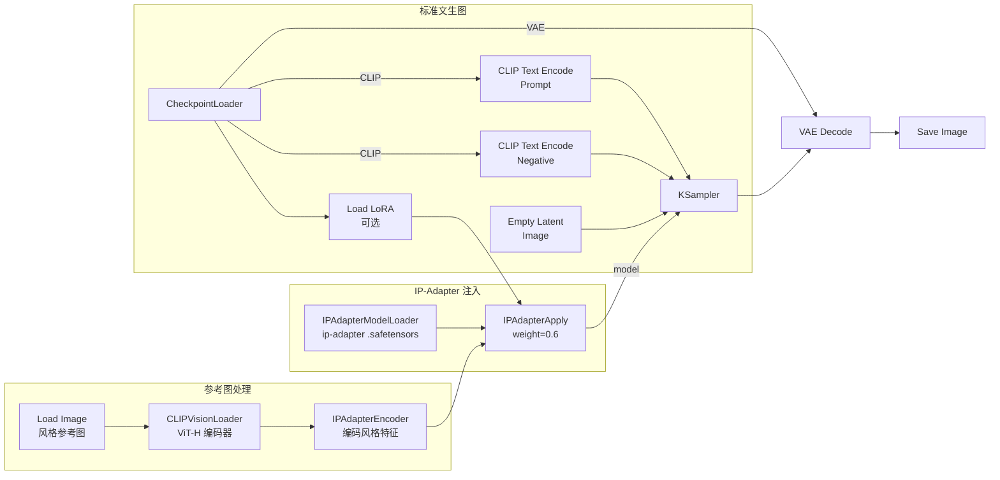
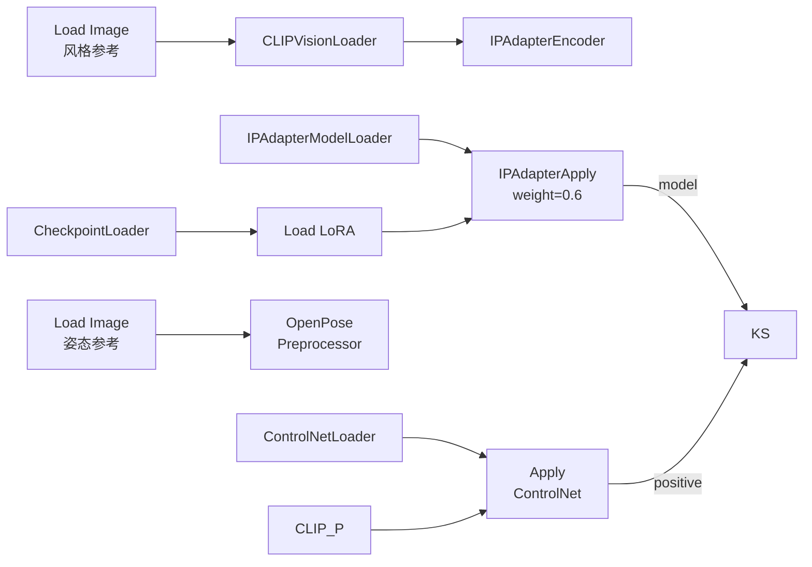

# IP-Adapter 风格迁移与身份保持——从入门到精通

> **前置**：已成功跑通文生图工作流。IP-Adapter 是在那基础上的"参考图风格/特征迁移"能力。
>
> **一句话理解 IP-Adapter**：你给 AI 一张参考图（比如梵高的星空、一张人像照片、一个产品的包装风格），AI 提取这张图的"风格特征"或"身份特征"，应用到新内容上。
>
> **和 ControlNet 的根本区别**：ControlNet 控制"形状和姿态"（骨架/轮廓/深度），IP-Adapter 控制"风格和质感"（笔触、色彩、光影、材质）。两者互补不冲突。

---

## 一、IP-Adapter 是什么？什么时候用？

### 白话版

文生图的 prompt 只能描述"是什么"，但很难描述"怎么画的"。比如你说"带梵高星空风格的城市夜景"，AI 可能完全不知道梵高的笔触是什么样的。

**IP-Adapter 解决这个问题**：你把梵高的《星月夜》图直接喂给模型——不需要训练 LoRA，不需要复杂的 prompt——IP-Adapter 提取图片的风格特征，应用到新生成的图片上。

### 三种核心用途

| 用途 | 输入参考图 | 输出效果 | 典型场景 |
|:-----|:-----------|:---------|:---------|
| 🎨 **风格迁移** | 一张名画/特定风格图 | 新内容带有该风格的笔触和色调 | 照片→水彩画、油画、赛博朋克 |
| 🧑 **身份保持** | 一张人像照片 | 新生成的图片人脸特征与参考人一致 | 换脸、保持角色一致性 |
| 📦 **内容迁移** | 一张产品/物品图 | 新内容保留原图的"内容特征" | 衣服图案迁移、产品设续 |

### IP-Adapter 和 ControlNet / LoRA 对比

| 技术 | 控制内容 | 需不需要训练 | 修改哪个数据流 | 文件大小 |
|:-----|:---------|:------------:|:--------------:|:--------:|
| **ControlNet** | 姿态/轮廓/深度结构 | 不用训练 | conditioning（橙色） | ~1.5GB |
| **IP-Adapter** | 风格/身份/材质 | **不用训练** | model（紫色） | ~100MB |
| **LoRA** | 角色/画风/对象概念 | 需预训练（别人已训好） | model（紫色） | ~30-150MB |
| **Textual Inversion** | 单一概念/角色 | 需训练（加载小嵌入） | conditioning（橙色） | ~10-50KB |

> **关键词**：IP-Adapter 是"即插即用"的。不像 LoRA 需要专门下载某个角色的 LoRA，IP-Adapter 你给任何一张参考图都能做。这是它最大的优势。

---

## 二、前置准备——安装节点和下载模型

### 2.1 安装自定义节点

```bash
cd /d %USERPROFILE%\workspace\ComfyUI\custom_nodes\
git clone https://gitclone.com/github.com/cubiq/ComfyUI_IPAdapter_plus.git
```

> `ComfyUI_IPAdapter_plus` 是由 ComfyUI 核心开发者 cubiq 维护的节点包，包含了 IP-Adapter 所需的所有节点类型。

安装后重启 ComfyUI。

### 2.2 下载 IP-Adapter 模型

```bash
# 设置 HuggingFace 镜像
set HF_ENDPOINT=https://hf-mirror.com
```

| 文件 | 版本 | 大小 | 存放路径 | 适用 checkpoint |
|:-----|:-----|:----:|:---------|:----------------|
| `ip-adapter_sd15.safetensors` | SD1.5 | ~100MB | `models/ipadapter/` | SD1.5 模型（DreamShaper 等）|
| `ip-adapter-plus_sd15.safetensors` | SD1.5 Plus | ~100MB | `models/ipadapter/` | SD1.5，质量更好 |
| `ip-adapter-plus-face_sd15.safetensors` | SD1.5 人脸 | ~100MB | `models/ipadapter/` | 人脸身份保持专用 |
| `ip-adapter_sdxl_vit-h.safetensors` | SDXL | ~100MB | `models/ipadapter/` | SDXL 模型 |
| `ip-adapter-plus_sdxl_vit-h.safetensors` | SDXL Plus | ~100MB | `models/ipadapter/` | SDXL，质量更好 |

从 HuggingFace 下载（hf-mirror.com/h94/IP-Adapter）：

```bash
# 或用浏览器手动下载以下文件
# https://hf-mirror.com/h94/IP-Adapter/tree/main/models
```

### 2.3 下载 CLIP Vision 模型

IP-Adapter 需要一个**图像编码器**（CLIP Vision）来理解参考图的内容：

| 文件 | 存放路径 | 下载 |
|:-----|:---------|:-----|
| `clip-vision_vit-h.safetensors` (SD1.5 用) | `models/clip_vision/` | hf-mirror.com/h94/IP-Adapter |
| `clip-vision_vit-bigG.safetensors` (SDXL 用) | `models/clip_vision/` | hf-mirror.com/h94/IP-Adapter |

### 2.4 验证安装

```
正确目录结构：
ComfyUI/models/
├── ipadapter/
│   ├── ip-adapter_sd15.safetensors
│   └── ip-adapter-plus_sd15.safetensors
├── clip_vision/
│   └── clip-vision_vit-h.safetensors

ComfyUI/custom_nodes/
└── ComfyUI_IPAdapter_plus/
```

右键搜索"IPAdapterApply" → 出现在下拉列表中 → ✅ 安装成功。

---

## 三、完整工作流总览（带 Mermaid 连线图）

### 标准风格迁移工作流



> ⏺ **与标准文生图的区别**：CheckpointLoaderSimple 的 MODEL 输出先经过 IPAdapterApply 再进 KSampler。**IP-Adapter 修改的是模型权重（紫色流），而不是 conditioning（橙色流）。**

### IP-Adapter + ControlNet 共存工作流



IP-Adapter 改 model（紫色），ControlNet 改 conditioning（橙色）→ **完全不冲突**，可以同时使用。

---

## 四、节点详解

### 4.1 CLIPVisionLoader（图像编码器加载器）

| 参数 | 说明 |
|:-----|:------|
| 操作 | 右键 → 搜索 "CLIPVisionLoader" |
| `clip_name` | 选择 `clip-vision_vit-h.safetensors` |
| 作用 | 加载 CLIP Vision 模型，负责把参考图编码成"特征向量" |

> **为什么需要它？** IP-Adapter 的核心——用 CLIP Vision 编码器提取图像的特征（笔触、色彩、构图布局），这些特征与 CLIP Text 的文本特征对齐后注入模型。

### 4.2 IPAdapterEncoder（编码器——将参考图转为 IP-Adapter 输入）

| 参数 | 说明 |
|:-----|:------|
| 操作 | 右键 → 搜索 "IPAdapterEncoder" |
| 输入 | CLIPVisionLoader 的 CLIP_VISION + Load Image 的 IMAGE |
| 输出 | ipadapter_input |

### 4.3 IPAdapterModelLoader（加载 IP-Adapter 权重）

| 参数 | 说明 |
|:-----|:------|
| 操作 | 右键 → 搜索 "IPAdapterModelLoader" |
| `ipadapter_name` | 选择已下载的 .safetensors 文件 |
| 输出 | IPADAPTER（连接到 IPAdapterApply 的 ipadapter 端口）|

### 4.4 IPAdapterApply（应用 IP-Adapter）—— 核心节点

这是 IP-Adapter 工作流的灵魂节点。

| 参数 | 推荐值 | 范围 | 说明 |
|:-----|:------:|:----:|:------|
| `weight` | 0.6-0.8 | 0.0-2.0 | 风格迁移强度。0=无影响，1.0=完全复制风格 |
| `weight_type` | linear | linear / original / style transfer / composition | 权重衰减模式 |
| `start_at` | 0.0 | 0.0-1.0 | 从去噪的哪个阶段开始应用 |
| `end_at` | 1.0 | 0.0-1.0 | 应用到去噪的哪个阶段结束 |
| `noise` | 0.0 | 0.0-1.0 | 为参考图潜空间添加噪声量 |
| `ins` | 平均 | average / concat | IP-Adapter 特征注入方式 |

#### weight 详解

```
weight
  │
  ├── 0.0 ─ 完全不用 IP-Adapter，就像没加一样
  ├── 0.3 ─ 轻微风格暗示
  ├── 0.5 ─ 一般风格参考，元素开始相似
  ├── 0.7 ─ 较强风格迁移 ✅ 大多数场景推荐起点
  ├── 1.0 ─ 强力风格迁移，参考图的元素非常明显
  └── >1.0 ─ 超强注入，可能过度饱和
```

#### weight_type 详解

| weight_type | 行为 | 适用场景 |
|:------------|:-----|:---------|
| **linear** | 线性权重衰减，标准模式 | ✅ 通用 |
| **original** | 保持 CLIP Text 原本的权重贡献 | 需要 prompt 细节不被参考图覆盖 |
| **style transfer** | 侧重提取风格特征（纹理、笔触），忽略内容 | 画风迁移（照片→油画）|
| **composition** | 侧重提取构图和布局特征 | 布局迁移 |

> **提示**：如果你的 prompt 中有很具体的描述（如"a cat wearing a hat"），用 `style transfer` 或 `original` 可以更好地保持 prompt 的内容，避免被参考图的"内容"覆盖。

#### start_at / end_at

```
去噪进度：0% ─────────────────────────────────── 100%
          |  阶段1：构图    |  阶段2：细节     |  阶段3：精修  |
start=0.0 ───────────────────────────────────── end=1.0  全程应用
start=0.0 ─────────── end=0.4   只在构图阶段应用风格
start=0.3 ───────────────── end=1.0   先文生图定构图→再注入风格
```

---

## 五、手把手操作：风格迁移（以照片→水彩画为例）

### Step 1：搭建基础文生图

1. 右键添加 `CheckpointLoaderSimple` → 选择（建议 SD1.5 如 DreamShaper 8）
2. 右键添加 `CLIP Text Encode (Prompt)` → 正面提示词
3. 右键添加 `CLIP Text Encode (Negative)` → 负面提示词
4. 右键添加 `Empty Latent Image` → width=512, height=512
5. 右键添加 `KSampler` → steps=20, cfg=7, sampler=euler
6. 右键添加 `VAE Decode` + `Save Image`

### Step 2：添加 IP-Adapter 部分（4 个节点）

7. 右键添加 `Load Image` → 选择你的风格参考图（水彩画照片）
8. 右键添加 `CLIPVisionLoader` → 选择 `clip-vision_vit-h`
9. 右键添加 `IPAdapterEncoder` → 连接 CLIPVisionLoader 的 CLIP_VISION + Load Image 的 IMAGE
10. 右键添加 `IPAdapterModelLoader` → 选择 `ip-adapter_sd15.safetensors`
11. 右键添加 `IPAdapterApply` → weight=0.7, weight_type=style_transfer

### Step 3：连线（关键区分）

```
Load Image.IMAGE → IPAdapterEncoder.images
CLIPVisionLoader.CLIP_VISION → IPAdapterEncoder.clip_vision
IPAdapterEncoder.ipadapter_input → IPAdapterApply.ipadapter_input
IPAdapterModelLoader.IPADAPTER → IPAdapterApply.ipadapter

CheckpointLoaderSimple.MODEL → IPAdapterApply.model
CLIP Text Encode (Positive).CONDITIONING → KSampler.positive
CLIP Text Encode (Negative).CONDITIONING → KSampler.negative

IPAdapterApply.MODEL → KSampler.model  ← 关键！model 流经过 IPAdapterApply
（其余连线同标准文生图）
```

### Step 4：写提示词

两种策略：

**策略 A：保留内容改风格**（一张猫的照片→水彩画的猫）
```
Prompt: a photo of a cat sitting on a table
```
参考图的"内容"（猫） + prompt 的"内容"（猫）→ 参考图和 prompt 内容一致 → 风格迁移效果最好

**策略 B：改变内容保留风格**（用梵高星空→画一座城市）
```
Prompt: a busy city street at night, starry sky, swirling clouds, vibrant colors, van gogh style
```
prompt 描述新内容，IP-Adapter 负责注入"梵高的画法"

### Step 5：运行

点击 Queue Prompt → 检查输出中的风格（笔触、色彩、氛围）是否与参考图一致。

---

## 六、场景参数速查表

| 场景 | 模型 | weight | weight_type | start_at | end_at | Prompt 策略 |
|:-----|:----:|:------:|:-----------:|:--------:|:-----:|:------------|
| 🎨 **照片→水彩画** | SD1.5 | 0.7-0.9 | style_transfer | 0.0 | 1.0 | 描述照片内容 |
| 🖼️ **照片→油画** | SD1.5 | 0.6-0.8 | style_transfer | 0.0 | 1.0 | 描述照片内容 |
| 🌃 **梵高星夜风格迁移** | SD1.5 | 0.7-0.9 | style_transfer | 0.0 | 1.0 | 描述目标内容 |
| 🧑 **人脸身份保持** | SD1.5 | 0.5-0.7 | original | 0.0 | 1.0 | 描述新场景 |
| 📐 **构图迁移** | SD1.5 | 0.5-0.8 | composition | 0.0 | 0.6 | 描述新内容 |
| 🫶 **混合两种风格** | SD1.5 | 0.6+0.3 | linear | 0.0 | 1.0 | 综合描述 |
| 🏎️ **产品设计延续** | SD1.5 | 0.7-0.9 | composition | 0.0 | 0.7 | 描述产品细节 |

---

## 七、高级技巧

### 7.1 串联多个 IP-Adapter（混合风格）

```
CheckpointLoader.MODEL → IPAdapterApply #1 (style A, weight=0.6)
                        → IPAdapterApply #2 (style B, weight=0.3)
                        → IPAdapterApply #3 (face, weight=0.5)
                        → KSampler.model
```

每个 IPAdapterApply 的 `ipadapter` 端口连接各自的 IPAdapterModelLoader。

**权重原则**：从高到低递减，第一个权重最高（主体风格），后面的逐步降低（辅助风格/细节）。

### 7.2 IP-Adapter + ControlNet 共存

```
模型流：
CheckpointLoader.MODEL → IPAdapterApply → KSampler.model

Conditioning 流：
CLIP Text → Apply ControlNet (OpenPose) → KSampler.positive
```

两者可以独立使用，因为作用于不同数据流。

### 7.3 IP-Adapter + LoRA 共存

```
CheckpointLoader.MODEL → Load LoRA (角色) → IPAdapterApply
                                                 ↓
                                            KSampler.model
```

顺序有讲究：LoRA 先加载（建立角色特征），IP-Adapter 再注入风格。如果反过来，LoRA 会覆盖掉 IP-Adapter 的风格。

### 7.4 人脸身份保持

使用专门的人脸模型 `ip-adapter-plus-face_sd15.safetensors`：

| 参数 | 推荐值 | 说明 |
|:-----|:------:|:------|
| weight | 0.5-0.7 | 人脸权重不宜太高，否则扭曲 |
| weight_type | original | 保持 prompt 描述的新内容 |
| 参考图 | 正面无遮挡、光照均匀 | 越清晰越好 |

**典型应用**：换脸、角色一致性（同一个人的不同场景）。

### 7.5 使用 weight_type=composition 控制构图

如果你有一张"布局很好看的海报"，想保留它的布局但换内容和颜色：

| 参数 | 推荐值 |
|:-----|:------:|
| weight | 0.5-0.8 |
| weight_type | composition |
| start_at | 0.0 |
| end_at | 0.6（仅在构图阶段生效，后面的细节阶段自由发挥）|

---

## 八、常见问题排查

| 问题 | 原因 | 解决 |
|:-----|:-----|:------|
| 🔴 **风格迁移效果太弱** | weight 太低 | 提高到 0.7-0.9 |
| 🔴 **参考图内容被完全复制** | weight 太高或 weight_type 不对 | 降低 weight 或改用 style_transfer |
| 🔴 **人脸被扭曲** | 人脸 weight 太高 | 降低到 0.5 以下 |
| 🔴 **IPAdapterApply 报错** | 缺少 IPAdapterModelLoader 连接 | 检查 IPADAPTER 端口 |
| 🔴 **CLIPVisionLoader 找不到模型** | 模型不在 `models/clip_vision/` | 下载 `clip-vision_vit-h.safetensors` |
| 🔴 **风格有了但 prompt 的内容丢了** | weight_type=linear 且 weight 太高 | 改用 style_transfer 或 original |
| 🔴 **参考图的参考强度各次不同** | 种子随机 | 固定 seed 值 |
| 🔴 **IP-Adapter + ControlNet 一起用时效果互相抵消** | 两种控制冲突 | 降低 IP-Adapter weight 到 0.5，ControlNet strength 到 0.6 |
| 🔴 **提示词写了"照片"但结果看起来像画** | weight_type=style_transfer 提取了笔触 | 改用 weight_type=original |
| 🔴 **多次串联 IP-Adapter 后结果变糊** | 太多 IP-Adapter 叠加 | 减少到最多 3 个，总 weight 不超过 1.5 |
| 🔴 **SD1.5 的 IP-Adapter 用在 SDXL 模型上** | 模型维度不匹配 | 检查 Checkpoint 和 IP-Adapter 版本一致 |
| 🔴 **用了 IP-Adapter 后画面出现奇怪的颜色** | weight_type=style_transfer 在提取色彩时过度 | 降低 weight 或换 linear |
| 🔴 **IPAdapterApply 窗口显示"unrecognized node"** | 版本不对 | 更新 ComfyUI_IPAdapter_plus 到最新版 |

---

## 九、IP-Adapter vs ControlNet vs LoRA 选型总结

| 你想达到什么效果 | 推荐工具 | 补充说明 |
|:-----------------|:---------|:---------|
| 人物摆特定姿势 | **ControlNet (OpenPose)** | 不需要参考图风格 |
| 画面按指定构图布局 | **ControlNet (Canny/Depth)** | 保留场景轮廓/深度 |
| 把一张图的美术风格迁移到新图 | **IP-Adapter (style_transfer)** | 即插即用，最方便 |
| 保持人脸保持一致 | **IP-Adapter (face model)** | 最好用正面清晰照片 |
| 固定角色特征（脸+服装+画风） | **LoRA** | 需要提前下载/训练 |
| 同时控制姿势和风格 | **IP-Adapter + ControlNet** | 兼容，互不冲突 |
| 在风格基础上固定角色特征 | **LoRA + IP-Adapter** | LoRA 先加载 |
| 从一张图提取"感觉"迁移到另一张 | **IP-Adapter** | 最擅长这个 |

---

## 十、检查清单

在点击 Queue Prompt 前确认：

- [ ] ComfyUI_IPAdapter_plus 已安装并重启
- [ ] IP-Adapter 模型文件在 `models/ipadapter/` 目录下
- [ ] CLIP Vision 模型在 `models/clip_vision/` 目录下
- [ ] CheckpointLoaderSimple.MODEL 的下一站是 IPAdapterApply（不是直接到 KSampler）
- [ ] IPAdapterApply 的 MODEL 输出连接到了 KSampler.model
- [ ] weight 在 0.6-0.9 之间（如果第一次用）
- [ ] weight_type 选择了正确的模式（style_transfer / original / composition）
- [ ] CLIPVisionLoader 的 CLIP_VISION 连接到了 IPAdapterEncoder
- [ ] IPAdapterModelLoader 的 IPADAPTER 连接到了 IPAdapterApply
- [ ] 如果同时使用 ControlNet：ControlNet 改 conditioning，IP-Adapter 改 model，两者端口不同
- [ ] 如果同时使用 LoRA：顺序是 Checkpoint → LoRA → IP-Adapter → KSampler
- [ ] 参考图分辨率不要过大（建议 ≤ 1024×1024）
- [ ] 参考图风格清晰可见（不是模糊或噪声图）
- [ ] 没有红色连线或红色节点

---

> **进阶小贴士**：IP-Adapter 最强的玩法是"同一个角色在不同场景中保持风格一致"。用一张正脸照片 + IP-Adapter face model，配合不同的 prompt 生成多张图片，角色特征保持稳定——这是做故事板或角色设计的好方法。
