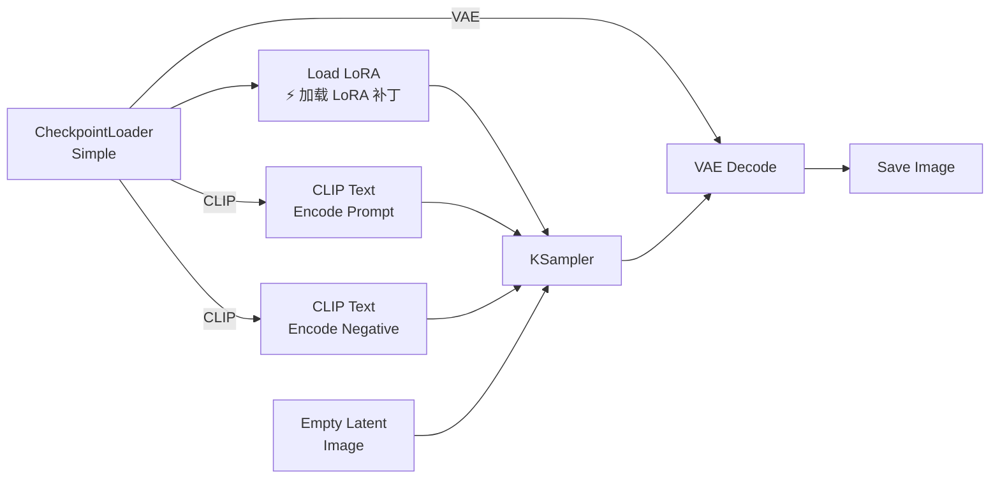
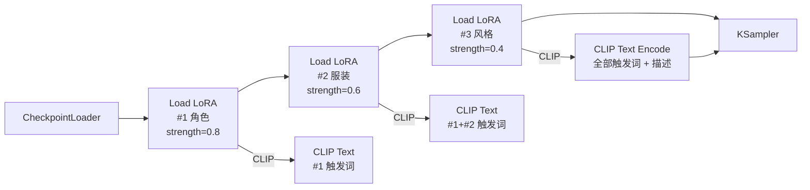

# LoRA 堆叠与权重搭配——从入门到精通

> **前置**：已成功跑通文生图工作流，知道节点怎么连。LoRA 是"给模型打补丁"的技术——用很小的文件（30-150MB）教会模型画某个角色、某种画风或某个物体。
>
> **场景**：你想生成"穿着赛博朋克盔甲的冲田总司"——需要一个角色 LoRA（冲田总司）+ 一个服装 LoRA（赛博朋克盔甲）+ 一个风格 LoRA（赛博朋克风格）。三个 LoRA 叠加使用，每个的权重需要精确控制。

---

## 一、LoRA 到底是什么？

### 白话版

LoRA（Low-Rank Adaptation，低秩适配）是一张"小贴纸"。Checkpoint 是整本书（2-50GB），LoRA 是一张便签纸（30-150MB），在上面写下你想要的角色/画风的"修改意见"，贴到书的某一页上。

**它不是独立的模型**，不能单独使用——必须贴在某个 Checkpoint 上才能生效。

### LoRA 的三种应用方式

| 方式 | 说明 | 文件大小 |
|:-----|:------|:--------:|
| **Load LoRA**（标准） | 修改 Checkpoint 的 UNET + CLIP 权重 | 30-150MB |
| **Load LoRA (Model Only)** | 只修改 UNET（不修改文本编码） | 20-100MB |
| **Load LoRA (CLIP Only)** | 只修改 CLIP 文本编码 | 5-30MB |

在 ComfyUI 中，通常用 `Load LoRA` 节点（同时修改 UNET 和 CLIP）。

### LoRA vs Checkpoint vs Textual Inversion vs IP-Adapter

| 技术 | 本质 | 文件大小 | 需要训练？ | 控制内容 |
|:-----|:-----|:--------:|:---------:|:---------|
| **Checkpoint** | 完整模型 | 2-50GB | ✅ 需大规模训练 | 全部 |
| **LoRA** | 权重补丁 | 30-150MB | ✅ 需训练（社区已训好） | 角色/画风/特定概念 |
| **Textual Inversion** | 文本嵌入 | 10-50KB | ✅ 需训练（很小） | 单一概念 |
| **IP-Adapter** | 图像参考编码 | ~100MB | ❌ 即插即用 | 风格/身份 |
| **ControlNet** | 条件控制 | ~1.5GB | ❌ 即插即用 | 姿态/轮廓/深度 |

---

## 二、前置准备

### 2.1 LoRA 模型存放位置

```
ComfyUI/models/loras/               ← 所有 LoRA 放这里
├── character_lora.safetensors      ← 角色 LoRA
├── clothing_lora.safetensors       ← 服装 LoRA
├── style_lora.safetensors          ← 风格 LoRA
└── ...
```

> 📌 LoRA 文件必须是 `.safetensors` 格式（推荐）或 `.ckpt`（旧格式，兼容但较慢）。

### 2.2 下载 LoRA

| 平台 | 特点 | 国内访问 |
|:-----|:------|:---------|
| **Civitai** (civitai.com) | LoRA 最丰富，有预览 + 触发词 + 参数范例 | 需代理 |
| **哩布哩布** (liblibai.com) | 国内平台，搬运了大部分 Civitai 模型 | ✅ 直接访问 |
| **HuggingFace** | 官方 LoRA 偏少，多为基础模型 | 需镜像 |

### 2.3 如何看懂 LoRA 页面信息

在 Civitai / 哩布哩布 打开一个 LoRA 页面，你需要关注这 4 个信息：

```
┌──────────────────────────────────────┐
│ LoRA 名称: 冲田总司 (okita_souji)     │ ← 文件名
│ Base Model: SD 1.5                   │ ← 基座模型类型（⚠️ 最重要！）
│ Trigger Words: okita souji, 1girl    │ ← 触发词（在 prompt 中必须用）
│ 推荐设置: Clip Skip=2, weight=0.8    │ ← 参数参考
└──────────────────────────────────────┘
```

| 信息 | 为什么重要 |
|:-----|:-----------|
| **Base Model** | SD1.5 的 LoRA **不能** 用于 SDXL，SDXL 的 LoRA **不能** 用于 Flux |
| **Trigger Words（触发词）** | 不在 prompt 中使用触发词 → LoRA 无效 |
| **推荐权重** | 作者测试过的最佳强度，可作为起点 |
| **推荐分辨率** | 该 LoRA 训练时的分辨率，尽量使用接近的分辨率 |

---

## 三、单 LoRA 工作流（基础）

### 3.1 完整连线图



### 3.2 节点详解：Load LoRA

这是 LoRA 工作流的核心节点。右键 → 搜索 "Load LoRA"。

| 参数 | 推荐值 | 范围 | 说明 |
|:-----|:------:|:----:|:------|
| `ckpt` | CheckpointLoader 的 MODEL | — | 连接 Checkpoint 的模型输出 |
| `lora_name` | 下拉选择 | — | 选择 `models/loras/` 目录下的文件 |
| `strength_model` | 0.7-1.0 | 0.0-2.0 | **UNET 权重修改强度**——影响画面的核心参数 |
| `strength_clip` | 1.0 | 0.0-2.0 | **CLIP 权重修改强度**——影响触发词响应 |

#### strength_model vs strength_clip 的区别

```
strength_model = 控制"画面效果"（角色长相、画风质感）
strength_clip  = 控制"触发词的匹配度"（prompt 中写触发词后多大概率触发）

例子：一个角色 LoRA
- strength_model = 0.8  → 角色长相明显是目标角色
- strength_clip  = 0.5  → prompt 中写了触发词，但响应较弱
- 如果 strength_clip = 0 → 写了触发词 LoRA 也不触发

通常：strength_model = strength_clip，或者 strength_clip 略低
```

### 3.3 手把手操作

**Step 1**：右键添加 `CheckpointLoaderSimple` → 选择你的基座模型

**Step 2**：右键添加 `Load LoRA` → 选择你下载的 LoRA 文件

**Step 3**：连线：CheckpointLoaderSimple.MODEL → Load LoRA.ckpt

**Step 4**：Load LoRA.MODEL → KSampler.model

**Step 5**：Load LoRA.CLIP → CLIP Text Encode (Prompt).clip

> ⚡ **重要**：Load LoRA 输出的是**修改后的** MODEL 和 CLIP，所以 KSampler 的 model 端口接的是 Load LoRA 而不是 CheckpointLoaderSimple。

### 3.4 写 Prompt

```
正面：trigger_word, detailed description of the scene, high quality, masterpiece
负面：worst quality, low quality, blurry, distorted, ugly, bad anatomy
```

**如果你不知道触发词是什么**：去该 LoRA 的下载页面找 "Trigger Words" 或 "Activation Text" 字段。如果找不到，试一下 LoRA 本身的文件名作为触发词。

---

## 四、多 LoRA 堆叠（核心）

### 4.1 串联原理

LoRA 的堆叠是**串联**的，不是并联。多个 LoRA 依次叠加：

```
Checkpoint → LoRA #1 → LoRA #2 → LoRA #3 → KSampler
```

每个 LoRA 依次修改模型权重。**顺序决定优先级**：

```
第一次修改（LoRA #1）→ 权重被深深"烙进"模型
第二次修改（LoRA #2）→ 在 #1 的基础上叠加
第三次修改（LoRA #3）→ 在 #1+#2 的基础上表层覆盖
```

### 4.2 完整多 LoRA 连线图



### 4.3 权重递减法则

| 位置 | LoRA 类型 | strength_model | 理由 |
|:----:|:---------:|:--------------:|:------|
| 🥇 **第 1 个** | 角色/主体 LoRA | 0.7-1.0 | 最底层建立基础特征，权重最大 |
| 🥈 **第 2 个** | 服装/配饰 LoRA | 0.5-0.7 | 附着于角色之上，中等待遇 |
| 🥉 **第 3 个** | 风格/背景 LoRA | 0.3-0.5 | 表面覆盖，权重最低 |

**为什么递减？** 如果角色 LoRA 权重低、风格 LoRA 权重高，风格会"覆盖"角色特征，导致角色不像。**底层特征需要更高权重来竞争空间。**

### 4.4 堆叠参数速查

| 堆叠方案 | #1 strength | #2 strength | #3 strength | 总强度 | 效果 |
|:---------|:----------:|:----------:|:----------:|:------:|:-----|
| 🧑 **角色+服装+风格** | 0.8（角色） | 0.6（服装） | 0.4（风格） | 1.8 | ✅ 均衡 |
| 🎨 **角色+双风格混合** | 0.8（角色） | 0.5（风格A） | 0.3（风格B） | 1.6 | ✅ |
| 🏠 **场景+物体+光照** | 0.7（场景） | 0.5（物体） | 0.3（光照） | 1.5 | ✅ |
| ⚡ **强力控制** | 1.0（角色） | 0.7（服装） | 0.5（风格） | 2.2 | ⚠️ 接近上限 |
| ❌ **总强度 > 2.5** | ≥1.0 | ≥1.0 | ≥1.0 | >3.0 | ❌ 崩溃 |

### 4.5 多 LoRA 的 Prompt 写法

每个 LoRA 都需要在 prompt 中包含对应的**触发词**：

```
Prompt: 
(trigger_word_for_lora1:1.2),          ← 角色触发词，提高权重
(trigger_word_for_lora2:0.9),          ← 服装触发词
detailed scene description, 
high quality, masterpiece, 
influence from style_lora

Negative Prompt:
worst quality, low quality, blurry, distorted
```

> ⚡ **触发词权重**：用 `(word:1.2)` 语法提高触发词权重。如果某个 LoRA 效果不够明显，提高触发词的括号权重比提高 strength_model 更安全。

---

## 五、LoRA + 其他技术共存

### 5.1 LoRA + ControlNet 共存

```
模型流：
Checkpoint → LoRA #1 → LoRA #2 → ControlNet 不在 model 流上 → KSampler.model

Conditioning 流：
CLIP Text → Apply ControlNet → KSampler.positive
```

LoRA 修改 model（紫色），ControlNet 修改 conditioning（橙色）→ **互不冲突**。

### 5.2 LoRA + IP-Adapter 共存

```
Checkpoint → Load LoRA → IPAdapterApply → KSampler.model
```

**顺序很重要**：LoRA 在先（建立角色特征），IP-Adapter 在后（注入风格）。如果反过来，IP-Adapter 的风格会被 LoRA 覆盖。

### 5.3 LoRA + Textual Inversion 共存

Textual Inversion 修改的是 conditioning（橙色），和 LoRA 也不冲突。TI 通常在 CLIP 之前加入：

```
Load LoRA.CLIP → CLIP Text Encode (Prompt) → KSampler.positive
                                      ↑ 在 prompt 中引用 TI 的嵌入词
```

---

## 六、如何在 ComfyUI 中调试 LoRA 效果

### 调参流程

```
效果不对时按这个顺序排查：

1️⃣ LoRA 完全没效果？
   └→ 检查是否写了触发词（去下载页找 trigger words）
   └→ 检查基座模型类型（SD1.5 LoRA 不能用于 SDXL）

2️⃣ LoRA 效果太弱？
   └→ 增加 strength_model（+0.1 每次试）
   └→ 增加触发词的 prompt 权重 (trigger_word:1.2)

3️⃣ LoRA 效果太过/画面变花？
   └→ 降低 strength_model
   └→ 检查总 weight（三个 LoRA 之和 > 2.0 属于高危）

4️⃣ 多个 LoRA 互相干扰？
   └→ 调整堆叠顺序（角色在先，风格在后）
   └→ 降低后加载的 LoRA 的 strength
   └→ 每次只改一个参数，对比差异

5️⃣ 画面崩坏/出紫色/绿色噪点？
   └→ 总 strength 太高 → 降低
   └→ 基座模型不兼容 → 换 Checkpoint
```

### A/B 对比方法

```
Step 1: 用 seed=42 跑一次（有 LoRA）
Step 2: 断掉 Load LoRA 的连线，seed=42 再跑一次（无 LoRA）
→ 对比这两张图，就能看出 LoRA 贡献了什么
```

---

## 七、高级技巧

### 7.1 strength_clip 调优

```
情景：你写入了触发词，LoRA 的角色特征出来了，但和 prompt 的其他内容互动不好（角色在错误的位置）

→ 降低 strength_clip（从 1.0 降到 0.6-0.8）
→ CLIP 修改强度降低，prompt 的其他部分得到更多表达空间
```

### 7.2 同一个角色的多个版本 LoRA 混用

不推荐。但如果必须混用：
- 第一个 LoRA 用完整版（strength=0.7）
- 第二个用更次时代的版本（strength=0.2-0.3，仅做"特征补充"）

### 7.3 基座模型选择影响 LoRA 效果

同一个 LoRA 在不同 Checkpoint 上的效果可能天差地别：

| 基座模型类型 | LoRA 匹配度 |
|:-------------|:-----------:|
| SD1.5 → SD1.5 LoRA | ✅ **完美**（同系兼容）|
| SD1.5 → SDXL LoRA | ❌ **不兼容** |
| SDXL → SDXL LoRA | ✅ **完美** |
| Realistic 模型 → 写实 LoRA | ✅ 很好 |
| Anime 模型 → 写实 LoRA | ⚠️ 可能冲突 |
| 蒸馏模型 → 蒸馏 LoRA | ✅ 最好 |

### 7.4 在 prompt 用 LoRA 权重语法（某些节点支持）

某些 ComfyUI 节点支持在 prompt 中直接指定 LoRA：

```
<lora:lora_name:0.8> trigger_word, description
```

这需要 `ComfyUI-Custom-Scripts` 等节点包的支持。

---

## 八、常见问题排查

| 问题 | 原因 | 解决 |
|:-----|:-----|:------|
| 🔴 **LoRA 完全没效果** | 没写触发词或基座模型不匹配 | 在 Civitai 找 trigger words；确认 base model 一致 |
| 🔴 **LoRA 效果太弱** | strength_model 太低 | 提升到 0.7-1.0 |
| 🔴 **画面崩溃/变花/出噪点** | 总 strength > 2.0 或基座不匹配 | 降低总权重，确认 Checkpoint 兼容性 |
| 🔴 **角色特征被覆盖** | 堆叠顺序错误 | 角色 LoRA 放第一个，权重最高 |
| 🔴 **多 LoRA 互相干扰** | 总权重太高或类型冲突（两个角色 LoRA）| 降低总强度或换掉一个 |
| 🔴 **LoRA 效果随 seed 变化很大** | 随机种子影响 | 固定 seed 试几次，取效果好的 seed |
| 🔴 **trigger words 无效** | 写错了或空格问题 | 精确复制 civitai 的 trigger words（含大小写）|
| 🔴 **LoRA 下拉框空白** | 没放到 `models/loras/` | 检查目录，文件必须是 .safetensors |
| 🔴 **Load LoRA 节点报错** | LoRA 文件与 ComfyUI 版本不兼容 | 更新 ComfyUI |
| 🔴 **多个 LoRA 叠加后画面崩坏** | 总强度超出极限 | 维持总 strength ≤ 2.0；最多 3 个 LoRA |
| 🔴 **LoRA + IP-Adapter 同时使用时 LoRA 效果消失** | 顺序错了 | IP-Adapter 放 LoRA 后面：Checkpoint → LoRA → IP-Adapter → KSampler |
| 🔴 **LoRA 效果好但颜色不对** | LoRA 训练数据色调和 prompt 冲突 | 在 prompt 中加颜色描述或调 cfg |
| 🔴 **蒸馏 LoRA 在非蒸馏 Checkpoint 上效果差** | 蒸馏是配对训练的 | 必须用蒸馏 Checkpoint + 蒸馏 LoRA 组合 |

---

## 九、LoRA 下载与选型指南

### 9.1 如何选一个好的 LoRA

| 选择标准 | 说明 |
|:---------|:------|
| **下载量** | 下载量越高，越可信 |
| **有示例图** | 示例图展示的效果通常真实 |
| **更新日期** | 越近期越好（兼容性高） |
| **触发词明确** | 页面上清楚写了 trigger words |
| **Base Model 明确** | 写了是基于哪个 Checkpoint 训练的 |

### 9.2 国内下载策略

| 你要的 LoRA | 方案 |
|:------------|:------|
| Civitai 上的热门 LoRA | 去 哩布哩布 (liblibai.com) 搜同名 |
| Civitai 上的小众 LoRA | 用代理直接上 Civitai |
| HuggingFace 上的 LoRA | 设 `HF_ENDPOINT=https://hf-mirror.com` |

---

## 十、检查清单

在点击 Queue Prompt 前确认：

- [ ] LoRA 文件在 `models/loras/` 目录下
- [ ] LoRA 的基座模型与 Checkpoint 匹配（SD1.5 ↔ SD1.5; SDXL ↔ SDXL）
- [ ] CheckpointLoaderSimple.MODEL 的第一站是 Load LoRA（不是直接到 KSampler）
- [ ] Load LoRA.MODEL 连接到了 KSampler.model
- [ ] Load LoRA.CLIP 连接到了 CLIP Text Encode.CLIP 或下一个 Load LoRA.CLIP
- [ ] 多 LoRA 串联时是串联的（一个的输出接另一个的输入）
- [ ] Prompt 中包含了每个 LoRA 的触发词
- [ ] 多 LoRA 时遵守了权重递减法则（角色 > 服装 > 风格）
- [ ] 多 LoRA 总 strength ≤ 2.0
- [ ] 如果和 IP-Adapter 共存，顺序是 Checkpoint → LoRA → IP-Adapter → KSampler
- [ ] 如果和 ControlNet 共存，ControlNet 连接在 conditioning 流上
- [ ] 没有红色连线或红色节点

---

> **进阶小贴士**：LoRA 最强大的用法是"角色一致性"——用同一个角色 LoRA + 不同的 prompt 生成同一角色在不同场景下的图像，这是做漫画/角色设计最方便的方法。搭配 ControlNet 可以控制角色在不同场景中的姿势。
