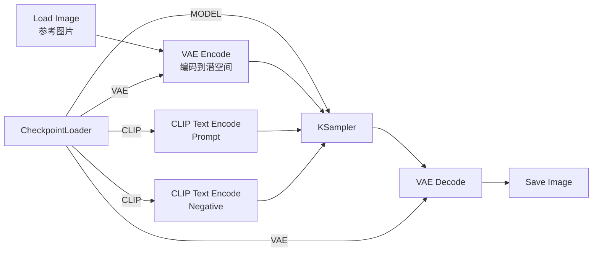

# 图生图工作流（Img2Img）——修改已有图片

> **场景**：你有一张图片，希望 AI 在**保留原图构图**的基础上对它进行修改——比如照片转风格、改色调、重绘某些细节。

## 一、图生图 vs 文生图

| 差异 | 文生图 | 图生图 |
|:-----|:-------|:-------|
| 输入 | 只有文字描述 | 文字 + 一张参考图片 |
| 初始潜空间 | 纯噪声（Empty Latent Image） | **原图 VAE 编码 + 部分噪声** |
| 控制参数 | — | **denoise**（去噪强度）决定保留原图多少 |
| 输出自由度 | 完全按 prompt 生成 | 按 prompt + 原图约束生成 |

**核心概念**：图生图 = 对原图添加一定量的噪声 → 用 prompt 引导 KSampler 去噪 → 得到一张"既保留原图结构又符合 prompt"的新图。

## 二、完整工作流



## 三、新增节点

### Load Image
右键 → 搜索 "Load Image" → 选择你的图片文件。支持 `.png` / `.jpg` / `.jpeg` / `.webp`。

### VAE Encode
右键 → 搜索 "VAE Encode"。

| 参数 | 说明 |
|:-----|:------|
| `vae` | CheckpointLoader 的 VAE 输出（🟡 黄色）|
| `pixels` | Load Image 的 IMAGE 输出（🟢 绿色）|
| 输出 | LATENT（🔵 蓝色）→ 连接 KSampler 的 `latent_image` |

与文生图的区别：这里**不需要** `Empty Latent Image`。潜空间来自原图编码而非随机噪声。

## 四、核心参数：denoise（去噪强度）

denoise 是图生图的灵魂参数——决定了"保留多少原图结构" vs "由 AI 自由发挥多少"。

```
denoise=0.0  → 完全不修改，原样输出（无用）
denoise=0.2  → 轻微色调/细节调整（颜色微调、降噪）
denoise=0.4  → 中等修改，保留构图和主要元素，改风格/颜色
denoise=0.6  → 较大修改，构图可能有变化，prompt 主导更强
denoise=0.8  → 大幅修改，原图仅作参考
denoise=1.0  → 完全重画（等同于文生图，但多了原图尺寸参考）
```

### 场景参数

| 场景 | denoise | steps | cfg | 说明 |
|:-----|:-------:|:-----:|:---:|:------|
| 🎨 照片→水彩画/油画 | 0.6-0.8 | 30 | 7-9 | 大幅改风格 |
| 🎭 照片→动漫风格 | 0.7-0.9 | 25-35 | 7-9 | 彻底换风格 |
| 🖌️ 轻度润色（去噪/调色） | 0.2-0.4 | 20 | 5-7 | 保留原图 |
| 🏠 室内换风格 | 0.6-0.8 | 30 | 7-8 | 换家具风格 |
| 🧑 换脸/改头发 | 0.4-0.6 | 25 | 6-7 | 只改脸部/头发 |

## 五、分辨率注意事项

- Load Image 的图片分辨率**决定了 KSampler 的画布大小**
- KSampler 不需要设置 width/height（它使用 VAE Encode 输出的 latent 尺寸）
- 如果原图分辨率很大（如 4K），可以先缩放到 512×512 或 1024×1024 再输入

## 六、常见问题

| 问题 | 原因 | 解决 |
|:-----|:-----|:------|
| 生成结果和原图几乎一样 | denoise 太低 | 提高到 0.4+ |
| 生成结果完全不像原图了 | denoise 太高 | 降低到 0.5-0.7 |
| 生成了奇怪的白色/黑色区域 | 原图含有透明度通道 | 确保图片是 RGB（非 RGBA）|
| 生成的结果分辨率变了 | VAE Encode 根据原图尺寸编码 | 先 resize 图片再输入 |
| 细节被磨平（画质下降） | steps 太低或 denoise 太高 | 增加 steps 到 30+ |

## 七、检查清单

- [ ] Load Image 已添加并连接到了 VAE Encode
- [ ] VAE Encode 的 `vae` 端口已连接
- [ ] VAE Encode 的 LATENT 输出连接到了 KSampler.latent_image
- [ ] **不需要** Empty Latent Image 节点
- [ ] denoise 在 0.2-0.9 之间
- [ ] 原图分辨率过大时已先缩放
