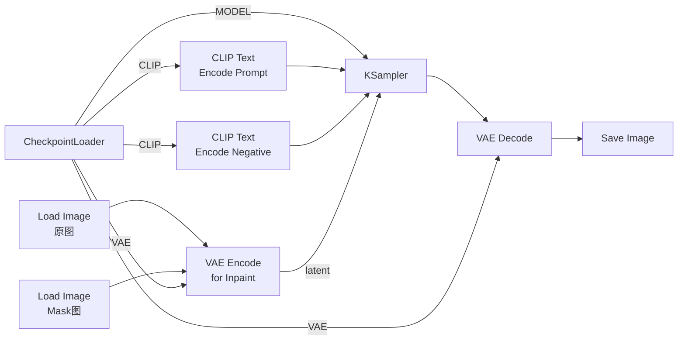

# 局部重绘（Inpaint）——只改你想改的地方

> **场景**：一张图片中，你只想修改特定区域（如换背景、去水印、改物体），其他部分完全保留不变。

## 一、Inpaint 是什么？

**白话**：你用一张 mask（遮罩/蒙版）告诉 AI "哪些地方要重画"——白色区域是"要改的"，黑色区域是"保留的"。

```
┌──────────────────┐     ┌──────────────────┐
│  原图              │     │  Mask（遮罩）     │
│                    │     │                    │
│  ########          │     │  ########          │
│  # 人脸 #          │     │  # 白色  # ← 要修的 │
│  ########          │     │  ########          │
│                    │     │                    │
└──────────────────┘     └──────────────────┘
```

## 二、完整工作流



**和普通图生图的关键区别**：使用 **VAE Encode (for Inpaint)** 而不是普通的 VAE Encode。

## 三、节点详解

### Load Image（原图）
加载你要修改的原始图片。不修改的部分会完全保留。

### Load Image（Mask）
加载遮罩图片，白色 = 要重绘的区域，黑色 = 保留的区域。

> 💡 **如何制作 Mask**：可以用 Photoshop / GIMP 等软件制作。新建黑色图层 → 用白色画笔涂你想要修改的区域 → 导出为 PNG 或 JPG。

### VAE Encode (for Inpaint)
右键 → 搜索 "VAE Encode (for Inpaint)" 或 "VAEEncodeForInpaint"。

| 参数 | 说明 |
|:-----|:------|
| `pixels` | 原图的 IMAGE 输出 |
| `mask` | Mask 图的 IMAGE 输出（🟢 绿色→红色端口）|
| `vae` | CheckpointLoader 的 VAE 输出 |
| 输出 | LATENT（🔵 蓝色）→ KSampler.latent_image |

> 注意：Mask 图的 IMAGE 输出接的是 `VAE Encode (for Inpaint)` 的 `mask` 输入端口，端口颜色是**红色**（代表遮罩数据类型）。

## 四、核心参数：denoise

| denoise | 效果 |
|:-------:|:------|
| 0.0 | 完全不修改（没用）|
| 0.3-0.5 | 保留原图大部分纹理，轻微修改（去水印、改小瑕疵）|
| **0.5-0.8** | **完全重绘 mask 区域的内容（换背景、改物体）** |
| 0.9-1.0 | 大幅修改，mask 区域可能延伸到外部 |

**关键关系**：denoise 越高，重绘区域越"自由"——AI 越倾向于忽略原图内容，完全按 prompt 生成。

### 场景参数

| 场景 | denoise | steps | prompt | mask 范围 |
|:-----|:-------:|:-----:|:--------|:----------|
| 🧹 去水印/文字 | 0.3-0.5 | 25-30 | 描述被遮挡的内容 | 刚好覆盖水印 |
| 🖼️ 换背景 | 0.7-0.9 | 30-40 | 描述新背景 | 覆盖背景区域 |
| 🧦 改衣服颜色/样式 | 0.5-0.7 | 25-35 | 描述新衣服 | 覆盖衣服区域 |
| 🧑 改发型 | 0.5-0.7 | 25-35 | 描述新发型 | 覆盖头发区域 |
| 🎭 换物体（猫→狗） | 0.7-1.0 | 30-40 | 描述新物体 | 覆盖物体区域 |

## 五、常见问题

| 问题 | 原因 | 解决 |
|:-----|:-----|:------|
| Mask 区域和原图过渡生硬 | denoise 太低或 grow mask 不够 | 提高 denoise 或使用膨胀 mask |
| 重绘区域颜色和原图不一致 | VAE 编码问题 | 使用 VAE Encode (for Inpaint) 确保传入 mask |
| Mask 区域被重绘了但边缘有白色边框 | mask 灰度不纯 | 确保 mask 是纯白（255）和纯黑（0）|
| 重绘时原图未被修改的区域也变了 | denoise 太高或 mask 没正确传入 | 降低 denoise 并检查 mask 端口连接 |
| 重绘结果出现重复纹理 | 原图+mask 混合时出问题 | 重启 ComfyUI |

## 六、检查清单

- [ ] 两个 Load Image（原图 + Mask 图）
- [ ] 使用的是 **VAE Encode (for Inpaint)**，不是普通 VAE Encode
- [ ] Mask 图的 IMAGE 连接到了 VAE Encode 的 mask（红色）端口
- [ ] denoise 在 0.3-0.9 之间
- [ ] Mask 是纯黑白图（白=改，黑=留）
- [ ] prompt 描述的是 mask 区域内应该出现什么
