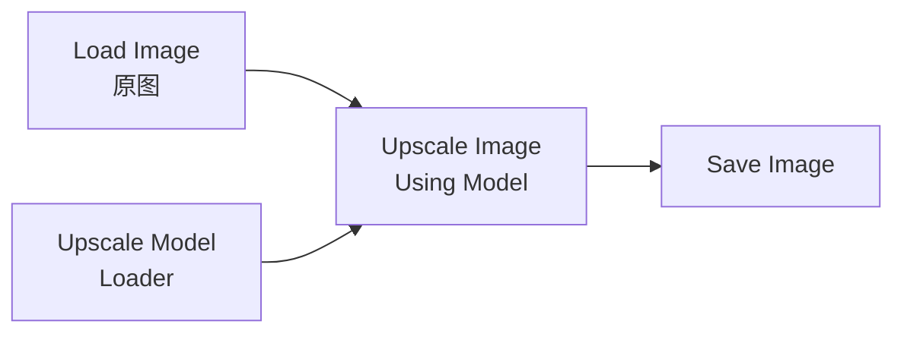
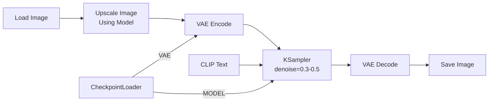

# 图像放大（Upscale）——把小图变清晰

> **场景**：生成的图片分辨率不够大（如 512×512），需要放大到 1024×1024、2K 甚至 4K，同时保持清晰度。

## 一、为什么要放大？

SD1.5 模型天然擅长 512×512，SDXL 擅长 1024×1024。如果你的素材是小图，或者你有更高分辨率的需求，需要放大。

**三种放大方式对比**：

| 方式 | 简单说 | 速度 | 质量 | 使用场景 |
|:-----|:-------|:----:|:----:|:---------|
| **常规放大（Resize）** | 简单拉伸，像素模糊 | 极快 | ❌ 低 | 后端不需要质量 |
| **AI 放大（Upscale Model）** | 用专门的放大模型补细节 | 中 | ✅ 高 | 日常推荐 |
| **潜在放大（Latent Upscale）** | 在潜空间放大再解码 | 中 | ✅ 高 | 视频/两阶段工作流 |

## 二、AI 放大（Upscale Model）工作流

### 模型下载

| 模型 | 文件 | 存放路径 |
|:-----|:-----|:---------|
| 4x-UltraSharp | `4x-UltraSharp.safetensors` | `models/upscale_models/` |
| 4x_NMKD-Superscale-SP | `4x_NMKD-Superscale-SP.safetensors` | `models/upscale_models/` |
| 4x-AnimeSharp | `4x-AnimeSharp.safetensors` | `models/upscale_models/` |

下载：去 `hf-mirror.com` 搜索对应文件名，或去 UpScale Wiki 查找。

### 完整工作流

### 节点详解

#### Upscale Model Loader
右键 → 搜索 "Upscale Model Loader"。

| 参数 | 说明 |
|:-----|:------|
| `model_name` | 选择你下载的放大模型（如 `4x-UltraSharp`）|
| 输出 | UPSCALE_MODEL → Upscale Image Using Model |

#### Upscale Image Using Model
右键 → 搜索 "Upscale Image Using Model"。

| 参数 | 推荐值 | 说明 |
|:-----|:------:|:------|
| `upscale_model` | 来自 Upscale Model Loader | 放大模型 |
| `image` | Load Image 的 IMAGE | 要放大的图片 |
| 可选参数 | 无 | 自动按模型倍数放大（如 4×）|

---

### 常用放大模型选型

| 模型名 | 倍数 | 显存 | 适用 | 效果 |
|:-------|:----:|:----:|:-----|:-----|
| **4x-UltraSharp** | 4× | ~1GB | 写实照片 | 清晰锐利，细节丰富 |
| **4x_NMKD-Superscale-SP** | 4× | ~1GB | 通用 | 自然，不过度锐化 |
| **8x_NMKD-Superscale** | 8× | ~1GB | 极大幅放大 | 适合超大分辨率需求 |
| **4x-AnimeSharp** | 4× | ~500MB | 二次元/动漫 | 线条清晰，色彩鲜艳 |
| **RealESRGAN_x4plus** | 4× | ~1GB | 写实照片 | 经典放大模型，泛化好 |
| **RealESRGAN_x4plus_anime** | 4× | ~1GB | 二次元/动漫 | 专门针对动漫优化 |
| **DAT_x2/x3/x4** | 2/3/4× | ~2GB | 通用（高质量） | Transformer 架构，细节保真度最高 |
| **4x-LSDIR** | 4× | ~1.5GB | 高质量通用 | Lightweight SwinIR，轻量高效 |

---

## 三、图生图放大法（进阶方案——效果最好）

先用 AI 放大模型把图片放大 2-4 倍，再用图生图（低 denoise）精修细节。

**参数**：
- denoise: 0.3-0.5（不可太高，否则画面变太多）
- steps: 20-30
- prompt: 和原图一致或稍加细节描述

**这种方法的优点**：
- 比单纯 AI 放大细节更丰富
- 可以同时纠正原图的一些小瑕疵
- 画面更自然，没有"AI 放大感"

---

## 四、潜在放大（用于视频/两阶段）

在潜空间放大，只在 LTX 两阶段、Wan 视频场景中使用。详见：
- [LTX 两阶段工作流](../03-视频生成-LTX/05-两阶段高质量工作流.md)
- 使用 `LTXVLatentUpsampler` 节点在潜空间 2× 放大

---

## 五、常见问题

| 问题 | 原因 | 解决 |
|:-----|:-----|:------|
| 放大后图片模糊 | 用了普通 Resize 而非 AI 放大 | 用 Upscale Image Using Model |
| 放大后细节不自然 | 放大模型不适合该风格 | 换模型（写实用 UltraSharp，动漫用 AnimeSharp）|
| 放大后画面出现了奇怪纹理 | 放大模型过锐化 | 换 NMKD-Superscale 更自然 |
| 图生图放大法画面变太多 | denoise 太高 | 降到 0.3-0.4 |
| 图生图放大法没变化 | denoise 太低 | 提到 0.4-0.5 |

## 六、检查清单

- [ ] 放大模型文件在 `models/upscale_models/` 目录
- [ ] 使用 Upscale Image Using Model（不是普通 Resize）
- [ ] 选择合适的放大模型（写实/动漫/通用）
- [ ] 图生图放大法时 denoise 在 0.3-0.5
- [ ] 视频放大时使用潜空间放大方案（非像素放大）
