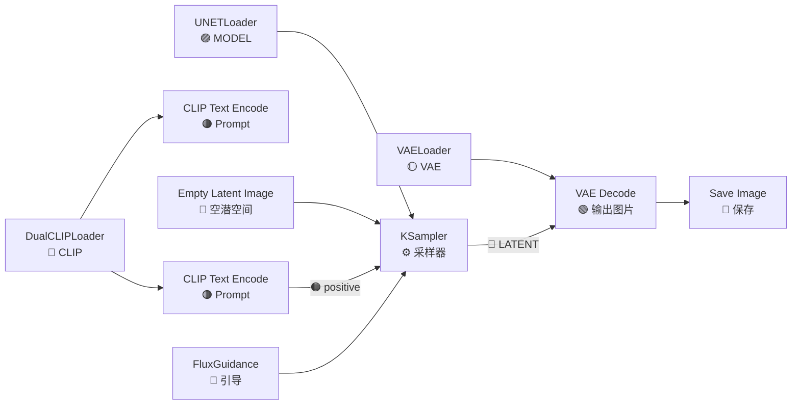

# Flux 文生图工作流——FLUX.1 与 FLUX.2 从配置到精通

> **前置**：已完成 `01-文生图工作流-完整新手教学.md`，理解 CheckpointLoader、KSampler、CLIP Text Encode 等基础节点的作用。
>
> **Flux 是什么**：Black Forest Labs（Stable Diffusion 原班人马）开发的新一代文生图模型家族。**目前（2026年5月）文生图质量的标杆**，对于写实、光影、材质细节的理解远超 SDXL 和 SD1.5。

---

## 一、Flux 模型家族选型

Flux 不是单个模型，而是一个系列，**选错版本会导致工作流搭不起来**。

| 模型 | 版本 | 参数量 | 显存需求 | 许可证 | 推荐场景 |
|:-----|:----:|:------:|:--------:|:------|:---------|
| **FLUX.1-dev** | v1 | 12B | 12-24GB | 🔒 非商业 | 个人创作，质量最高 |
| **FLUX.1-schnell** | v1 | 12B | 8-16GB | ✅ Apache 2.0 | 快速出图/商用 |
| **FLUX.1-dev fp8** | v1 | 12B→8bit | **12-16GB** | 🔒 非商业 | **低显存首选** |
| **FLUX.2-dev** | v2 | — | ~16-24GB | 🔒 非商业 | 第二代，排队中 |
| **FLUX.2-schnell** | v2 | — | ~12-16GB | ✅ Apache 2.0 | 第二代快速版 |

> 💡 **新手推荐**：`FLUX.1-dev fp8`（Comfy-Org 打包版，约 12GB 可跑，16GB 流畅）。

**fp8 非官方但社区常用**，官方只有 BF16 版本。Comfy-Org 社区将模型量化为 fp8，显存从 24GB 降到 12-16GB，质量损失很小。

### 下载地址

| 模型 | 来源 | HF 仓库 | 文件名 | 大小 |
|:-----|:-----|:--------|:-------|:----:|
| FLUX.1-dev fp8 | HuggingFace | `Comfy-Org/flux1-dev` | `flux1-dev-fp8.safetensors` | ~12GB |
| FLUX.1-schnell fp8 | HuggingFace | `Comfy-Org/flux1-schnell` | `flux1-schnell-fp8.safetensors` | ~12GB |
| FLUX.1-dev (BF16) | HuggingFace | `black-forest-labs/FLUX.1-dev` | `flux1-dev.safetensors` | ~24GB |
| FLUX.2-dev | HuggingFace | `black-forest-labs/FLUX.2-dev` | 含 decoder | — |

国内镜像：
```bash
set HF_ENDPOINT=https://hf-mirror.com
# 然后正常下载
```

---

## 二、Flux 和 SD 的架构差异（重点）

Flux 和 SDXL/SD1.5 的最大区别：**Flux 不使用传统 VAE 和 CLIP**。

### 架构对比

| 组件 | SDXL | Flux | 说明 |
|:-----|:-----|:-----|:------|
| **文本编码** | 2x CLIP-L | **CLIP-L + T5XXL** | Flux 多了 4.7B 参数的 T5 编码器 |
| **文本长度** | 77 tokens | **256 tokens** | 能理解更长的提示词 |
| **模型加载** | CheckpointLoaderSimple | **DualCLIPLoader + UNETLoader + VAELoader** | 分体加载 |
| **VAE** | Checkpoint内置 | **独立 VAE（`ae.safetensors`）** | Flux VAE 是单独的 |
| **Guidance** | CFG (cfg参数) | **FluxGuidance 节点** | 机制完全不同 |
| **分辨规则** | 64 的倍数 | **16 的倍数** | 更灵活 |
| **潜空间比例** | 1:8 | **1:8** | 相同（1024×1024 → 128×128） |

### 你需要额外下载的文件

除主模型外，Flux 还需要：

| 文件 | 来源 | 存放路径 | 大小 |
|:-----|:------|:---------|:----:|
| `ae.safetensors`（VAE） | `black-forest-labs/FLUX.1-dev` | `models/vae/` | ~335MB |
| T5XXL fp8 编码器 | `Comfy-Org/flux1-dev` | `models/clip/` | ~4.7GB |
| CLIP-L | ComfyUI 自带 | 内置 | 无需下载 |

> ⚠️ **没下载 T5 编码器 → 节点全红**。这是新手最容易漏的步骤。

---

## 三、完整文生图工作流（6 个节点）

### 工作流总览



### 节点 1：DualCLIPLoader（双文本编码器加载器）

**添加方式**：右键 → 输入 `DualCLIPLoader` → 选择

**这个节点替代了 SDXL 的 CLIPLoader，同时加载两个编码器：**

| 参数 | 设置值 | 说明 |
|:-----|:-------|:------|
| `clip_name1` | `t5xxl_fp8.safetensors` | T5XXL 编码器（理解长文本的关键） |
| `clip_name2` | `clip_l.safetensors` | CLIP-L 编码器（标准 CLIP，ComfyUI 自带） |
| `type` | `flux` | 必须选 flux，否则输出端口不匹配 |

**输出端口**：
- CLIP → 连接到 CLIP Text Encode 的 CLIP 端口
- 注意：DualCLIPLoader 的 CLIP 输出只有一个端口，但内部包含两个编码器

> ⚠️ **常见错误**：`t5xxl_fp8.safetensors` 不在 `models/clip/` 目录下 → 下拉框为空。先确认模型已下载。

### 节点 2：CLIP Text Encode（提示词编码）

**添加方式**：右键 → 输入 `CLIP Text Encode` → 选择 `CLIP Text Encode (Prompt)`

与普通文生图一样，你需要两个：

| 节点 | text 设置 |
|:-----|:----------|
| CLIP Text Encode (positive) | 正面提示词 |
| CLIP Text Encode (negative) | 负面提示词（虽然 Flux 对负面不敏感，但保留没坏处） |

**提示词写法差异**：
- Flux 支持 **256 tokens**，可以写更长的描述
- 中文提示词效果比 SDXL 好（T5 的多语言能力更强）
- 不需要 `masterpiece, best quality` 等画质词，Flux 默认就是高质量

**示例**：
```
正面：a serene japanese garden in autumn, maple leaves falling, a small wooden bridge over a koi pond, soft sunlight filtering through trees, cinematic lighting, highly detailed, 8K
```

### 节点 3：UNETLoader（模型加载器）

**添加方式**：右键 → 输入 `UNETLoader` → 选择

| 参数 | 设置值 | 说明 |
|:-----|:-------|:------|
| `unet_name` | `flux1-dev-fp8.safetensors` | 选你下载的 Flux 模型文件 |
| `weight_dtype` | `default` 或 `fp8_e4m3fn` | 如果模型本身就是 fp8，选 default；如果 BF16 模型想强压 fp8，选对应量化 |

**输出端口**：
- MODEL（紫色）→ KSampler 的 model 端口
- 注意：UNETLoader 只有一个 MODEL 输出，不像 CheckpointLoaderSimple 还有 CLIP 和 VAE

### 节点 4：VAELoader（VAE 加载器）

**添加方式**：右键 → 输入 `VAELoader` → 选择

| 参数 | 设置值 | 说明 |
|:-----|:-------|:------|
| `vae_name` | `ae.safetensors` | Flux 专用 VAE |

> 💡 `ae.safetensors` 名字是固定的，由几个文件组成。如果在下拉框中看到多个 `ae` 开头的文件，选大小约 335MB 的那个。

### 节点 5：FluxGuidance（Flux 引导参数）

**添加方式**：右键 → 输入 `FluxGuidance` → 选择

这是 Flux 独有节点，**SD 的 CFG 概念在 Flux 中不直接适用**。Guidance 通过 T5 编码器的特殊机制控制提示词的跟随强度。

| 参数 | FLUX.1-dev | FLUX.1-schnell | 说明 |
|:-----|:----------:|:--------------:|:------|
| `guidance` | **3.5** | **1.0** | dev 需要 >1，schnell 固定 1 |

**输出**：GUIDANCE → KSampler 的 guidance 端口

> ⚠️ **重要**：FLUX.1-schnell 的 guidance 必须设为 1.0，设为其他值会出奇怪结果。FLUX.1-dev 建议 3.0-5.0，3.5 是标准值。

### 节点 6：KSampler + Empty Latent Image + VAE Decode + Save Image

这些节点和标准文生图工作流一样，但参数有差异：

**KSampler 设置**：

| 参数 | FLUX.1-dev | FLUX.1-schnell | 说明 |
|:-----|:----------:|:--------------:|:------|
| `steps` | 20-30 | **4-8** | schnell 是蒸馏版，4 步就够 |
| `cfg` | 1.0 | 1.0 | **Flux 不用 CFG**，设 1.0 即可。控制提示词用 guidance 节点 |
| `sampler_name` | `euler` | `euler` | Flux 对采样器不敏感，euler 最稳定 |
| `scheduler` | `sgm_uniform` | `sgm_uniform` | **一定用 sgm_uniform**，其他调度器可能出问题 |
| `denoise` | 1.0 | 1.0 | 文生图固定 1.0 |

**Empty Latent Image 设置**：

| 参数 | 推荐值 | 说明 |
|:-----|:------:|:------|
| `width` | 1024 | 必须是 **16 的倍数** |
| `height` | 1024 | 同上 |

Flux 原生支持的分辨率非常灵活（16倍数），不像 SDXL 有严格限制：

| 分辨率 | 宽高比 | 场景 |
|:-------|:------:|:-----|
| 1024×1024 | 1:1 | 标准方图 |
| 1024×576 | 16:9 | 横屏 |
| 576×1024 | 9:16 | 竖屏（手机壁纸） |
| 896×1152 | 3:4 | 竖版海报 |
| 768×1344 | 9:19.5 | 手机全屏 |

---

## 四、完整连线步骤（手把手）

**Step 1**：右键 → 搜索 `DualCLIPLoader` → 添加
- `clip_name1` = `t5xxl_fp8.safetensors`
- `clip_name2` = `clip_l.safetensors`
- `type` = `flux`

**Step 2**：右键 → 搜索 `CLIP Text Encode` → 添加两个
- 一个写正面提示词
- 一个写负面提示词（可选）

**Step 3**：右键 → 搜索 `UNETLoader` → 添加
- `unet_name` = 你的 Flux 模型

**Step 4**：右键 → 搜索 `VAELoader` → 添加
- `vae_name` = `ae.safetensors`

**Step 5**：右键 → 搜索 `FluxGuidance` → 添加
- `guidance` = 3.5（dev）或 1.0（schnell）

**Step 6**：右键 → 搜索 `KSampler` → 添加
- steps = 20-30 (dev) / 4-8 (schnell)
- cfg = 1.0
- sampler_name = euler
- scheduler = sgm_uniform

**Step 7**：右键 → 搜索 `Empty Latent Image` → 添加
- width = 1024, height = 1024

**Step 8**：右键 → 搜索 `VAE Decode` → 添加

**Step 9**：右键 → 搜索 `Save Image` → 添加

**连线**：

```
DualCLIPLoader.CLIP → CLIP Text Encode.CLIP (正面)
                    → CLIP Text Encode.CLIP (负面)
UNETLoader.MODEL → KSampler.model
Empty Latent Image.LATENT → KSampler.latent_image
CLIP Text Encode (正面).CONDITIONING → KSampler.positive
CLIP Text Encode (负面).CONDITIONING → KSampler.negative
FluxGuidance.GUIDANCE → KSampler.guidance
KSampler.LATENT → VAE Decode.latent
VAELoader.VAE → VAE Decode.vae
VAE Decode.IMAGE → Save Image.images
```

**Step 10**：点击 Queue Prompt → 生成！

---

## 五、FLUX.2 更新要点（2026年2月发布）

Black Forest Labs 在 2026年2月发布了 FLUX.2，主要变化：

| 变化 | 说明 |
|:-----|:------|
| **小型解码器** | FLUX.2-small-decoder 让显存需求降低 |
| **质量提升** | 更好的材质渲染和光影一致性 |
| **Pro 版** | 闭源，通过 API 调用 |

如果使用 FLUX.2，工作流与 FLUX.1 基本相同，但模型文件不同：

| 文件 | 位置 |
|:-----|:------|
| `FLUX.2-dev` 主模型 | `models/unet/` |
| `FLUX.2-small-decoder` | 单独的 decoder 文件 |

> 💡 **FLUX.2 尚在早期**，大部分社区资源和 LoRA 仍在 FLUX.1-dev 上生态更丰富。如果不是追求最新，FLUX.1-dev fp8 仍是当前最稳妥的选择。

---

## 六、Flux vs SDXL 参数对照表

> 💡 SDXL 与 Flux 的完整参数对照见 [技术选型与组合参考 §四](00-技术选型与组合参考.md#42-flux-vs-sdxl-参数对照)。

---

## 七、常见问题排查

| 问题 | 原因 | 解决 |
|:-----|:-----|:------|
| 🔴 **节点全红：DualCLIPLoader 下拉框为空** | T5XXL 编码器没下载 | 下载 `t5xxl_fp8.safetensors` 放到 `models/clip/` |
| 🔴 **UNETLoader 下拉框为空** | Flux 模型没下载 | 下载 `flux1-dev-fp8.safetensors` 放到 `models/unet/` |
| 🔴 **VAELoader 下拉框为空** | ae.safetensors 没下载 | 下载放到 `models/vae/` |
| 🔴 **生成的都是噪点/雪花** | KSampler 的 scheduler 不是 sgm_uniform | 改成 `sgm_uniform` |
| 🔴 **颜色过饱和/怪异** | CFG 值没设成 1.0 | KSampler 的 cfg 设 1.0 |
| 🔴 **图片和 prompt 不相关** | guidance 太低 | Flux.1-dev 调高到 3.5-5.0 |
| 🔴 **图片模糊/细节差** | steps 太少 | dev 至少 20 步，schnell 至少 4 步 |
| 🔴 **内存不足 OOM** | 显存不够 | 换 fp8 版，或用 schnell 版 |
| 🔴 **schnell 版出图奇怪** | guidance 不是 1.0 | schnell 必须 guidance=1.0 |
| 🔴 **负面提示词完全没效果** | Flux 设计如此 | 不需要写很长负面词，写基本的即可 |

---

## 八、检查清单

在点击 Queue Prompt 前确认：

- [ ] `t5xxl_fp8.safetensors` 在 `models/clip/` 目录
- [ ] `ae.safetensors`（Flux VAE）在 `models/vae/` 目录
- [ ] Flux 主模型在 `models/unet/` 目录（不是 `checkpoints/`）
- [ ] DualCLIPLoader 的 type 设为 `flux`
- [ ] KSampler 的 scheduler 设为 `sgm_uniform`（最关键）
- [ ] KSampler 的 cfg 设为 **1.0**（不是 7.0！）
- [ ] FluxGuidance 节点已添加并连接
- [ ] guidance 值：dev=3.5 / schnell=1.0
- [ ] 如果是 schnell 版：steps=4-8
- [ ] 分辨率是 16 的倍数
- [ ] 所有紫色（MODEL）、蓝色（LATENT）、橙色（CONDITIONING）、黄色（VAE）端口都正确连接
- [ ] 没有红色连线