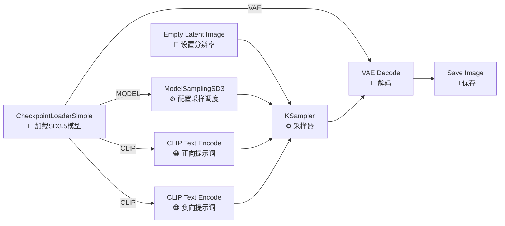

# SD3.5 文生图工作流——Stability AI 的第三代架构

> **前置**：已完成 `01-文生图工作流-完整新手教学.md`，理解 CheckpointLoader、KSampler、CLIP Text Encode 等基础节点的作用。
>
> **SD3.5 是什么**：Stability AI 于 2024 年 10 月发布的 SD3 系列重大升级。**区别于 SDXL/SD1.5 的 UNet 架构，SD3.5 采用了全新的 MMDiT（Multimodal Diffusion Transformer）架构**，将文本理解直接融入扩散过程，在提示词遵循和文字渲染方面有质的飞跃。

---

## 一、SD3.5 模型家族选型

| 模型 | 参数量 | 显存需求 | 架构 | 许可证 | 推荐场景 |
|:-----|:------:|:---------|:-----|:-------|:---------|
| **SD3.5 Medium** | **2.5B** | **8-12GB** | MMDiT-X（轻量） | 社区许可 | **新手首选**，消费级显卡 |
| **SD3.5 Large** | 8B | 24-32GB | MMDiT（完整） | 社区许可 | 专业创作，A100/4090 |
| **SD3.5 Large Turbo** | 8B | 24-32GB | MMDiT（蒸馏） | 社区许可 | 快速出图（4-8步） |
| **SD3.5 Medium fp8** | 2.5B→8bit | **6-8GB** | MMDiT-X 量化 | 社区许可 | **6GB 低显存救星** |

> 💡 **选型建议**：
> - 8GB 显存以下 → `SD3.5 Medium fp8`
> - 8-12GB 显存 → `SD3.5 Medium`（BF16，原生）
> - 24GB+ 显存 → `SD3.5 Large` 或 `SD3.5 Large Turbo`
> - 追求速度 → `SD3.5 Large Turbo`（4 步出图）

### 下载地址

| 模型 | HF 仓库 | 文件名 | 大小 |
|:-----|:--------|:------:|:----:|
| SD3.5 Medium | `stabilityai/stable-diffusion-3.5-medium` | `sd3.5_medium.safetensors` | ~5GB |
| SD3.5 Large | `stabilityai/stable-diffusion-3.5-large` | `sd3.5_large.safetensors` | ~16GB |
| SD3.5 Large Turbo | `stabilityai/stable-diffusion-3.5-large-turbo` | `sd3.5_large_turbo.safetensors` | ~16GB |
| SD3.5 Medium fp8 | `Comfy-Org/stable-diffusion-3.5-medium` | `sd3.5_medium_fp8.safetensors` | ~2.5GB |

> 💡 **存放路径**：所有 .safetensors 文件放入 `models/checkpoints/`
>
> **国内镜像**：
> ```bash
> set HF_ENDPOINT=https://hf-mirror.com
> # 然后再用浏览器或 huggingface-cli 下载
> ```

> ⚠️ **注意**：SD3.5 需要同意 Stability AI 的社区许可协议才能下载。访问 HF 页面后点「Agree & Access」，注册账号即可免费获取。

---

## 二、SD3.5 与 SDXL/Flux 的架构差异

理解架构差异有助于排查问题和选型：

| 组件 | SDXL | SD3.5 | Flux |
|:-----|:-----|:------|:-----|
| **底层架构** | UNet | **MMDiT (Transformer)** | MMDiT + DoubleStream |
| **文本编码器** | CLIP-L (77 tokens) | **CLIP-L + CLIP-G + T5-XXL** | CLIP-L + T5XXL |
| **文本长度** | 77 tokens | **512 tokens** | 256 tokens |
| **模型加载** | CheckpointLoaderSimple | **CheckpointLoaderSimple**（一体式） | UNETLoader（分体式） |
| **特殊节点** | — | **ModelSamplingSD3** | FluxGuidance |
| **分辨率规则** | 64 的倍数 | **64 的倍数** | 16 的倍数 |
| **文字渲染** | ❌ 较差 | ✅ **优秀** | ❌ 较差 |
| **显存效率** | 高（4-8GB） | 中（8-32GB） | 低（12-32GB） |
| **VLM 质量** | 可接受 | **优秀** | 标杆 |

**SD3.5 vs Flux 的关键区别**：
- SD3.5 是一体式 checkpoint（像 SDXL），只有一个 .safetensors 文件 → **新手友好**
- SD3.5 的文字渲染能力极佳，**特别适合海报、封面、Logo 等需要文字的场景**
- SD3.5 的显存需求介于 SDXL 和 Flux 之间
- SD3.5 **不需要** T5 编码器单独下载（已内嵌在 checkpoint 中）

---

## 三、完整文生图工作流（7 个节点）

### 工作流总览



### 完整连接说明

| 节点 | 输入 | 输出 | 连接到 |
|:------|:-----|:-----|:-------|
| **CheckpointLoaderSimple** | ckpt_name (选 SD3.5 模型) | MODEL, CLIP, VAE | MODEL→ModelSamplingSD3, CLIP→CLIPTextEncode×2 |
| **ModelSamplingSD3** | model (来自 CheckpointLoader) | MODEL | →KSampler |
| **CLIP Text Encode (正向)** | clip (来自 CheckpointLoader), text (提示词) | CONDITIONING | →KSampler positive |
| **CLIP Text Encode (负向)** | clip, text (负面词) | CONDITIONING | →KSampler negative |
| **Empty Latent Image** | width, height, batch_size | LATENT | →KSampler latent_image |
| **KSampler** | model, positive, negative, latent + 参数 | LATENT | →VAE Decode |
| **VAE Decode** | samples, vae | IMAGE | →Save Image |
| **Save Image** | images | — | — |

---

## 四、逐个节点详解

### 节点 1：CheckpointLoaderSimple（模型加载器）

与 SDXL 完全相同，选择你的 SD3.5 模型即可。

| 参数 | 说明 | 可选值 |
|:-----|:------|:-------|
| `ckpt_name` | 选择 SD3.5 模型文件 | 下拉选择（如 `sd3.5_medium.safetensors`） |

> ⚠️ **节点变红排查**：
> - 检查文件是否在 `models/checkpoints/` 目录
> - 检查文件是否完整下载（SD3.5 Medium 约 5GB，Library 约 16GB）
> - 如果报 CUDA Out of Memory → 换 fp8 版本或 Medium 版本
> - **这是整条工作流最卡显存的一步**，如果 Medium 都跑不动，建议用 fp8 量化版

### 节点 2：ModelSamplingSD3（采样调度配置——新增节点）

**这是 SD3.5 独有的核心节点**。MMDiT 架构需要特定的噪声调度，而 ModelSamplingSD3 就是来配置它的。

**添加方式**：右键 → 搜索 `ModelSamplingSD3`

| 参数 | 推荐值 | 说明 |
|:-----|:------:|:------|
| `model` | 来自 CheckpointLoader | 传入 MODEL |
| `shift` | **3.0**（Medium）/ **2.0**（Large） | 噪声偏移系数，影响画面亮度和对比度 |
| `discrete` | 勾选 ✅ | 使用离散 flow matching 调度 |

> 💡 **shift 参数详解**（经验值，建议自己微调）：
> - 较小的 shift（如 1.0）→ 画面较暗，对比度高
> - 较大的 shift（如 4.0）→ 画面较亮，对比度低
> - Medium 推荐 3.0，Large 推荐 2.0
> - 根据出图效果在 1.5-4.0 之间微调

### 节点 3-4：CLIP Text Encode（正 / 负提示词编码）

与 SDXL 相同的节点。SD3.5 使用 **CLIP-L + CLIP-G + T5-XXL 三重编码**，这是内嵌在 checkpoint 中的，你不需要额外配置。

**提示词长度**：SD3.5 支持最长 **512 tokens**（SDXL 只有 77），所以可以写更长的提示词。

| 参数 | 说明 | 推荐写法 |
|:-----|:------|:---------|
| `text`（正向） | 描述你想要的内容 | "cinematic photo of a cat, detailed fur, soft lighting, 8k" |
| `text`（负向） | 描述你不要的内容 | "blurry, low quality, distorted, deformed" |

> 💡 **SD3.5 的负向提示词**：虽然 SD3 最初设计没有使用 CFG（所以负向提示词作用有限），但 SD3.5 恢复了对 CFG 的支持。**建议始终提供负向提示词**。

### 节点 5：Empty Latent Image（潜空间图像）

| 参数 | 推荐值 | 说明 |
|:-----|:------:|:------|
| `width` | **1024** | 宽度（必须是 64 的倍数） |
| `height` | **1024** | 高度（必须是 64 的倍数） |
| `batch_size` | 1 | 一次生成的图片数量 |

> ⚠️ **分辨率规则**：64 的倍数，和 SDXL 相同。推荐 1024×1024（Medium 原生训练尺寸）。

### 节点 6：KSampler（采样器）

**SD3.5 的参数和 SDXL/Flux 差异很大**，请按以下推荐值设置：

| 参数 | SD3.5 Medium | SD3.5 Large | SD3.5 Large Turbo | 说明 |
|:-----|:------------:|:-----------:|:-----------------:|:------|
| `steps` | **25-40** | **20-30** | **4-8** | Medium 需要更多步数 |
| `cfg` | **4.0-6.0** | **3.5-5.0** | **2.0-3.0** | 低 cfg 效果好于 SDXL |
| `sampler_name` | `dpmpp_2m` | `dpmpp_2m` | `dpmpp_2m` | 通用选择 |
| `scheduler` | `karras` | `karras` | `normal` | |
| `denoise` | 1.0 | 1.0 | 1.0 | 文生图不调整 |

> 💡 **SD3.5 的 cfg 比 SDXL 低**：SDXL 通常用 cfg=7，而 SD3.5 在 cfg=4-6 时效果最好。太高会让画面过度饱和。

> ⚠️ **Turbo 版本**（Large Turbo）用 **4-8 steps 且 cfg=2-3** 即可出高质量图，这是 distillation（蒸馏）技术的结果。不要用 20 步以上！

---

## 五、参数微调指南

### 常见调整场景

| 问题 | 解决方案 |
|:-----|:---------|
| 画面太暗 | 降低 `ModelSamplingSD3.shift`（如 3.0→2.0） |
| 画面太亮/发白 | 提高 `ModelSamplingSD3.shift`（如 3.0→4.0） |
| 细节不够 | 增加 `steps`（Medium 建议 30-40） |
| 颜色过饱和 | 降低 `cfg`（5.0→4.0） |
| 颜色不够 | 提高 `cfg`（5.0→6.0） |
| 提示词不跟 | 检查模型选择是否正确（选到了 SDXL 模型） |
| 显存不足 | 换 Medium fp8 版本，或降低分辨率到 768×768 |
| 文字渲染模糊 | 提示词中加入"清晰文字"描述，增加 steps |

### 推荐参数组合

| 场景 | Model | Shift | Steps | CFG | Sampler | Scheduler |
|:-----|:-----|:-----:|:-----:|:---:|:-------:|:---------:|
| 默认优质 | Medium | 3.0 | 30 | 5.0 | dpmpp_2m | karras |
| 快速出图 | Medium | 3.0 | 20 | 5.0 | dpmpp_2m | karras |
| 低显存 | Medium fp8 | 3.0 | 25 | 5.0 | dpmpp_2m | karras |
| 专业品质 | Large | 2.0 | 28 | 4.5 | dpmpp_2m | karras |
| Turbo 快速 | Large Turbo | 2.0 | 6 | 2.5 | dpmpp_2m | normal |

---

## 六、常见问题

| 问题 | 原因 | 解决 |
|:-----|:-----|:------|
| **节点变红：Error(s) in loading state_dict** | 模型文件损坏或不完整 | 重新下载，检查大小 |
| **节点变红：CUDA out of memory** | 显存不足 | 换 Medium fp8，降分辨率，或关掉其他程序 |
| **出图全是黑色** | 缺少 ModelSamplingSD3 节点 | 加入 ModelSamplingSD3 并设置 shift |
| **出图雾蒙蒙** | shift 值太高 | 降低 shift（3.0→2.0） |
| **出图对比度太高、暗部死黑** | shift 值太低 | 提高 shift（3.0→4.0） |
| **提示词不跟随** | 模型未正确加载（可能选了 SDXL 模型） | 确认选中的是 SD3.5 模型文件 |
| **画面扭曲/畸形** | 分辨率不是 64 倍数 | 检查 width/height 是否为 64 的倍数 |
| **文字模糊** | steps 不够或提示词不准确 | 增加 steps 到 35+，提示词加 literacy / text 描述 |
| **显存不足但不想降质量** | 尝试 tiled VAE | 用 `VAEDecodeTiled` 代替 `VAE Decode` |

---

## 七、检查清单

- [ ] 选择正确的 SD3.5 模型（确认文件名在 models/checkpoints/ 中）
- [ ] 加入 **ModelSamplingSD3** 节点（这是最容易漏的！）
- [ ] 设置 shift 值（Medium: 3.0, Large: 2.0）
- [ ] 勾选 discrete
- [ ] 分辨率设为 64 的倍数（推荐 1024×1024）
- [ ] cfg 设置在 4.0-6.0（不要用 SDXL 的 7.0）
- [ ] Medium 用 25-40 步，Turbo 用 4-8 步
- [ ] 如需文字生成，确保 steps ≥ 30
- [ ] 如显存不足，优先换 Medium fp8 而非降分辨率