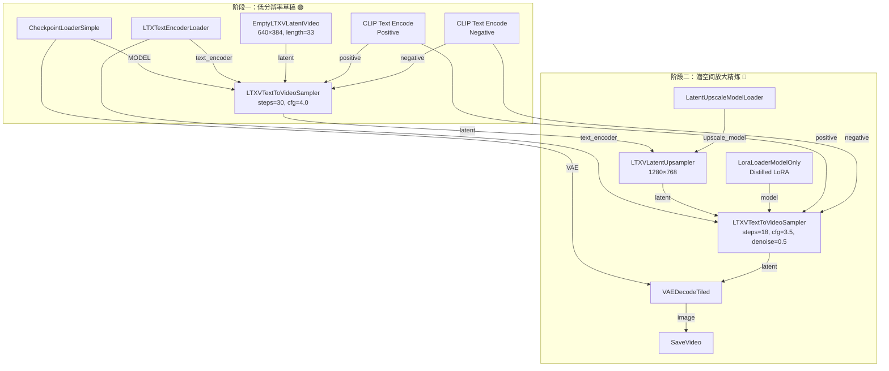

# LTX 2.3 两阶段高质量工作流——从原理到精调

> **前置**：已成功跑通单阶段文生视频工作流（新手教学见 `03-文生视频工作流.md`）。
>
> **核心思想**：先低分辨率快速确定构图和运动轨迹（阶段一），再潜空间放大精炼细节（阶段二）。不做一次生成为最终质量，而是分成两步，各司其职。

---

## 一、为什么需要两阶段？

### 单阶段的问题

假设你直接设置 1280×768、49 帧、50 步去生成一个高质量视频：

| 问题 | 原因 | 后果 |
|:-----|:-----|:------|
| 显存暴涨 | 高分辨率 × 多帧数 × 多步数 | OOM 崩溃 |
| 时间成倍增加 | 每一步都在处理大量数据 | 等很久才能看到结果 |
| 构图和细节同时优化 | 模型两头兼顾，两头都不好 | 运动僵硬、细节模糊 |
| 失败成本高 | 跑 10 分钟才发现构图不对 | 改 prompt 重跑等更久 |

### 两阶段的解决思路

```
                   阶段一（低分辨率草稿）              阶段二（潜空间放大精炼）
               ┌───────────────────┐            ┌──────────────────────┐
               │ 分辨率  640×384    │            │ 分辨率  1280×768     │
               │ 帧数    33         │  latent    │ 步数    15-20        │
               │ 步数    25-35      │ ────────→  │ denoise 0.4-0.6      │
               │ 找构图和运动轨迹    │            │ 补充细节、提升清晰度  │
               └───────────────────┘            └──────────────────────┘
                    快速（1-2 分钟）                    精细（2-4 分钟）
```

| 好处 | 说明 |
|:-----|:------|
| 💾 **显存省一半** | 阶段一用半分辨率，阶段二在潜空间放大，无需一次加载全部像素 |
| 🎥 **运动更连贯** | 阶段一专门优化运动轨迹，不受高分辨率细节干扰 |
| 🔄 **迭代快** | 不满意运动轨迹只需改 prompt 重跑阶段一（1-2 分钟） |
| ✨ **细节更丰富** | 阶段二专注补细节，distilled LoRA 让精炼步数更少效果更好 |

### 什么场景建议用两阶段？

| ✅ 推荐使用 | ❌ 不需要 |
|:------------|:----------|
| 最终输出需要高质量（发布级） | 只是测试 prompt 效果 |
| 分辨率 > 832×480 | 短视频（≤33 帧、低分辨率） |
| 运动复杂的场景（运镜、人物走动） | 静态场景（风景、静物） |
| 显存 ≤ 24GB | 显存 ≥ 32GB 且资源充足 |

> **一句话决策**：如果你愿意多等 3 分钟换来明显更好的质量，就用两阶段。如果你是快速测试参数，单阶段就够了。

---

## 二、完整工作流总览——全节点连线图

以下是两阶段完整的节点连接图。**绿色线 = 阶段一、蓝色线 = 阶段二**：



> ⏺ **节点数量**：阶段一 7 个节点 + 阶段二 6 个节点 + 共用节点 = 共约 12 个节点（不含共用端口的分叉）。

---

## 三、阶段一详解——低分辨率"草稿"创作

### 3.1 阶段一的目标

```
阶段一只做一件事：确定构图和运动轨迹。
```

你可以把它理解为电影的分镜师——先用草稿确定镜头怎么走，人物怎么动，再交给特效师加细节。

### 3.2 阶段一的节点清单

| # | 节点名称 | 作用 | 从哪里来 |
|:-:|:---------|:-----|:---------|
| 1 | CheckpointLoaderSimple | 加载 LTX 主模型 | 右键搜索 |
| 2 | LTXTextEncoderLoader | 加载 Gemma 3 文本编码器 | 右键 Search → "LTXText" |
| 3 | EmptyLTXVLatentVideo | 创建视频潜空间（半分辨率） | 自动出现或右键 → "Empty LTX" |
| 4 | CLIP Text Encode (Prompt) | 正面提示词 | 右键 → "CLIP Text" |
| 5 | CLIP Text Encode (Negative) | 负面提示词 | 复制上一个后改 |
| 6 | LTXVTextToVideoSampler | 核心采样器 | 右键 Search → "LTXVText" |

⚠️ 阶段一**不需要** VAE Decode 和 Save Video！阶段一输出的是潜空间张量（蓝色端口），直接送给阶段二。

### 3.3 节点连线顺序

```
① CheckpointLoaderSimple
    ├── MODEL ──────────────────→ ⑥ LTXVTextToVideoSampler.model
    └── VAE ────────────────────→（阶段二的）VAEDecodeTiled.vae

② LTXTextEncoderLoader
    └── text_encoder ───────────→ ⑥ 的 text_encoder（也分叉到阶段二）

③ EmptyLTXVLatentVideo
    └── latent ─────────────────→ ⑥ LTXVTextToVideoSampler.latent

④ CLIP Text Encode (Prompt)
    └── CONDITIONING ───────────→ ⑥ positive（也分叉到阶段二）

⑤ CLIP Text Encode (Negative)
    └── CONDITIONING ───────────→ ⑥ negative（也分叉到阶段二）
```

### 3.4 阶段一的关键参数与调优策略

#### EmptyLTXVLatentVideo 参数

| 参数 | 推荐值 | 最小 | 最大 | 说明 |
|:-----|:------:|:----:|:----:|:------|
| `width` | 640 | 320 | 832 | 半分辨率。低=快，但太低会丢失构图信息 |
| `height` | 384 | 192 | 480 | 配合 width 保持比例 |
| `length` | 33 | 9 | 201 | 8×N+1。33 帧≈1.4秒@24fps，测试用够了 |
| `batch_size` | 1 | 1 | 1 | 一次一段视频 |

**帧数对照表**：

| length | 8×N+1 公式 | 时长 @24fps | 用途 |
|:------:|:----------:|:-----------:|:-----|
| 17 | 2×8+1 | ~0.7s | 极短视频测试 |
| **33** | **4×8+1** | **~1.4s** | **日常测试推荐** |
| 49 | 6×8+1 | ~2.0s | 正常视频 |
| 65 | 8×8+1 | ~2.7s | 稍长一些 |
| 97 | 12×8+1 | ~4.0s | 较长时间视频 |
| 201 | 25×8+1 | ~8.4s | 极限长度 |

> ⚡ **为什么是 8×N+1？** 因为 LTX 的 temporal VAE 下采样因子是 8，帧数必须是 8 的整数倍再加 1（多出来的 1 帧是第一帧的 reference）。

#### LTXVTextToVideoSampler 参数

| 参数 | 推荐值 | 范围 | 说明 |
|:-----|:------:|:----:|:------|
| `seed` | -1 或固定值 | -1 表示随机 | 固定 seed 可复现结果 |
| `steps` | 25-35 | 15-50 | 阶段一不需要太多步，够确定构图就行 |
| `cfg` | 4.0-5.0 | 2.0-6.0 | 阶段一 cfg 略高，有助于确立清晰的运动方向 |
| `sampler_name` | euler | dpmpp_2m, uni_pc | euler 兼容性最好 |
| `scheduler` | normal | karras, sgm_uniform | normal 配合 euler |

**steps vs 运动质量关系**：

```
steps < 15  → 画面闪烁、运动不连贯（太少了）
steps 20-25 → 基本运动流畅，细节模糊
steps 25-35 → ✅ 阶段一甜点区：运动已定、构图明确
steps 40-50 → 运动非常连贯但耗时翻倍（留给阶段二更好）
```

> **核心心法**：阶段一不要追求细节，细节是阶段二的事。如果阶段一已经细节丰富，说明 steps 或 cfg 偏高了，反而可能限制了阶段二的精炼空间。

---

## 四、阶段二详解——潜空间放大与精炼

### 4.1 核心概念：潜空间放大 vs 像素放大

```
像素放大（传统方式）：640×384 → 放大到 1280×768 → 像素变模糊 → AI 再补细节
潜空间放大（LTX 方式）：latent 编码 → 直接用放大模型在潜空间放大 → AI 在潜空间精炼

潜空间放大的优势：在模型"最懂"的高维空间操作，比在像素空间操作效果好得多。
```

### 4.2 阶段二的节点清单

| # | 节点名称 | 作用 |
|:-:|:---------|:-----|
| 7 | LatentUpscaleModelLoader | 加载潜空间放大模型：`ltx-2.3-spatial-upscaler-x2` |
| 8 | LoraLoaderModelOnly | （可选）加载 Distilled LoRA |
| 9 | LTXVLatentUpsampler | 执行潜空间放大：640×384 → 1280×768 |
| 10 | LTXVTextToVideoSampler | 精炼采样（参数与阶段一不同） |
| 11 | VAEDecodeTiled | 潜空间 → 像素视频 |
| 12 | SaveVideo | 保存最终视频 |

### 4.3 阶段二的连线顺序

```
阶段一 ⑥ S1.latent → 阶段二 ⑨ LTXVLatentUpsampler.latent_in

⑧ LoraLoaderModelOnly
    ├── model ← CheckpointLoaderSimple.MODEL（分叉）
    └── model_out → ⑩ LTXVTextToVideoSampler.model

⑦ LatentUpscaleModelLoader
    └── upscale_model → ⑨ LTXVLatentUpsampler.upscale_model

⑨ LTXVLatentUpsampler
    └── latent_out → ⑩ LTXVTextToVideoSampler.latent

⑩ LTXVTextToVideoSampler.latent → ⑪ VAEDecodeTiled.samples
⑪ VAEDecodeTiled.image → ⑫ SaveVideo.images
```

### 4.4 阶段二的关键参数

#### LTXVLatentUpsampler

| 参数 | 推荐值 | 说明 |
|:-----|:------:|:------|
| `width` | 1280 | 2× 第一阶段的 640 |
| `height` | 768 | 2× 第一阶段的 384 |
| `upscale_method` | nearest-exact | 默认 |

宽高必须充分对齐：阶段一的 latent 是 640×384 → 阶段二的 width=1280, height=768。

#### LoraLoaderModelOnly（Distilled LoRA）

| 参数 | 推荐值 | 范围 | 说明 |
|:-----|:------:|:----:|:------|
| `lora_name` | `ltx-2.3-22b-distilled-lora-384` | 一个文件 | 和 LTX fp8 搭配使用 |
| `strength_model` | 0.6-0.8 | 0.3-1.0 | 蒸馏调优的强度 |

> **Distilled LoRA 起什么作用？** LTX 的 distilled 版本经过了"蒸馏"训练——把高质量 50 步模型的"知识"压缩到少数几步的 LoRA 权重中。加载它之后，即使 steps 降到 15-20，效果也能接近原来 40 步的水平。**它特别适合阶段二**，因为阶段二本身就在做精炼，distilled LoRA 让每一步都更高效。

#### LTXVTextToVideoSampler（阶段二）

| 参数 | 推荐值 | 范围 | 说明 |
|:-----|:------:|:----:|:------|
| `steps` | 15-20 | 10-30 | 因为有 distilled LoRA + 已有好的基线，不需要很多步 |
| `cfg` | 3.0-4.0 | 2.0-5.0 | 比阶段一略低，给模型更多"创作空间"来补细节 |
| `denoise` | 0.4-0.6 | 0.3-0.8 | **核心参数**，见下方详解 |
| `sampler_name` | euler | 同阶段一 | 一致 |

### 4.5 denoise 参数——两阶段的核心

**denoise 决定了"保留多少阶段一的结构，补充多少新细节"。**

```
denoise = 0.0 → 完全不修改，直接输出阶段一的潜空间（无用，等效于跳过阶段二）
denoise = 0.5 → 保留 50% 的阶段一结构，补充 50% 的新细节（✅ 推荐起点）
denoise = 1.0 → 完全重新生成，忽略阶段一的所有成果（浪费两阶段的优势）
```

**视觉上 denoise 不同值的效果**：

| denoise | 效果 | 适用场景 |
|:-------:|:-----|:---------|
| 0.3 | 几乎完全保留阶段一的构图，仅轻微优化 | 阶段一已经很好，只需要轻微去噪 |
| 0.4 | 保留大部分结构，适度增加细节 | 风景、静态场景 |
| **0.5** | **平衡：结构基本保留 + 明显细节提升** | **大多数场景的推荐起点** |
| 0.6 | 更多新细节，可能小幅改变构图 | 人像特写、需要大幅增加细节 |
| 0.7 | 构图可能有明显变化 | 阶段一效果不够好时 |

> **调试 denoise 的方法**：先设 0.5 跑一次，观察结果。如果细节不够 → 提高 denoise。如果构图被破坏了 → 降低 denoise。

---

## 五、全流程操作步骤（手把手）

### Step 1：搭建阶段一

1. 右键添加 `CheckpointLoaderSimple` → 选择 `ltx-2.3-22b-dev-fp8`
2. 右键添加 `LTXTextEncoderLoader` → 选择 `gemma_3_12B_it_fp4_mixed`
3. 右键添加 `EmptyLTXVLatentVideo` → 设 width=640, height=384, length=33
4. 右键添加 2 个 `CLIP Text Encode (Prompt)` → 一个写正面、一个写负面
5. 右键添加 `LTXVTextToVideoSampler` → 设 steps=30, cfg=4.0
6. 按照「3.3 连线顺序」连接所有节点

### Step 2：搭建阶段二

7. 右键添加 `LatentUpscaleModelLoader` → 选择 `ltx-2.3-spatial-upscaler-x2-1.0`
8. 右键添加 `LoraLoaderModelOnly` → 选择 `ltx-2.3-22b-distilled-lora-384`
9. 右键添加 `LTXVLatentUpsampler` → 设 width=1280, height=768
10. 右键添加 `LTXVTextToVideoSampler` → 设 steps=18, cfg=3.5, denoise=0.5
11. 右键添加 `VAEDecodeTiled`
12. 右键添加 `SaveVideo`

### Step 3：完整连接

按照「二、完整工作流总览」的 Mermaid 图逐一连接。

### Step 4：写提示词

**正面提示词**：
```
Cinematic shot of a woman walking through a rainy Tokyo street at night,
holding a transparent umbrella, camera slowly pans left, 4K, high quality,
sharp focus, detailed, cinematic lighting
```

**负面提示词**：
```
worst quality, low quality, blurry, distorted, ugly, bad anatomy,
deformed, disfigured, watermarked, text, logo, cropped, jpeg artifacts
```

### Step 5：运行

1. 点击 `Queue Prompt`，观察阶段一进度（完成后会自动进入阶段二）
2. 阶段一预估 1-2 分钟，阶段二 2-4 分钟
3. 等待完成后在 ComfyUI 中预览或去 `output/` 目录查看视频文件

---

## 六、场景参数速查与调优策略

### 4 大场景的参数方案

| 场景 | 阶段一 steps | 阶段一 cfg | 阶段二 steps | 阶段二 cfg | denoise | LoRA 强度 | 帧数 | 分辨率 |
|:-----|:-----------:|:---------:|:-----------:|:---------:|:-------:|:---------:|:----:|:------:|
| 🧑 **人像特写** | 30 | 4.0 | 20 | 3.5 | 0.5 | 0.7 | 33 | 640×384 → 1280×768 |
| 🏞️ **风景/场景** | 25 | 5.0 | 15 | 3.0 | 0.6 | 0.5 | 33-49 | 640×384 → 1280×768 |
| 🏃 **动作/运动** | 35 | 4.5 | 18 | 3.5 | 0.4 | 0.6 | 33 | 640×384 → 1280×768 |
| 🎨 **风格化/艺术** | 25 | 4.0 | 15 | 3.0 | 0.5 | 0.8 | 33 | 640×384 → 1280×768 |

**各场景的推理**：

- **人像特写** → 需要较多细节，阶段二是关键，denoise=0.5 平衡保留与创新。LoRA 强度较高，可以沿用阶段一的角色特征。
- **风景** → 运动相对简单，阶段一可以少步数+高 cfg 快速确定场景结构。阶段二 denoise 最高（0.6），因为风景需要更多细节提升。
- **动作** → 运动复杂，阶段一需要更多步数（35）确定流畅的运动轨迹。阶段二 denoise 最低（0.4），避免破坏已经确定的运动。LoRA 中等。
- **风格化** → 阶段一基础结构 + 阶段二用高 LoRA 强度注入风格。

### 调优的一般策略

```
结果不如预期时，按这个顺序排查：

1️⃣ 运动不连贯？
    └→ 增加阶段一的 steps (#1)
    
2️⃣ 细节不够丰富？
    └→ 增加阶段二的 steps 或 denoise (#2)
    
3️⃣ 构图被破坏了？
    └→ 降低 denoise (#1)
    
4️⃣ 画面过于模糊？
    └→ 检查 LoRA strength_model ≤ 0.8
    └→ 检查阶段二的 steps ≥ 15
    
5️⃣ 颜色不对或过饱和？
    └→ 降低 cfg（两阶段都降，或只降阶段二）
    
6️⃣ 运动僵硬？
    └→ 降低 cfg（阶段一降到 3.5）
    └→ 增加阶段一的 steps
```

---

## 七、两阶段 vs 单阶段——对比

| 维度 | 单阶段 (1280×768, 50步) | 两阶段 (640×384→30步 + 1280×768→18步) |
|:-----|:----------------------:|:--------------------------------------:|
| 总步数 | 50 | 30 + 18 = 48（接近） |
| 峰值显存 | ⚠️ 高 | ✅ 低约 30-50% |
| 生成时间 | ~5-8 分钟 | ~4-7 分钟（稍快） |
| 运动质量 | 一般（模型两头兼顾） | ✅ 更好（阶段一专注运动） |
| 细节质量 | 好 | ✅ 更好（阶段二专注细节）|
| 可迭代性 | ❌ 改 prompt 重跑全部 | ✅ 可只改阶段一快速验证 |
| 复杂度 | 简单 | ❌ 节点翻倍 |
| 调优难度 | 容易 | ⚠️ 多一个 denoise 参数 |

**结论**：
- 追求质量、显存有限 → 两阶段
- 快速测试、草图阶段 → 单阶段
- 静态场景、简单运动 → 单阶段足够
- 复杂运镜、人像特写、发布级质量 → 两阶段不可替代

---

## 八、常见两阶段特定问题

| 问题 | 原因 | 解决 |
|:-----|:-----|:------|
| 阶段二输出和阶段一完全一样 | denoise=0 或 latent 没正确传递 | 检查 latent 连线，denoise ≥ 0.3 |
| 阶段二输出了完全不同的内容 | denoise=1.0 | 降低到 0.4-0.6 |
| 阶段一正常，阶段二开始报 OOM | 阶段二分辨率太高 | 降低 width/height（如 960×576） |
| 阶段二结果比单阶段还差 | LoRA 强度过高或 denoise 不合适 | 调低 LoRA 到 0.5，denoise 到 0.4 试 |
| 阶段二把人变丑了 | denoise 太高覆盖了关键特征 | 降低 denoise 到 0.3-0.4 |
| 阶段二的 latent 输入是红色端口 | latent 数据类型不对 | 确认阶段一用的是 LTXVTextToVideoSampler |
| 找不到 `LTXVLatentUpsampler` 节点 | 缺少 ComfyUI-LTXVideo 插件 | 重新安装并重启 |
| Distilled LoRA 载入报错 | LoRA 文件下载不完整 | 删除重下，检查 hash |

---

## 九、检查清单

在点击 Queue Prompt 之前逐项确认：

- [ ] 阶段一 EmptyLTXVLatentVideo 的 width/height 是 32 的倍数（640×384 ✓）
- [ ] 阶段一 length 满足 8×N+1（33=4×8+1 ✓）
- [ ] 阶段一 vs 阶段二的宽高比例一致（2× 关系）
- [ ] 阶段二的 denoise 在 0.4-0.6 之间
- [ ] 阶段二的 steps ≥ 15
- [ ] CheckpointLoaderSimple.MODEL 分叉到了阶段二的 KSampler
- [ ] LTXTextEncoderLoader 分叉到了两个阶段的 KSampler
- [ ] CLIP Text Encode 分叉到了两个阶段的 KSampler
- [ ] LatentUpscaleModelLoader 的模型文件存在于 `models/latent_upscale_models/`
- [ ] Distilled LoRA 文件存在于 `models/loras/`
- [ ] VAEDecodeTiled 的 VAE 端口连接到了 CheckpointLoaderSimple
- [ ] SaveVideo 已正确连线
- [ ] 没有红色连线或红色节点

---

> **进阶：** 跑通后，可以尝试增加阶段一的帧数（49、65）获得更长的视频，或调整分辨率比例（如 832×480 → 1664×960）。每次只改一个参数，比较差异。
