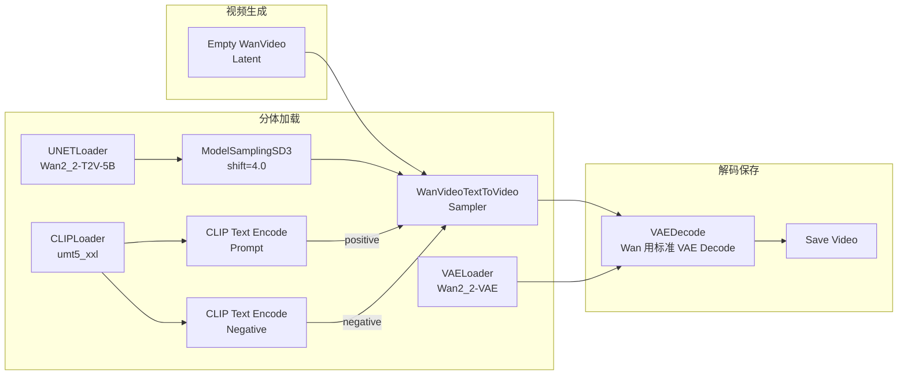
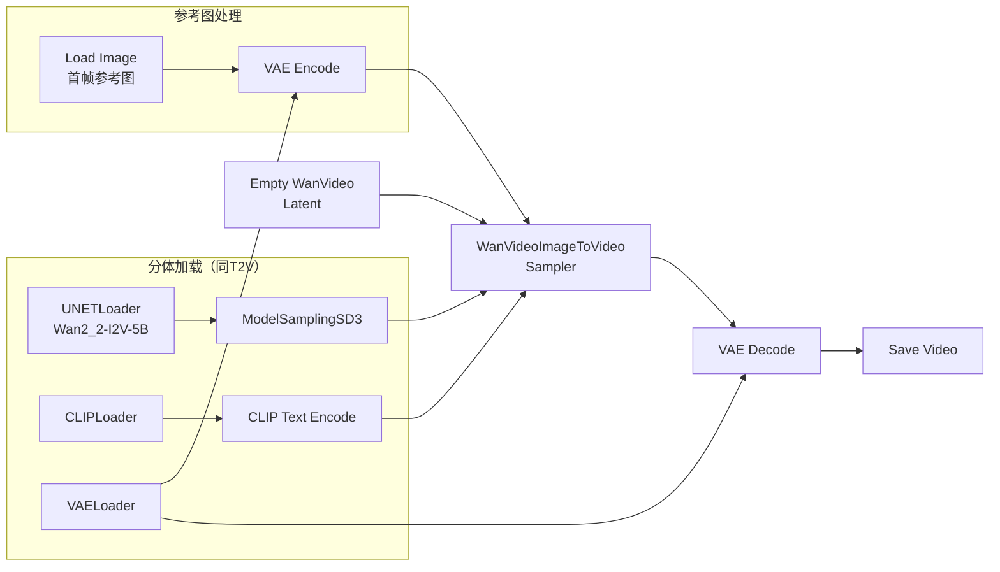
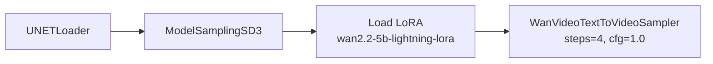

# Wan 2.2 视频生成——从入门到精通

> **前置**：已掌握文生图基础操作。Wan 2.2 是阿里巴巴开源的高质量视频生成模型系列，参数量从 5B 到 14B 可选。
>
> **和 LTX 2.3 最大的区别**：LTX 是一体化加载（CheckpointLoaderSimple），Wan 是**分体加载**——UNET、CLIP、VAE 各需要独立的加载器。这不是更麻烦，而是更灵活。

---

## 一、Wan 2.2 模型家族

### 模型型号选择

| 模型 | 参数量 | 功能 | 显存需求 (fp8) | 质量 |
|:----:|:------:|:----|:--------------:|:----:|
| **Wan 2.2 5B T2V** | 5B | 文本 → 视频 | 12-16GB | ✅ 平衡 |
| **Wan 2.2 5B I2V** | 5B | 图像 + 文本 → 视频 | 12-16GB | ✅ 人像效果好 |
| **Wan 2.2 14B S2V** | 14B | 声音 → 驱动视频 | 32GB+ | ⚠️ 显存极高 |

**5B 版本**是目前主流选择，fp8 量化后 16GB 可用。

### Wan 2.2 vs LTX 2.3 对比

| 差异 | LTX 2.3 | Wan 2.2 |
|:-----|:---------|:---------|
| 参数量 | 22B | 5B / 14B |
| 加载方式 | CheckpointLoaderSimple（一体） | **UNETLoader + CLIPLoader + VAELoader**（分体） |
| 文本编码器 | Gemma 3 12B（~12GB） | **UMT5 XXL**（~8GB） |
| 采样调度 | ModelSamplingLTXV | **ModelSamplingSD3** |
| 文生视频 | LTXVTextToVideoSampler | **WanVideoTextToVideoSampler** |
| 图生视频 | LTXVImageToVideoSampler | **WanVideoImageToVideoSampler** |
| 帧数规则 | 8×N+1 | 4×N+1 |
| 分辨率规则 | 32 的倍数 | **16 的倍数** |
| 轻量化加速 | GGUF 量化 | **Lightning LoRA** |
| 中文支持 | 一般 | **✅ 较好（阿里出品）** |

---

## 二、前置准备

### 2.1 模型下载

```bash
export HF_ENDPOINT=https://hf-mirror.com
```

| 模型文件 | 大小 | 存放路径 | 说明 |
|:---------|:----:|:---------|:------|
| `Wan2_2-T2V-5B-fp8.safetensors` | ~8GB | `models/checkpoints/` | 文生视频模型 |
| `Wan2_2-I2V-5B-fp8.safetensors` | ~8GB | `models/checkpoints/` | 图生视频模型 |
| `Wan2_2-VAE.safetensors` | ~1.5GB | `models/vae/` | VAE 编码器 |
| `umt5_xxl_fp8.safetensors` | ~8GB | `models/clip/` | 文本编码器 |
| `wan2.2-5b-lightning-lora.safetensors`（可选）| ~500MB | `models/loras/` | Lightning 加速 LoRA |

> ⚠️ 注意：Wan 的模型文件是**分体的**—UNET 放 `models/checkpoints/`，VAE 放 `models/vae/`，文本编码器放 `models/clip/`。不是一体文件。

### 2.2 验证 ComfyUI 版本

Wan 2.2 需要 **ComfyUI 0.3.0+**（内置 Wan 节点支持）：

```bash
cd ~/workspace/ComfyUI
git pull origin master
```

### 2.3 安装自定义节点（可选）

```bash
cd custom_nodes/
git clone https://gitclone.com/github.com/kijai/ComfyUI-Wan-Superresolution.git
```

> **ComfyUI-Wan-Superresolution** 提供 Wan 视频超分辨率功能。基础使用不需要这个节点，内置节点就够了。

### 2.4 验证安装

刷新后右键搜索 "WanVideo" → 出现 `WanVideoTextToVideoSampler`、`WanVideoImageToVideoSampler` 等节点 → ✅ 安装成功。

### 2.5 验证模型目录

```
ComfyUI/models/
├── checkpoints/
│   ├── Wan2_2-T2V-5B-fp8.safetensors
│   └── Wan2_2-I2V-5B-fp8.safetensors
├── clip/
│   └── umt5_xxl_fp8.safetensors
├── vae/
│   └── Wan2_2-VAE.safetensors
└── loras/
    └── wan2.2-5b-lightning-lora.safetensors (可选)
```

---

## 三、分体加载原理——Wan 和 LTX 的核心区别

### 为什么 Wan 要分体加载？

LTX 22B 是一个**一体化的 Checkpoint**——UNET、CLIP、VAE 全部打包在同一个文件里。`CheckpointLoaderSimple` 一次加载三者。

Wan 5B 把这些拆开了：

```
Wan 的模型构成：
  ├── UNET (核心生成网络)    → UNETLoader     → checkpoints/
  ├── UMT5 (文本编码器)      → CLIPLoader     → clip/
  └── VAE (编解码)           → VAELoader      → vae/
```

**分体的好处**：
1. 想升级某个组件不需要重新下载整个模型（如换 VAE）
2. 可以用不同的精度（UNET 用 fp8，VAE 用 fp16）
3. 内存管理更灵活

**分体的麻烦**：
1. 需要 3 个加载器节点
2. 需要跟踪不同的目录
3. 少一个就全红

---

## 四、文生视频工作流（T2V）

### 4.1 完整工作流连线图



### 4.2 节点详解

#### UNETLoader（加载生成网络）

右键 → 搜索 "UNETLoader"。

| 参数 | 说明 |
|:-----|:------|
| `unet_name` | 选择 `Wan2_2-T2V-5B-fp8.safetensors` 或 `Wan2_2-I2V-5B-fp8.safetensors` |
| 输出 | MODEL（🟣 紫色）→ 连接 ModelSamplingSD3 |

> 📌 选择 T2V 还是 I2V 版本取决于你要做文生视频还是图生视频。之后 KSampler 也需要对应切换。

#### CLIPLoader（加载文本编码器）

右键 → 搜索 "CLIPLoader"。

| 参数 | 说明 |
|:-----|:------|
| `clip_name` | 选择 `umt5_xxl_fp8.safetensors` |
| `type` | 自动或 umt5 |
| 输出 | CLIP（🩷 粉色）→ 连接 CLIP Text Encode 节点 |

> ⚠️ UMT5 不是标准 CLIP 编码器，但 ComfyUI 中用同一个端口类型。

#### VAELoader（加载 VAE）

右键 → 搜索 "VAELoader"。

| 参数 | 说明 |
|:-----|:------|
| `vae_name` | 选择 `Wan2_2-VAE.safetensors` |
| 输出 | VAE（🟡 黄色）→ 连接 VAE Decode |

#### ModelSamplingSD3（采样调度）

| 参数 | 推荐值 | 范围 | 说明 |
|:-----|:------:|:----:|:------|
| `model` | UNETLoader 的 MODEL | — | 输入 |
| `shift` | 4.0 | 2.0-8.0 | 控制视频动态幅度。越高→运动更激烈；越低→更稳定 |

**shift 调优**：

```
shift=2.0 → 非常保守，运动很少（适合静态场景）
shift=4.0 → ✅ 平衡（大多数场景的甜点值）
shift=6.0 → 运动明显，可能不稳定
shift=8.0 → 剧烈运动（可能画面抖动）
```

#### Empty WanVideo Latent（视频潜空间）

右键 → 搜索 "Empty WanVideo"。

| 参数 | 推荐值 | 规则 | 说明 |
|:-----|:------:|:----:|:------|
| `width` | 832 | **16 的倍数** | 分辨率宽 |
| `height` | 480 | **16 的倍数** | 分辨率高 |
| `length` | 81 | **4×N+1** | 帧数 |

**帧数对照表**：

| length | 4×N+1 | 时长 @24fps |
|:------:|:-----:|:-----------:|
| 17 | 4×4+1 | ~0.7s |
| 33 | 8×4+1 | ~1.4s |
| **49** | **12×4+1** | **~2.0s** |
| 65 | 16×4+1 | ~2.7s |
| **81** | **20×4+1** | **~3.4s** |
| 97 | 24×4+1 | ~4.0s |

> 📌 Wan 的帧数规则是 **4×N+1**（LTX 是 8×N+1）。原因是 Wan 的 temporal VAE 下采样因子是 4。

#### WanVideoTextToVideoSampler（文生视频采样器）

右键 → 搜索 "WanVideoText"。

| 参数 | 推荐值 | 范围 | 说明 |
|:-----|:------:|:----:|:------|
| `seed` | -1 或固定 | — | -1=随机，固定可复现 |
| `steps` | 30-50 | 20-100 | 30 步是起点，50 步效果更好 |
| `cfg` | 5.0-6.0 | 2.0-12.0 | 比 LTX 更高（Wan 需要更高 cfg） |
| `sampler_name` | euler | 多种 | euler 兼容性最好 |
| `scheduler` | normal | — | 配合 euler |

#### VAEDecode

Wan 使用**标准的 VAE Decode** 节点（不是 VAE Decode Tiled）：

| 参数 | 说明 |
|:-----|:------|
| `vae` | VAELoader 的 VAE 输出 |
| `samples` | 采样器的 LATENT 输出 |

#### Save Video

| 参数 | 推荐值 |
|:-----|:-------|
| `fps` | 24 |

### 4.3 提示词写法（中文效果更好！）

Wan 2.2 由阿里开发，UMT5 编码器对中文支持很好：

```
Prompt（中文）：
一个年轻女子在雨夜的东京街头漫步，撑着透明雨伞，
镜头缓缓向左平移，4K，高画质，电影级光影

Negative Prompt：
低质量，模糊，扭曲，丑陋，人体畸形，水印，文字
```

**中文 vs 英文**：

| 语言 | 效果 |
|:-----|:------|
| 中文 | ✅ 自然、语义准确（阿里原生支持） |
| 英文 | ✅ 也支持但可能不如中文细腻 |

### 4.4 手把手操作（文生视频）

**Step 1**：右键 → 搜索 "UNETLoader" → 选择 `Wan2_2-T2V-5B-fp8`

**Step 2**：右键 → 搜索 "CLIPLoader" → 选择 `umt5_xxl_fp8`

**Step 3**：右键 → 搜索 "VAELoader" → 选择 `Wan2_2-VAE`

**Step 4**：右键 → 搜索 "ModelSamplingSD3" → shift=4.0

**Step 5**：右键 → 搜索 "Empty WanVideo Latent" → width=832, height=480, length=81

**Step 6**：右键 → 添加 2 个 "CLIP Text Encode (Prompt)" → 一个写正面、一个写负面

**Step 7**：右键 → 搜索 "WanVideoTextToVideoSampler" → steps=30, cfg=5.0

**Step 8**：右键 → 搜索 "VAEDecode"（标准 VAE Decode）

**Step 9**：右键 → 搜索 "Save Video"

**Step 10**：连线

```
UNETLoader.MODEL → ModelSamplingSD3.model → WanVideoTextToVideoSampler.model
CLIPLoader.CLIP → CLIP Text Encode (Prompt).clip
                  → CLIP Text Encode (Negative).clip
CLIP Text Encode (正面).CONDITIONING → WanVideoTextToVideoSampler.positive
CLIP Text Encode (负面).CONDITIONING → WanVideoTextToVideoSampler.negative
Empty WanVideo Latent.latent → WanVideoTextToVideoSampler.latent
VAELoader.VAE → VAEDecode.vae
WanVideoTextToVideoSampler.latent → VAEDecode.samples
VAEDecode.IMAGE → Save Video.images
```

**Step 11**：点击 Queue Prompt → 等待生成（Wan 5B 比 LTX 22B 快不少）

---

## 五、图生视频工作流（I2V）

### 5.1 与文生视频的区别

| 差异 | T2V | I2V |
|:-----|:---:|:---:|
| UNET 模型 | `Wan2_2-T2V-5B-fp8` | `Wan2_2-I2V-5B-fp8` |
| 采样器 | `WanVideoTextToVideoSampler` | **`WanVideoImageToVideoSampler`** |
| 额外节点 | 无 | **Load Image** + VAE Encode |
| 提示词重点 | 描述场景+运动 | **描述运动**（场景在图片里）|

### 5.2 完整工作流



### 5.3 新增节点

#### Load Image

加载你的参考图片（视频的第一帧）。

#### VAE Encode

| 参数 | 说明 |
|:-----|:------|
| `vae` | VAELoader 的 VAE 输出 |
| `pixels` | Load Image 的 IMAGE |

**输出** → 连接 WanVideoImageToVideoSampler 的 `image` 端口。

#### WanVideoImageToVideoSampler

| 参数 | 推荐值 | 范围 | 说明 |
|:-----|:------:|:----:|:------|
| `steps` | 40-60 | 20-100 | 图生视频比文生视频多 10-20 步 |
| `cfg` | 5.0-6.0 | — | 同 T2V |
| `image_noise_scale` | 0.05-0.15 | 0.0-1.0 | 控制首帧保留程度 |

### 5.4 提示词技巧

图生视频的提示词**只描述运动**，场景信息已经包含在参考图片中：

```
✅ 正确示例：
"镜头缓缓右移，窗帘随风飘动，光线透过窗户变化"

❌ 错误示例：
"一个房间里有窗帘和窗户"（场景在图片里）
```

### 5.5 参考图要求

| 要求 | 说明 |
|:-----|:------|
| 分辨率 | 与生成分辨率一致（至少比例一致）|
| 内容 | 画面清晰，构图明确 |
| 长宽比 | 与 Empty WanVideo Latent 的 width/height 比例匹配 |

---

## 六、首帧过烤问题修复

### 6.1 什么是首帧过烤？

图生视频（I2V）时，模型生成的视频首帧和参考图片**不完全一样**——AI 对首帧进行了"再加工"，导致首帧被过度修改（俗称"过烤"）。

### 6.2 症状

```
参考图片：一张清晰的猫的照片
I2V 生成：
  第 1 帧 → 猫的毛色变了，耳朵角度不同 ← 过烤了！
  第 2 帧 → ...
```

### 6.3 修复方法

**方法 1**：降低 `image_noise_scale` 到 0.05-0.1

| image_noise_scale | 效果 |
|:-----------------:|:------|
| 0.0 | 严格保持首帧（但可能和后续帧衔接不自然）|
| 0.05-0.1 | ✅ 保留首帧 + 自然运动过渡 |
| 0.1-0.2 | 轻度修改首帧 |
| >0.3 | 首帧可能被大幅修改 |

**方法 2**：使用 LatentCut + LatentConcat（需要 `ComfyUI-KJNodes`）

```
Load Image → VAE Encode → LatentCut ──→ LatentConcat → ImageToVideoSampler
Empty WanVideo Latent ─────────────┘
```

LatentCut 从参考图中提取潜空间特征，LatentConcat 将其与生成的视频潜空间拼接。这样模型不会再修改首帧，因为它已经有了精确的潜空间表示。

### 6.4 需要安装的节点

```bash
git clone https://gitclone.com/github.com/kijai/ComfyUI-KJNodes.git
```

> 💡 先试方法 1（降低 `image_noise_scale`），如果还不够再使用方法 2。

---

## 七、Lightning LoRA 加速——轻量路径

### 7.1 什么时候需要？

| 情况 | 使用 Lightning LoRA？ |
|:-----|:--------------------:|
| 显存刚好够（12-16GB）| ✅ 推荐 |
| 需要快速迭代测试 | ✅ 推荐 |
| 追求最高质量 | ❌ 标准路径更好 |
| 生成时间太长（>10 分钟）| ✅ 推荐 |

### 7.2 原理

Lightning LoRA 是一个**蒸馏 LoRA**——把高质量模型"知识"压缩到 4 步能出片。配合 CFG≈1.0，显存降低约 30%。

### 7.3 工作流改动

在原文生视频/图生视频的基础上，增加一个 `Load LoRA` 节点：



### 7.4 参数

| 节点 | 参数 | 值 |
|:-----|:-----|:---|
| Load LoRA | `lora_name` | `wan2.2-5b-lightning-lora.safetensors` |
| | `strength_model` | 1.0 |
| WanVideoTextToVideoSampler | `steps` | 4 |
| | `cfg` | 1.0 |
| | `sampler_name` | euler |

> ⚡ **Lightning 效果对比**：标准路径（50 步, cfg=5.0）→ 质量最好 → 耗时 ~5min；Lightning 路径（4 步, cfg=1.0）→ 质量可接受 → 耗时 ~1min。

---

## 八、场景参数速查表

| 场景 | 模式 | 模型 | steps | cfg | shift | image_noise | 帧数 | 分辨率 |
|:-----|:----:|:----|:----:|:----:|:----:|:-----------:|:----:|:------:|
| 🏃 **文生视频（标准）** | T2V | T2V | 50 | 5.0 | 4.0 | — | 81 | 832×480 |
| 🧑 **图生视频（标准）** | I2V | I2V | 50 | 5.0 | 4.0 | 0.1 | 81 | 832×480 |
| ⚡ **文生视频（Lightning）** | T2V + LoRA | T2V | 4 | 1.0 | 4.0 | — | 81 | 832×480 |
| 🫳 **图生视频（Lightning）** | I2V + LoRA | I2V | 4 | 1.0 | 4.0 | 0.05 | 81 | 832×480 |
| 🎬 **高质慢速** | T2V | T2V | 70 | 6.0 | 5.0 | — | 49 | 1280×768 |
| 📱 **快速测试** | T2V | T2V | 20 | 4.0 | 3.0 | — | 17 | 640×384 |

---

## 九、常见问题排查

| 问题 | 原因 | 解决 |
|:-----|:-----|:------|
| 🔴 **UNETLoader 找不到模型** | 模型在 `models/checkpoints/` 但 UNETLoader 搜索不到 | 刷新 ComfyUI 或重启 |
| 🔴 **CLIPLoader 报错** | UMT5 模型没放在 `models/clip/` | 检查目录：`models/clip/umt5_xxl_fp8.safetensors` |
| 🔴 **WanVideo...Sampler 找不到** | ComfyUI 版本低于 0.3.0 | `git pull origin master` 更新 |
| 🔴 **分体加载显示 Missing Node** | 缺少分体加载器节点 | 确认 ComfyUI 版本 ≥ 0.3.0 |
| 🔴 **视频生成 OOM** | 分辨率或帧数太高 | 降到 640×384，length=33-49 |
| 🔴 **运动不连贯** | steps 太少或 cfg 太低 | steps ≥ 40，cfg ≥ 4.0 |
| 🔴 **视频全黑** | VAE 没连接 | 检查 VAELoader 到 VAE Decode 的黄色线 |
| 🔴 **I2V 首帧过烤严重** | image_noise_scale 太高 | 降到 0.05-0.1 |
| 🔴 **I2V 首帧完全保留但后续帧闪烁** | image_noise_scale=0 | 提到 0.05-0.15 加一点噪声 |
| 🔴 **Lightning LoRA 效果很差** | 步骤没设置成 4 步 | 确认 steps=4，cfg=1.0 |
| 🔴 **Lightning LoRA 加载失败** | LoRA 文件不在 `models/loras/` | 下载后放入正确目录 |
| 🔴 **提示词写了中文但效果不好** | 中文描述不够具体 | 加入更多运动描述（"向左缓缓平移"）|
| 🔴 **ModelSamplingSD3 shift 太高导致画面抖动** | shift > 6.0 | 降低到 4.0 |
| 🔴 **帧数报错** | length 不满足 4×N+1 | 选 17/33/49/65/81/97 等 |

---

## 十、Wan 2.2 vs LTX 2.3 选型指南

| 场景 | 推荐模型 | 理由 |
|:-----|:---------|:------|
| 🥇 **追求最高质量** | Wan 2.2 T2V 5B | 细节更丰富，运动更自然 |
| ⚡ **追求生成速度** | Wan 2.2 + Lightning LoRA | 4 步出片，远快于 LTX |
| 🎨 **图生视频** | Wan 2.2 I2V 5B | 首帧保留好，过烤易修复 |
| 💾 **显存受限 (≤16GB)** | Wan 2.2 5B fp8 | 比 LTX 22B 轻很多 |
| 🎯 **长视频** | LTX 2.3 | 支持长达 201 帧（~8s）|
| 🏠 **中文提示词友好** | Wan 2.2 | 阿里出品，中文语义理解更好 |
| 🧪 **快速测试迭代** | Wan 2.2 + Lightning LoRA | 1 分钟内出片 |
| 🖥️ **高分辨率出片** | LTX 2.3（两阶段） | 支持潜空间放大到 1280+ |

---

## 十一、检查清单

在点击 Queue Prompt 前确认：

- [ ] ComfyUI 版本 ≥ 0.3.0（内置 Wan 节点支持）
- [ ] 三个分体模型都已下载：UNET + UMT5 + VAE
- [ ] UNET 模型放在 `models/checkpoints/`
- [ ] UMT5 模型放在 `models/clip/`
- [ ] VAE 模型放在 `models/vae/`
- [ ] T2V 使用 `WanVideoTextToVideoSampler`，I2V 使用 `WanVideoImageToVideoSampler`
- [ ] T2V 使用 `Wan2_2-T2V-5B`，I2V 使用 `Wan2_2-I2V-5B`
- [ ] ModelSamplingSD3 已连接并在 UNETLoader 和 KSampler 之间
- [ ] shift 值在 3.0-6.0 之间
- [ ] Empty WanVideo Latent 的 width/height 是 **16 的倍数**
- [ ] length 满足 **4×N+1**
- [ ] VAELoader 的 VAE 连接到了 VAEDecode
- [ ] I2V 时：Load Image → VAE Encode → WanVideoImageToVideoSampler
- [ ] 如果使用 Lightning LoRA：steps=4, cfg=1.0
- [ ] 如果首帧过烤：image_noise_scale=0.05-0.1
- [ ] 没有红色连线或红色节点

---

> **进阶小贴士**：Wan 2.2 和 LTX 2.3 各有优势，两者之间切换只需要理解"分体加载 vs 一体加载、4×N+1 vs 8×N+1、ModelSamplingSD3 vs ModelSamplingLTXV"这三点差异。同时装了两种模型后，可以对比同样的 prompt 在两者上的效果差异。
