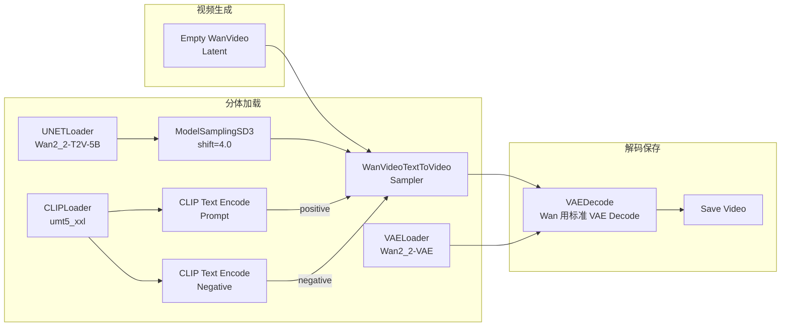

# Wan 2.2 文生视频工作流（T2V）

> **前置**：已下载 Wan 模型并安装节点（详见 [环境准备与模型部署](02-环境准备与模型部署.md)）。

---

## 一、完整工作流



---

## 二、节点详解

### 1. UNETLoader（加载生成网络）

右键 → 搜索 `UNETLoader`。

| 参数 | 说明 |
|:-----|:------|
| `unet_name` | 选择 `Wan2_2-T2V-5B-fp8.safetensors` |
| 输出 | MODEL（🟣 紫色）→ 连接 ModelSamplingSD3 |

> 📌 如果之后要做图生视频，这里要换 `Wan2_2-I2V-5B-fp8`。

### 2. CLIPLoader（加载文本编码器）

右键 → 搜索 `CLIPLoader`。

| 参数 | 说明 |
|:-----|:------|
| `clip_name` | 选择 `umt5_xxl_fp8.safetensors` |
| `type` | 自动或 umt5 |
| 输出 | CLIP（🩷 粉色）→ 连接 CLIP Text Encode 节点 |

> ⚠️ UMT5 不是标准 CLIP 编码器，但 ComfyUI 中用同一个端口类型。

### 3. VAELoader（加载 VAE）

右键 → 搜索 `VAELoader`。

| 参数 | 说明 |
|:-----|:------|
| `vae_name` | 选择 `Wan2_2-VAE.safetensors` |
| 输出 | VAE（🟡 黄色）→ 连接 VAE Decode |

### 4. ModelSamplingSD3（采样调度）

Wan 专用的采样调度器，控制视频的动态幅度。

| 参数 | 推荐值 | 范围 | 说明 |
|:-----|:------:|:----:|:------|
| `model` | UNETLoader 的 MODEL | — | 输入 |
| `shift` | 4.0 | 2.0-8.0 | 控制视频运动幅度 |

**shift 调优**：

```
shift=2.0 → 非常保守，运动很少（适合静态场景）
shift=4.0 → ✅ 平衡（大多数场景的甜点值）
shift=6.0 → 运动明显，可能不稳定
shift=8.0 → 剧烈运动（可能画面抖动）
```

### 5. Empty WanVideo Latent（视频潜空间）

右键 → 搜索 `Empty WanVideo`。

| 参数 | 推荐值 | 规则 | 说明 |
|:-----|:------:|:----:|:------|
| `width` | 832 | **16 的倍数** | 分辨率宽 |
| `height` | 480 | **16 的倍数** | 分辨率高 |
| `length` | 81 | **4×N+1** | 帧数 |

> 💡 帧数规则详见 [核心概念与选型指南](01-Wan-核心概念与选型指南.md)

### 6. WanVideoTextToVideoSampler（文生视频采样器）

右键 → 搜索 `WanVideoText`。

| 参数 | 推荐值 | 范围 | 说明 |
|:-----|:------:|:----:|:------|
| `seed` | -1 或固定 | — | -1=随机，固定可复现 |
| `steps` | 30-50 | 20-100 | 30 步是起点，50 步效果更好 |
| `cfg` | 5.0-6.0 | 2.0-12.0 | 比 LTX 更高（Wan 需要更高 cfg） |
| `sampler_name` | euler | 多种 | euler 兼容性最好 |
| `scheduler` | normal | — | 配合 euler |

### 7. VAEDecode

Wan 使用**标准的 VAE Decode** 节点（不是 VAE Decode Tiled）。

### 8. Save Video

| 参数 | 推荐值 |
|:-----|:-------|
| `fps` | 24 |

---

## 三、手把手操作 12 步

**Step 1**：右键 → 搜索 `UNETLoader` → 选择 `Wan2_2-T2V-5B-fp8`

**Step 2**：右键 → 搜索 `CLIPLoader` → 选择 `umt5_xxl_fp8`

**Step 3**：右键 → 搜索 `VAELoader` → 选择 `Wan2_2-VAE`

**Step 4**：右键 → 搜索 `ModelSamplingSD3` → shift=4.0

**Step 5**：右键 → 搜索 `Empty WanVideo Latent` → width=832, height=480, length=81

**Step 6**：右键 → 添加 2 个 `CLIP Text Encode (Prompt)` → 一个写正面、一个写负面

**Step 7**：右键 → 搜索 `WanVideoTextToVideoSampler` → steps=30, cfg=5.0

**Step 8**：右键 → 搜索 `VAEDecode`（标准 VAE Decode）

**Step 9**：右键 → 搜索 `Save Video` → fps=24

**Step 10**：连线

```text
UNETLoader.MODEL → ModelSamplingSD3.model → WanVideoTextToVideoSampler.model
CLIPLoader.CLIP → CLIP Text Encode (Prompt).clip
                  → CLIP Text Encode (Negative).clip
CLIP Text Encode (正面).CONDITIONING → WanVideoTextToVideoSampler.positive
CLIP Text Encode (负面).CONDITIONING → WanVideoTextToVideoSampler.negative
Empty WanVideo Latent.latent → WanVideoTextToVideoSampler.latent
VAELoader.VAE → VAEDecode.vae
WanVideoTextToVideoSampler.latent → VAEDecode.samples
VAEDecode.IMAGE → Save Video.images
```

**Step 11**：点击 Queue Prompt → 等待生成

**Step 12**：查看结果，调整参数后重新生成

---

## 四、提示词写法（中文效果更好！）

Wan 2.2 由阿里开发，UMT5 编码器对中文支持很好。

```
Prompt（中文）：
一个年轻女子在雨夜的东京街头漫步，撑着透明雨伞，
镜头缓缓向左平移，4K，高画质，电影级光影

Negative Prompt：
低质量，模糊，扭曲，丑陋，人体畸形，水印，文字
```

**中文 vs 英文**：

| 语言 | 效果 |
|:-----|:------|
| 中文 | ✅ 自然、语义准确（阿里原生支持） |
| 英文 | ✅ 也支持但可能不如中文细腻 |

**提示词四要素**：

```
主体 + 场景 + 运动 + 画质
↓       ↓      ↓      ↓
"一个女子  在雨夜  镜头右移  电影级光影"
```

---

## 五、检查清单

- [ ] UNETLoader 使用了正确的 T2V 模型
- [ ] CLIPLoader、VAELoader、UNETLoader 三者都连接到位
- [ ] ModelSamplingSD3 插在 UNETLoader 和 KSampler 之间
- [ ] shift 值在 3.0-6.0 之间
- [ ] width/height 是 16 的倍数
- [ ] length 满足 4×N+1（推荐 81）
- [ ] VAELoader.VAE 连接到了 VAEDecode
- [ ] 没有红色连线或红色节点
- [ ] 提示词包含运动描述（"向左平移""飘动"等）
- [ ] 视频帧数不要超过显存限制（初次选 33-49 帧）

---

> **下一步**：[图生视频工作流 I2V](04-图生视频工作流I2V.md) → 用参考图片生成视频
