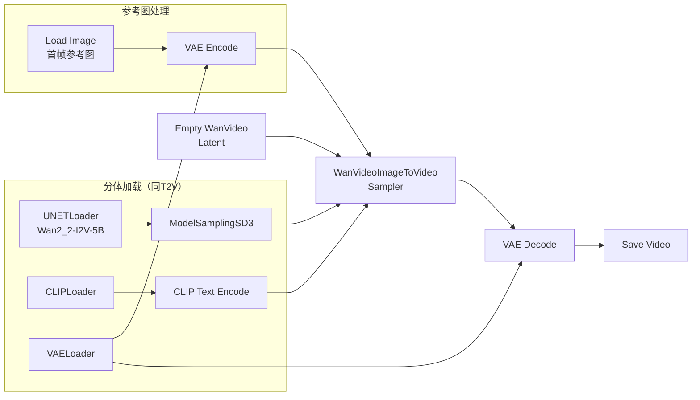

# Wan 2.2 图生视频工作流（I2V）

> **前置**：已掌握 [文生视频 T2V 工作流](03-文生视频工作流T2V.md)。I2V 在 T2V 基础上增加了图片输入。

---

## 一、与文生视频的区别

| 差异 | T2V | I2V |
|:-----|:---:|:---:|
| UNET 模型 | `Wan2_2-T2V-5B-fp8` | `Wan2_2-I2V-5B-fp8` |
| 采样器 | `WanVideoTextToVideoSampler` | **`WanVideoImageToVideoSampler`** |
| 额外节点 | 无 | **Load Image** + VAE Encode |
| 提示词重点 | 描述场景+运动 | **描述运动**（场景在图片里） |

---

## 二、完整工作流



---

## 三、新增节点详解

### 1. Load Image

右键 → 搜索 `Load Image`。加载你的参考图片（视频的第一帧）。

**参考图要求**：

| 要求 | 说明 |
|:-----|:------|
| 分辨率 | 与生成分辨率一致（至少比例一致） |
| 内容 | 画面清晰，构图明确 |
| 长宽比 | 与 Empty WanVideo Latent 的 width/height 比例匹配 |

### 2. VAE Encode

右键 → 搜索 `VAE Encode`。

| 参数 | 说明 |
|:-----|:------|
| `vae` | VAELoader 的 VAE 输出 |
| `pixels` | Load Image 的 IMAGE |
| **输出** | LATENT → WanVideoImageToVideoSampler 的 `image` 端口 |

### 3. WanVideoImageToVideoSampler

右键 → 搜索 `WanVideoImage`。

| 参数 | 推荐值 | 范围 | 说明 |
|:-----|:------:|:----:|:------|
| `steps` | 40-60 | 20-100 | 图生视频比文生视频多 10-20 步 |
| `cfg` | 5.0-6.0 | — | 同 T2V |
| `image_noise_scale` | 0.05-0.15 | 0.0-1.0 | 控制首帧保留程度 |

---

## 四、提示词技巧

图生视频的提示词**只描述运动**，场景信息已经包含在参考图片中：

```
✅ 正确示例：
"镜头缓缓右移，窗帘随风飘动，光线透过窗户变化"

❌ 错误示例：
"一个房间里有窗帘和窗户"（场景在图片里）
```

---

## 五、首帧过烤问题修复

### 5.1 什么是首帧过烤？

图生视频（I2V）时，模型生成的视频首帧和参考图片**不完全一样**——AI 对首帧进行了"再加工"，导致首帧被过度修改（俗称"过烤"）。

### 5.2 症状

```
参考图片：一张清晰的猫的照片
I2V 生成：
  第 1 帧 → 猫的毛色变了，耳朵角度不同 ← 过烤了！
  第 2 帧 → ...
```

### 5.3 修复方法

**方法 1（推荐）**：降低 `image_noise_scale` 到 0.05-0.1

| image_noise_scale | 效果 |
|:-----------------:|:------|
| 0.0 | 严格保持首帧（但可能和后续帧衔接不自然） |
| 0.05-0.1 | ✅ 保留首帧 + 自然运动过渡 |
| 0.1-0.2 | 轻度修改首帧 |
| >0.3 | 首帧可能被大幅修改 |

**方法 2**：使用 LatentCut + LatentConcat（需要 `ComfyUI-KJNodes`）

```
Load Image → VAE Encode → LatentCut ──→ LatentConcat → ImageToVideoSampler
Empty WanVideo Latent ─────────────┘
```

LatentCut 从参考图中提取潜空间特征，LatentConcat 将其与生成的视频潜空间拼接。这样模型不会再修改首帧，因为它已经有了精确的潜空间表示。

### 5.4 需要安装的节点

```bash
git clone https://gitclone.com/github.com/kijai/ComfyUI-KJNodes.git
```

> 💡 先试方法 1（降低 `image_noise_scale`），如果还不够再使用方法 2。

---

## 六、检查清单

- [ ] UNETLoader 使用了 **I2V 模型**（`Wan2_2-I2V-5B`），不是 T2V 模型
- [ ] 采样器使用了 `WanVideoImageToVideoSampler`（不是 TextToVideo）
- [ ] 添加了 Load Image + VAE Encode
- [ ] VAE Encode 的输出连接到了采样器的 `image` 端口
- [ ] image_noise_scale 在 0.05-0.15 之间
- [ ] 提示词**只描述运动**，不重复场景描述
- [ ] 参考图分辨率比例与生成分辨率一致
- [ ] 参考图清晰、构图明确

---

> **下一步**：[Lightning 加速与场景参数](05-Lightning加速与场景参数.md) → 加速生成、场景参数速查
