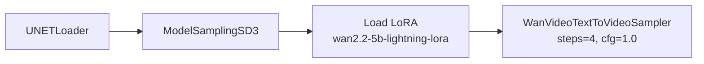

# Wan 2.2 Lightning 加速与场景参数

> **前置**：已掌握 T2V 和 I2V 工作流。Lightning LoRA 适用于需要**快速迭代**或**显存受限**的场景。

---

## 一、什么时候需要 Lightning LoRA？

| 情况 | 使用 Lightning LoRA？ |
|:-----|:--------------------:|
| 显存刚好够（12-16GB） | ✅ 推荐 |
| 需要快速迭代测试 | ✅ 推荐 |
| 追求最高质量 | ❌ 标准路径更好 |
| 生成时间太长（>10 分钟） | ✅ 推荐 |

---

## 二、原理

Lightning LoRA 是一个**蒸馏 LoRA**——把高质量模型的"知识"压缩到 4 步就能出片。配合 CFG≈1.0，显存降低约 30%。

> ⚡ **效果对比**：
> - 标准路径（50 步, cfg=5.0）→ 质量最好 → 耗时 ~5min
> - Lightning 路径（4 步, cfg=1.0）→ 质量可接受 → 耗时 ~1min

---

## 三、工作流改动

在原文生视频（T2V）或图生视频（I2V）的 UNETLoader 和 KSampler 之间，插入 `Load LoRA` 节点：

---

## 四、参数设置

| 节点 | 参数 | 值 |
|:-----|:-----|:---|
| Load LoRA | `lora_name` | `wan2.2-5b-lightning-lora.safetensors` |
| | `strength_model` | 1.0 |
| WanVideoTextToVideoSampler | `steps` | **4**（必须 4 步） |
| | `cfg` | **1.0**（必须 1.0） |
| | `sampler_name` | euler |
| WanVideoImageToVideoSampler（I2V 版） | `steps` | **4** |
| | `cfg` | **1.0** |
| | `image_noise_scale` | 0.05（更小的噪声） |

> ⚠️ **关键**：Lightning LoRA 必须配合 steps=4 和 cfg=1.0，不能随意调整。用了其他步数或 cfg 值，效果会很差。

---

## 五、场景参数速查表

| 场景 | 模式 | 模型 | steps | cfg | shift | image_noise | 帧数 | 分辨率 |
|:-----|:----:|:----|:----:|:----:|:----:|:-----------:|:----:|:------:|
| 🏃 **文生视频（标准）** | T2V | T2V | 50 | 5.0 | 4.0 | — | 81 | 832×480 |
| 🧑 **图生视频（标准）** | I2V | I2V | 50 | 5.0 | 4.0 | 0.1 | 81 | 832×480 |
| ⚡ **文生视频（Lightning）** | T2V + LoRA | T2V | **4** | **1.0** | 4.0 | — | 81 | 832×480 |
| 🫳 **图生视频（Lightning）** | I2V + LoRA | I2V | **4** | **1.0** | 4.0 | 0.05 | 81 | 832×480 |
| 🎬 **高质慢速** | T2V | T2V | 70 | 6.0 | 5.0 | — | 49 | 1280×768 |
| 📱 **快速测试** | T2V | T2V | 20 | 4.0 | 3.0 | — | 17 | 640×384 |

---

## 六、Lightning vs 标准：实战对比

| 维度 | 标准路径 | Lightning 路径 |
|:-----|:--------:|:--------------:|
| steps | 30-50 | **4** |
| cfg | 5.0-6.0 | **1.0** |
| 生成时间（81帧, 832×480）| ~5 分钟 | ~1 分钟 |
| 显存消耗 | ~15-16GB | ~11-12GB |
| 运动细节 | 丰富 | 较少但可接受 |
| 首帧保持（I2V）| 好 | 较好 |
| 适用范围 | 最终出片 | 快速测试、迭代 |

---

## 七、常见 Lightning 问题

| 问题 | 原因 | 解决 |
|:-----|:-----|:------|
| Lightning LoRA 效果很差 | 步骤没设置成 4 步 | 确认 steps=4, cfg=1.0 |
| Lightning LoRA 加载失败 | LoRA 文件不在 `models/loras/` | 下载后放入正确目录 |
| Lightning 视频模糊 | 蒸 LoRA 本身质量上限不如标准 | 用作测试，最终出片用标准 |
| T2V 可以但 I2V Lightning 崩 | I2V + Lightning 兼容性略差 | 降 image_noise_scale 到 0.05 |
| Load LoRA 后 UNET 端口不对 | LoRA 节点插入位置错误 | Load LoRA 接在 ModelSamplingSD3 之后 |

---

> **下一步**：[进阶技巧与故障排除](06-进阶技巧与故障排除.md) → 常见问题排查、检查清单、进阶技巧
