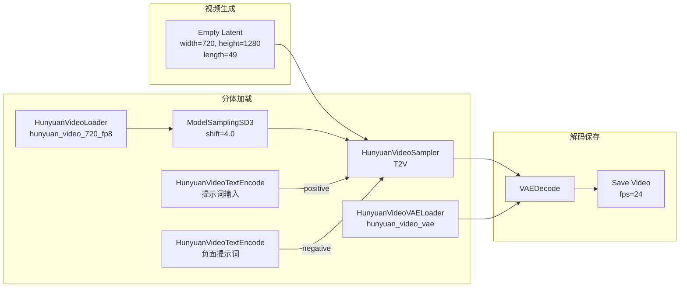

# HunyuanVideo 文生视频工作流（T2V）

> **前置**：已完成 [环境准备与模型部署](02-环境准备与模型部署.md)，ComfyUI 已重启，节点搜索正常。
>
> **和 Wan T2V 的差异**：Wan 使用 ComfyUI 内置节点，HunyuanVideo 使用 **Kijai 的自定义节点**。HunyuanVideo 采用**双文本编码器**（CLIP-L + T5-XXL），帧数规则为 **8×N+1**（与 LTX 相同）。

---

## 一、完整工作流



---

## 二、节点详解

### 1. HunyuanVideoLoader（加载主模型）

右键 → 搜索 `HunyuanVideoLoader`。

| 参数 | 说明 |
|:-----|:------|
| `model_name` | 选择 `hunyuan_video_720_fp8.safetensors` |
| `precision` | 选择 `fp8`（推荐）或 `bf16` 等 |
| 输出 | MODEL（🟣 紫色）→ 连接 ModelSamplingSD3 |

> 📌 **精度选择**：
> - `fp8` → 显存约 12GB，质量良好
> - `bf16` → 显存约 20GB+，质量最佳
> - 如果使用蒸馏版本，选择对应的 checkpoint

### 2. HunyuanVideoTextEncode（文本编码）

右键 → 搜索 `HunyuanVideoTextEncode`。

**注意**：HunyuanVideo 使用**双文本编码器**（CLIP-L + T5-XXL），因此这个节点可能比标准的 CLIP Text Encode 更复杂，需要加载两个编码器或已预处理的嵌入。

| 参数 | 推荐值 | 说明 |
|:-----|:------:|:------|
| `text` | 你的提示词 | 中英文均可，中文效果极佳 |
| `clip` | — | 连接 CLIP 编码器（如有需要） |
| `t5` | — | 连接 T5 编码器（如有需要） |

> ⚠️ **不同版本的 Kijai 节点处理方式可能不同**：
> - 有些版本会内置双编码器，只需输入 text
> - 有些版本需要先分别加载 CLIP 和 T5 编码器，再连接到此节点
> - **请根据实际安装的节点版本确认**

### 3. HunyuanVideoVAELoader（加载 VAE）

右键 → 搜索 `HunyuanVideoVAELoader`。

| 参数 | 说明 |
|:-----|:------|
| `vae_name` | 选择 `hunyuan_video_vae.safetensors` |
| 输出 | VAE（🟡 黄色）→ 连接 VAE Decode |

### 4. ModelSamplingSD3（采样调度）

HunyuanVideo 兼容 **ModelSamplingSD3** 或使用节点自带的采样配置。（部分版本可能不需要此节点——主模型加载器已内置调度设置，请以实际节点为准。）

| 参数 | 推荐值 | 范围 | 说明 |
|:-----|:------:|:----:|:------|
| `model` | HunyuanVideoLoader 的 MODEL | — | 输入 |
| `shift` | 4.0 | 2.0-8.0 | 控制视频运动幅度 |

**shift 调优**：

```text
shift=2.0 → 非常保守，运动很少（适合静态场景）
shift=4.0 → ✅ 平衡（大多数场景的甜点值）
shift=6.0 → 运动明显，可能不稳定
shift=8.0 → 剧烈运动（可能画面抖动）
```

> 📌 如果节点报错说找不到 ModelSamplingSD3 或提示不需要，**直接省略此节点**，将 HunyuanVideoLoader 的 MODEL 直接连接采样器。

### 5. Empty Latent（视频潜空间）

右键 → 搜索 `Empty Latent` 或使用专门的 `HunyuanVideoEmptyLatent`（如有）。

| 参数 | 推荐值 | 规则 | 说明 |
|:-----|:------:|:----:|:------|
| `width` | 720 | **32 的倍数** | 分辨率宽 |
| `height` | 1280 | **32 的倍数** | 分辨率高 |
| `batch_size` / `length` | 49 | **8×N+1** | 帧数（49 = 8×6+1） |

> 💡 **帧数速查**：
> - 快速测试：25（8×3+1）- 约 1 秒
> - 标准：49（8×6+1）- 约 2 秒
> - 高质量：81（8×10+1）- 约 3.4 秒
> - 长视频：129（8×16+1）- 约 5.4 秒

> 📌 注意：部分 Kijai 节点版本使用 `length` 参数而非 `batch_size`，请以实际节点为准。

### 6. HunyuanVideoSampler（文生视频采样器）

右键 → 搜索 `HunyuanVideoSampler`。

| 参数 | 推荐值 | 范围 | 说明 |
|:-----|:------:|:----:|:------|
| `seed` | -1 或固定 | — | -1=随机，固定值可复现 |
| `steps` | 30-50 | 15-100 | 30 步起点，50 步效果更好 |
| `cfg` | 6.0-7.0 | 3.0-12.0 | HunyuanVideo 典型 cfg 较高 |
| `sampler_name` | euler | 多种 | euler 兼容性最好 |
| `scheduler` | normal | — | 配合 euler |

**蒸馏版本参数**（如果使用 distilled checkpoint）：

| 参数 | 蒸馏 8 步版 | 蒸馏 12 步版 | 标准版 |
|:-----|:-----------:|:------------:|:------:|
| `steps` | **8** | **12** | 30-50 |
| `cfg` | 4.0-5.0 | 5.0-6.0 | 6.0-7.0 |

### 7. VAEDecode（解码潜空间）

使用标准的 **VAEDecode** 节点。连接 HunyuanVideoVAELoader 的 VAE 输出。

### 8. Save Video（保存视频）

| 参数 | 推荐值 | 说明 |
|:-----|:------:|:------|
| `fps` | 24 | 标准视频帧率 |

---

## 三、手把手操作步骤

### 步骤一览

**Step 1**：右键 → 搜索 `HunyuanVideoLoader` → 选择 `hunyuan_video_720_fp8` → 精度选 `fp8`

**Step 2**：右键 → 搜索 `HunyuanVideoTextEncode` × 2 个（正面 + 负面提示词）

**Step 3**：右键 → 搜索 `HunyuanVideoVAELoader` → 选择 `hunyuan_video_vae`

**Step 4**：右键 → 搜索 `ModelSamplingSD3` → shift=4.0（如节点需要）

**Step 5**：右键 → 搜索 `Empty Latent` → width=720, height=1280, 帧数=49

**Step 6**：右键 → 搜索 `HunyuanVideoSampler` → steps=30, cfg=6.0

**Step 7**：右键 → 搜索 `VAEDecode`（标准）

**Step 8**：右键 → 搜索 `Save Video` → fps=24

### 连线

```text
HunyuanVideoLoader.MODEL → ModelSamplingSD3.model → HunyuanVideoSampler.model
HunyuanVideoTextEncode(正面).CONDITIONING → HunyuanVideoSampler.positive
HunyuanVideoTextEncode(负面).CONDITIONING → HunyuanVideoSampler.negative
Empty Latent.LATENT → HunyuanVideoSampler.latent
HunyuanVideoVAELoader.VAE → VAEDecode.vae
HunyuanVideoSampler.latent → VAEDecode.samples
VAEDecode.IMAGE → Save Video.images
```

**Step 9**：点击 Queue Prompt → 等待生成

**Step 10**：查看结果，调整参数后重新生成

---

## 四、推荐参数速查

| 参数 | 快速测试 | 标准 | 高质量 |
|:-----|:--------:|:----:|:------:|
| steps | 20-25 | 30 | 50 |
| cfg | 5.0 | 6.0 | 7.0 |
| shift | 3.0 | 4.0 | 5.0 |
| 分辨率 | 576×1024 | 720×1280 | 720×1280 |
| 帧数 | 25 | 49 | 81 |
| 显存需求 | ~10GB | ~12GB | ~14GB |
| 生成时间（参考） | ~1min | ~3min | ~8min |

---

## 五、提示词写法（中英文均可）

HunyuanVideo 由腾讯开发，**中英文提示词均支持**，中文理解能力尤其出色。

### 中文提示词示例

```text
正面提示词：
一个年轻女子在樱花飘落的东京街头漫步，穿着红色和服，
镜头缓缓向右平移，4K，高画质，电影级光影，真实感

负面提示词：
低质量，模糊，扭曲，丑陋，人体畸形，水印，文字，
画面闪烁，色彩失真，过度曝光
```

### 英文提示词示例

```text
Positive prompt:
A young woman walking in a cherry blossom-filled Tokyo street,
wearing a red kimono, camera slowly panning right,
4K, high quality, cinematic lighting, realistic

Negative prompt:
low quality, blurry, distorted, ugly, deformed, watermark,
text, flickering, color distortion, overexposed
```

### 提示词四要素

```text
主体 + 场景 + 运动 + 画质
 ↓      ↓      ↓      ↓
"女子  东京街头  镜头右移  电影级光影"
```

### 提示词注意事项

| 要点 | 说明 |
|:-----|:------|
| **运动描述** | 必须包含（"镜头平移""飘动""缓慢旋转"等） |
| **语言** | 中文效果极佳（腾讯训练数据中中文占比高） |
| **长度** | 20-50 字适中，过长可能稀释注意力 |
| **负面提示词** | 建议简短的 5-10 个负面词 |

> 💡 **运动描述词汇库**：
> - 镜头运动：镜头缓缓右移、推进、拉远、环绕、俯拍
> - 物体运动：飘动、摇曳、流动、旋转、闪烁
> - 场景变化：光线变化、阴影移动、水波荡漾

---

## 六、检查清单

- [ ] HunyuanVideoLoader 使用了 fp8 模型（显存不足时）
- [ ] HunyuanVideoTextEncode 正确连接，提示词已填写
- [ ] 正面提示词和负面提示词都有
- [ ] HunyuanVideoVAELoader 已加载正确的 VAE 文件
- [ ] ModelSamplingSD3（如需要）已连接，shift 在 3.0-5.0 之间
- [ ] Empty Latent 的 width/height 是 **32 的倍数**
- [ ] Empty Latent 的帧数满足 **8×N+1**（推荐 25/49/81）
- [ ] HunyuanVideoSampler 参数已设置（steps 30+, cfg 6.0+）
- [ ] VAEDecode 已连接 VAE
- [ ] Save Video 的 fps 设置为 24
- [ ] 提示词包含运动描述
- [ ] 没有红色连线或红色节点
- [ ] 首次生成使用较低帧数（25-33）测试

---

> **下一步**：[图生视频工作流 I2V](04-图生视频工作流I2V.md) → 用参考图片生成视频