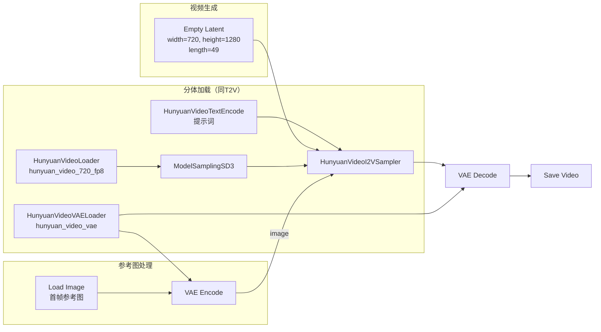

# HunyuanVideo 图生视频工作流（I2V）

> **前置**：已掌握 [文生视频 T2V 工作流](03-文生视频工作流T2V.md)，HunyuanVideo 节点已安装并验证。
>
> **注意**：I2V（图生视频）仅在 **HunyuanVideo-1.5** 中支持，v1.0 没有此功能。使用时需要加载 **I2V 专用的模型文件**（部分版本中 T2V 和 I2V 使用同一主模型，但采样器不同）。

---

## 一、与文生视频（T2V）的区别

| 差异 | T2V | I2V |
|:-----|:---:|:---:|
| 主模型 | 通用或 T2V 专用 | 通用（v1.5 同一主模型支持双模式） |
| 采样器 | **`HunyuanVideoSampler`** | **`HunyuanVideoI2VSampler`** |
| 额外节点 | 无 | **Load Image** + **VAE Encode** |
| 提示词重点 | 描述场景+运动 | **描述运动**（场景信息在参考图片中） |
| 首帧控制 | 无 | 提供参考图片作为首帧 |

> 📌 **重要**：HunyuanVideo-1.5 的同一主模型 `hunyuan_video_720_fp8.safetensors` 同时支持 T2V 和 I2V，只需在采样器上区分即可。部分早期版本可能需要不同的 checkpoint，请以实际节点下拉选项为准。

---

## 二、完整工作流



---

## 三、新增节点详解

### 1. Load Image（加载参考图）

右键 → 搜索 `Load Image`。

加载你的参考图片——它将成为生成视频的**第一帧**。

| 参数 | 说明 |
|:-----|:------|
| `image` | 选择本地图片文件 |
| 输出 | IMAGE（🔴 红色）→ 连接 VAE Encode |

**参考图要求**：

| 要求 | 说明 |
|:-----|:------|
| **分辨率** | 应与生成分辨率比例一致（或使用缩放/裁剪） |
| **比例** | 与 Empty Latent 的 width/height 匹配（推荐 720×1280 或同比例） |
| **内容** | 画面清晰、构图明确 |
| **尺寸** | 建议 720×1280 以内，超过会占用更多显存 |

> 💡 **图片预处理技巧**：
> - 如果参考图尺寸不对，先使用 `Image Resize` 节点调整到目标分辨率
> - 如果参考图比例和生成比例不一致，可先用 `Image Pad for Outpainting` 或 `Crop` 处理

### 2. VAE Encode（潜空间编码）

右键 → 搜索 `VAE Encode`。

将参考图片编码到潜空间，供采样器使用。

| 参数 | 说明 |
|:-----|:------|
| `vae` | HunyuanVideoVAELoader 的 VAE 输出（🟡 黄色） |
| `pixels` | Load Image 的 IMAGE（🔴 红色） |
| **输出** | LATENT → HunyuanVideoI2VSampler 的 `image` 端口 |

### 3. HunyuanVideoI2VSampler（图生视频采样器）

右键 → 搜索 `HunyuanVideoI2VSampler` 或 `HunyuanVideoImageToVideoSampler`（以实际节点名为准）。

| 参数 | 推荐值 | 范围 | 说明 |
|:-----|:------:|:----:|:------|
| `seed` | -1 或固定 | — | -1=随机 |
| `steps` | 40-60 | 20-100 | 图生视频通常比文生视频多 10-20 步 |
| `cfg` | 6.0-7.0 | 3.0-12.0 | 与 T2V 相同范围 |
| `sampler_name` | euler | 多种 | euler 兼容性最好 |
| `scheduler` | normal | — | 配合 euler |
| `image_noise_scale` | 0.1 | 0.0-1.0 | 控制首帧保留程度（详细见下节） |

**蒸馏版本（如果使用 distilled checkpoint）**：

| 参数 | 蒸馏 8 步版 | 蒸馏 12 步版 |
|:-----|:-----------:|:------------:|
| `steps` | **8** | **12** |
| `cfg` | 4.0-5.0 | 5.0-6.0 |

---

## 四、首帧控制说明

### 4.1 image_noise_scale 参数

`image_noise_scale` 是 I2V 中最重要的参数，它控制**模型对参考图的修改程度**：

| image_noise_scale | 效果 |
|:-----------------:|:------|
| **0.0** | 严格保持首帧——但可能和后续帧衔接不自然 |
| **0.05-0.1** | ✅ 保留首帧 + 自然运动过渡 |
| **0.1-0.2** | 轻度修改首帧（推荐） |
| **0.2-0.5** | 大幅修改首帧 |
| **>0.5** | 首帧基本不保留，更像从噪声重建 |

### 4.2 首帧过烤问题

**什么是首帧过烤？**

图生视频（I2V）时，模型会对参考图进行"再加工"。如果修改过多，第一帧和参考图差异很大，称为"过烤"。

**症状**：
```text
参考图片：一只清晰的橘猫坐在窗台上
I2V 生成：
  第 1 帧 → 橘猫变成了三花猫，耳朵角度不同 ← 过烤了！
  第 2 帧 → ...
```

**修复方法**：

**方法 1（推荐）**：降低 `image_noise_scale` 到 0.05-0.1

**方法 2**：提高 cfg 到 7.0-8.0（让模型更遵循提示词，但可能放大过烤）

**方法 3**：如果首帧保留很完美但后续帧与首帧不连贯，**适当提高** image_noise_scale 到 0.15-0.2

### 4.3 首帧过烤 vs 首帧不连贯

```text
症状                      → 解决
─────────────────────────────────
首帧和参考图不一致（过烤） → 降低 image_noise_scale
首帧保留很好但后续闪烁     → 提高 image_noise_scale（加一点噪声）
后续视频和参考图完全无关   → 检查提示词是否写了运动描述
```

---

## 五、提示词技巧

图生视频的提示词**重点描述运动**，场景信息已在参考图片中：

```text
✅ 正确示例（中文）：
"镜头缓缓向右平移，窗帘随风轻轻飘动，光线透过窗户变化"

✅ 正确示例（英文）：
"Camera slowly panning right, curtains gently swaying in the wind,
light changing through the window"

❌ 错误示例：
"一个房间里有窗帘和窗户，光线透过窗户"
（场景信息已经在图片里了，不需要重复描述）
```

### I2V 提示词公式

```text
[运动描述] + [变化描述] + [画质要求]
   ↓            ↓            ↓
"镜头右移   光线变化    4K 高画质"
```

> 💡 **不要描述场景**——图片已经提供了场景信息。你只需要告诉 AI **怎么动**。

---

## 六、检查清单

- [ ] 确认使用的是 **HunyuanVideo-1.5**（v1.0 不支持 I2V）
- [ ] 采样器使用了 **HunyuanVideoI2VSampler**（不是 HunyuanVideoSampler）
- [ ] 添加了 Load Image + VAE Encode 节点
- [ ] VAE Encode 的输出连接到了 I2V 采样器的 `image` 端口
- [ ] image_noise_scale 设置在 0.05-0.2 之间（默认 0.1）
- [ ] 参考图分辨率比例与生成分辨率一致
- [ ] 参考图清晰、构图明确
- [ ] 提示词**只描述运动**，不重复场景描述
- [ ] steps 比 T2V 多 10-20 步（推荐 40+）
- [ ] 没有红色连线或红色节点

---

> **下一步**：[进阶技巧与故障排除](05-进阶技巧与故障排除.md) → fp8 优化、蒸馏加速、常见问题排查