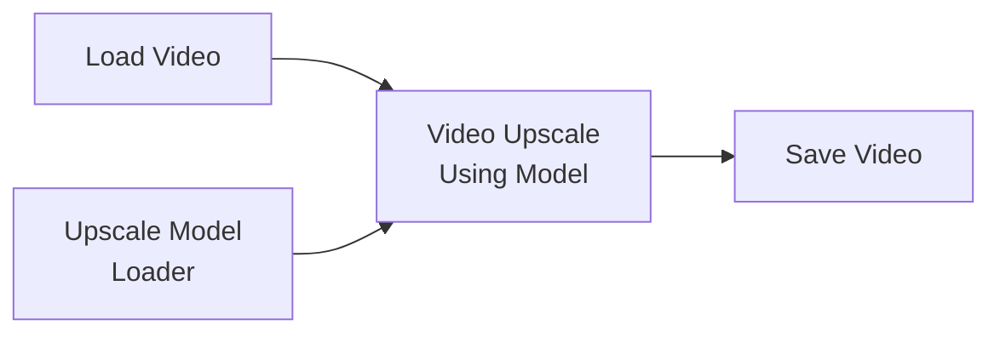

# 视频后处理——帧插值、超分与复合

> **适用范围**：对已经生成好的视频进行后期处理，包括**帧率提升（帧插值）**、**画面放大（超分）** 和**多视频复合**。可以让一段 3 秒的 480p 视频变成 6 秒的 1080p 视频。

---

## 一、为什么需要视频后处理？

ComfyUI 直接生成的视频往往受限于：
- 帧数有限（Wan 最高 ~97 帧，LTX 最高 ~201 帧，约 4-8 秒）
- 分辨率有限（受显存制约，通常 832×480）
- 无法多个视频拼接

**视频后处理可以做到：**
- 帧插值（RIFE/IFNet）：把 24fps 插成 48fps 或 60fps，**时长翻倍**
- 视频超分：把分辨率提升到 1080p/4K
- 拼接/裁剪：多段视频合并或截取

---

## 二、工作流概览


---

## 三、帧插值（Frame Interpolation）

### 3.1 什么是帧插值？

在两个现有帧之间**生成中间帧**，让运动更平滑。常用在：
- 把 24fps 视频插到 48fps 或 60fps（更流畅）
- 把视频时长翻倍（如 3 秒 → 6 秒）
- 慢动作效果

### 3.2 自定义节点安装

推荐使用 **ComfyUI-Frame-Interpolation** 或 **ComfyUI-VideoHelperSuite** 中的帧插值功能：

```bash
cd /path/to/ComfyUI/custom_nodes/
# 方案 1：RIFE（效果最好，推荐）
git clone https://gitclone.com/github.com/Fannovel16/ComfyUI-Frame-Interpolation.git

# 方案 2：VideoHelperSuite（多功能）
git clone https://gitclone.com/github.com/Kosinkadink/ComfyUI-VideoHelperSuite.git
```

> ⚠️ RIFE 需要下载模型文件，首次使用时会自动下载（国内网络可能需要手动下载放入 `ComfyUI/models/rife/`）。

### 3.3 RIFE 帧插值工作流


### 3.4 参数说明

| 参数 | 推荐值 | 说明 |
|:-----|:------:|:------|
| `model` | RIFE v4.7+ | 选择最新版本模型 |
| `multiplier` | 2 | 2× = 帧数翻倍（24→48fps）|
| | | 4× = 帧数四倍（24→96fps） |
| `scale` | 1.0 | 1=不缩放，保持原分辨率 |
| `fast` | True | 快速模式（推荐） |

### 3.5 场景参数

| 场景 | multiplier | 输入 fps | 输出 fps | 效果 |
|:-----|:---------:|:--------:|:--------:|:------|
| 🎬 **流畅化** | 2× | 24 | 48 | 运动更平滑 |
| 🐢 **慢动作** | 4× | 24 | 96 | 时长翻 4 倍（=慢动作）|
| 📹 **标准补帧** | 2× | 30 | 60 | 60fps 流畅体验 |
| ⏪ **慢速慢动作** | 2→4→再输出短帧 | 24 | 48 | 必要帧切出再插值 |

> 📌 慢动作原理：假设你的视频是 24fps 3 秒（72 帧），用 4× 帧插值后变成 288 帧，以 24fps 播放就是 12 秒——画面内容不变但播放延长 4 倍。

---

## 四、视频超分辨率

### 4.1 方案选择

| 方案 | 适用 | 安装 |
|:-----|:-----|:------|
| VideoHelperSuite Upscale | 通用，简单 | 内置 Install |
| | ComfyUI-WanVideoWrapper (FlashVSR) | Wan 视频超分（内置） | `git clone` |
| 图生图放大法 | 效果最好但最慢 | 不需要额外节点 |

### 4.2 VideoHelperSuite 超分



### 4.3 参数

| 参数 | 推荐值 | 说明 |
|:-----|:------:|:------|
| `upscale_model` | 4x-UltraSharp | 与图像放大相同（见[图像放大Upscale](../02-图像生成篇/08-图像放大Upscale.md)）|
| | 4x_NMKD-Superscale-SP | 更自然的放大效果 |
| | 4x-AnimeSharp | 动漫风格视频 |

### 4.4 逐帧图生图放大法（效果最好）

对视频的每一帧进行图生图（低 denoise）处理，同时放大：


此方案需要将视频拆解成单帧图片序列→逐帧图生图放大→重新合并成视频。需要安装 `ComfyUI-VideoHelperSuite`（提供帧序列工具）。

---

## 五、视频复合操作

### 5.1 视频拼接

用 `ComfyUI-VideoHelperSuite` 的 VHS_VideoCombine 可以实现**多个视频拼接**：

| 模式 | 说明 |
|:-----|:------|
| 串联 | 视频 A + 视频 B 首尾相接 |
| 并排 | 视频 A 和 B 左右/上下拼在一帧里 |

### 5.2 视频导出格式

| 格式 | 适用场景 | 文件大小 |
|:-----|:---------|:--------:|
| MP4 (H.264) | 通用，兼容性好 | 中等 |
| WebP | 网页/动图 | 较小 |
| GIF | 社交媒体分享 | 大（不推荐视频级 GIF）|
| PNG 序列 | 后期编辑 | 极大 |

---

## 六、完整后处理流程示例

```
原始视频（24fps, 3s, 480p）
          ↓ 帧插值 2×（RIFE）
延长视频（6s, 480p）
          ↓ 视频超分 4×（UltraSharp）
放大视频（6s, 1080p）
          ↓ 导出 MP4
最终成品
```

---

## 七、常见问题

| 问题 | 原因 | 解决 |
|:-----|:-----|:------|
| 帧插值后出现重影 | multiplier 太高或场景变化太大 | 调低 multiplier 到 2× |
| 超分后视频闪烁 | 逐帧放大时 denoise 不一致 | 固定 seed，每帧用同一 seed |
| 视频文件极大 | MP4 码率太高 | Output Node 中调整 quality 或 bitrate |
| 帧插值很慢 | multiplier 高 + 帧数多 | 先用 RIFE fast mode |

---

## 八、检查清单

- [ ] 帧插值模型已安装（RIFE 或 VideoHelperSuite）
- [ ] 确认 multiplier 值（2× 流畅，4× 慢动作）
- [ ] 超分模型已放在 `models/upscale_models/`
- [ ] 逐帧放大时 seed 已固定
- [ ] 输出格式选择了通用 MP4
- [ ] 总帧数不要超过显存限制（初次测试用短片段）
