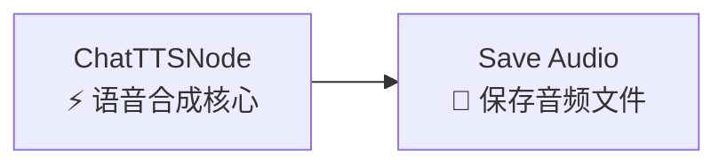
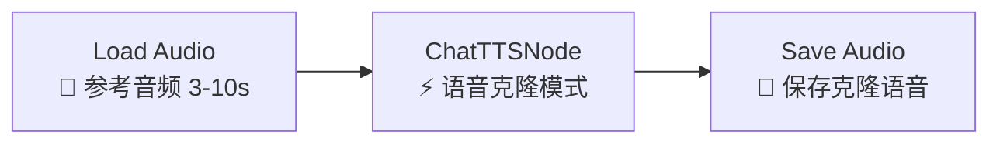

# TTS 语音合成与克隆——从入门到精通

> **前置**：已成功跑通文生图工作流（基本的节点操作能力）。TTS 是 ComfyUI 中的"跨界"能力——你可以把 ComfyUI 当作一个 AI 语音工厂使用。
>
> **应用场景**：给视频配音、为角色生成台词、有声读物生成、AI 播报、多语言语音生成、声音克隆（只用几秒参考音频复制一个人的声音）。

---

## 一、ChatTTS + OpenVoice 是什么？

### ChineseTTS (ChatTTS)

**ChatTTS** 是专为对话场景设计的文本到语音模型，由社区开发。

| 特性 | 说明 |
|:-----|:------|
| **语言** | 中文效果极佳（原生支持），英文也不错 |
| **音色** | 默认有多组随机种子控制不同音色 |
| **风格** | 支持添加笑声 `<laugh/>`、停顿 `[uv_break]` 等控制标签 |
| **速度** | 实时生成，快于多数 TTS 模型 |
| **2025 发展** | 最新版本支持多说话人音色控制 |

### OpenVoice

**OpenVoice** 是**语音克隆**模型——用 3-10 秒的参考音频，就能克隆一个人的声音。它的核心特点是：

1. **少样本克隆**：只用几秒音频，不需要大量数据
2. **音色分离**：把"音色"和"说话风格"解耦，可以单独调整情感强度
3. **多语言**：克隆的中文声音可以合成英文语音（反之亦然）

---

## 二、前置准备

### 2.1 安装自定义节点

```bash
cd ~/workspace/ComfyUI/custom_nodes/
git clone https://gitclone.com/github.com/AIFSH/ComfyUI-ChatTTS.git

# 国内 pip 镜像
pip install -r requirements.txt -i https://pypi.tuna.tsinghua.edu.cn/simple
```

### 2.2 了解模型下载机制

首次运行时会**自动下载** ChatTTS 和 OpenVoice 模型（约 2-3GB）到 HuggingFace 缓存目录。

| 模型 | 大小 | 下载方式 | 缓存位置 |
|:-----|:----:|:---------|:---------|
| ChatTTS 模型 | ~1GB | 自动 | `~/.cache/huggingface/` |
| OpenVoice 模型 | ~1.5GB | 自动 | `~/.cache/huggingface/` |

> ⚠️ **国内网络**：如果首次运行自动下载失败（一般表现为节点全红），可以设置 HuggingFace 镜像：
> ```bash
> export HF_ENDPOINT=https://hf-mirror.com
> # 然后重启 ComfyUI
> ```
> 或者手动下载模型文件放入 `~/.cache/huggingface/hub/` 下。

### 2.3 验证安装

重启 ComfyUI 后，右键搜索 "ChatTTS" → 出现 `ChatTTSNode` → ✅ 安装成功。

---

## 三、基础 TTS 工作流（仅 2 个节点！）

TTS 工作流是 ComfyUI 中最简单的工作流之一——只需要 2 个节点。

### 完整连线图



就是这么简单。不需要 CheckpointLoader、不需要 KSampler、不需要 VAE——因为 TTS 节点内部已经封装了所有模型。

### 节点详解

#### ChatTTSNode（核心节点）

这是 TTS 工作流唯一的"处理"节点。右键 → 搜索 "ChatTTS"。

| 参数 | 推荐值 | 范围 | 说明 |
|:-----|:------:|:----:|:------|
| `text` | 待合成的文字 | 不限长度 | 建议分段（每段 ≤ 200 字）以获得最佳质量 |
| `audio_seed` | 42 | 任意整数 | **控制音色**。相同种子→相同音色；不同种子→不同音色 |
| `temperature` | 0.3 | 0.1-1.0 | 越低越稳定清晰。高则更多随机性（可能不清晰）|
| `top_P` | 0.7 | 0.1-1.0 | 核采样参数，控制采样范围 |
| `top_K` | 20 | 1-50 | Top-K 采样参数，控制候选词数量 |

#### Save Audio（保存音频）

请用 "Save Audio" 而非普通的 "Save Image" 节点。按需配置：

| 参数 | 说明 |
|:-----|:------|
| `filename_prefix` | 文件名前缀，如 "tts_output" |
| 输出格式 | 默认为 `.wav`，可在节点配置中调整 |

### 手把手操作（Step 1-3）

**Step 1**：右键 → 搜索 "ChatTTS" → 添加 `ChatTTSNode`

**Step 2**：右键 → 搜索 "Save Audio" → 添加

**Step 3**：ChatTTSNode 的 AUDIO 输出 → Save Audio 的 audio 输入

| 参数 | 设置值 |
|:-----|:-------|
| text | "你今天过得怎么样？听说最近天气不错。" |
| audio_seed | 42 |
| temperature | 0.3 |
| top_P | 0.7 |
| top_K | 20 |

点击 Queue Prompt → 几秒后就能听到合成的语音。

---

## 四、语音克隆工作流（高级）

### 4.1 你需要什么

- 一段 3-10 秒的**参考音频**（.wav / .mp3 均可）
  - 理想：单一说话人、无背景噪声、声音清晰
  - 避免：多人声、回声、音乐背景
- 你合成的文本

### 4.2 完整连线图



### 4.3 Load Audio 节点

右键 → 搜索 "Load Audio"（注意：不是 Load Image）。选择你准备好的参考音频文件。

> 💡 **音频格式**：支持 `.wav`、`.mp3`、`.flac`、`.m4a`。推荐 `.wav`（无损、处理快）。

### 4.4 语音克隆参数

| 参数 | 推荐值 | 范围 | 说明 |
|:-----|:------:|:----:|:------|
| `text` | 克隆说话的内容 | — | 与参考音频说的内容无关 |
| `ref_audio` | Load Audio 的输出 | — | 节点的音频输入（左侧端口）|
| `audio_seed` | 42 | 整数 | 建议固定，便于调试 |
| `temperature` | 0.3 | 0.1-0.5 | 克隆场景建议 ≤ 0.3，避免偏离参考音色 |
| `emotion_strength` | 0.3-0.6 | 0.0-1.0 | 情感表现的强度 |

### 4.5 emotion_strength 详解

| 值 | 效果 | 适用场景 |
|:--:|:----:|:---------|
| 0.0 | 完全中性、机械感 | 新闻播报、技术文档朗读 |
| 0.1-0.2 | 略微软化，接近中性 | 客服播报、公告 |
| **0.3-0.5** | **自然有感情，像真人对话** | **绝大多数日常场景** |
| 0.6-0.8 | 情绪明显，抑扬顿挫 | 讲故事、广告配音 |
| 0.8-1.0 | 强烈情绪，可能戏剧化 | 诗歌朗诵、独白、情感爆发场景 |

### 4.6 手把手操作（语音克隆）

**Step 1**：右键 → 添加 `Load Audio` → 选择你的参考音频文件（3-10 秒）

**Step 2**：右键 → 添加 `ChatTTSNode`

**Step 3**：右键 → 添加 `Save Audio`

**Step 4**：连线

```
Load Audio.AUDIO → ChatTTSNode.ref_audio
ChatTTSNode.AUDIO → Save Audio.audio
```

**Step 5**：设置参数

| 位置 | 参数 | 值 |
|:-----|:-----|:---|
| ChatTTSNode | text | "你好，我是这段语音的主人，今天想跟你说一件事。" |
| ChatTTSNode | audio_seed | 42 |
| ChatTTSNode | temperature | 0.3 |
| ChatTTSNode | emotion_strength | 0.4 |
| Save Audio | filename_prefix | "cloned_voice" |

**Step 6**：点击 Queue Prompt → 等几秒 → 播放生成的音频 → 听听是否像参考音频的声音。

---

## 五、高级技巧

### 5.1 用 audio_seed 控制音色类型

ChatTTS 内置了多种默认音色，用不同的 `audio_seed` 切换：

```
audio_seed = 42   → 温和的女声（默认，最常用）
audio_seed = 99   → 沉稳的男声
audio_seed = 128  → 活泼的女声
audio_seed = 200  → 中性的男声
audio_seed = 77   → 年轻的男声
audio_seed = 256  → 知性的女声
```

> ⚡ **发现新音色**：在 1-999 范围内随机尝试，每次得到不同的音色。

### 5.2 在文本中插入情感控制标签

ChatTTS 支持在文本中嵌入控制标签：

```python
text = "今天真是太开心了<laugh/>太开心了！[uv_break]你知道吗，[uv_break]我居然中奖了！"
```

| 标签 | 效果 |
|:----|:-----|
| `<laugh/>` | 插入笑声 |
| `[uv_break]` | 插入短暂停顿 |
| `[laugh]` | 笑的方式说话 |
| `[oral_2]` | 口语化语气 |
| `[break_4]` | 较长停顿（数字越大停顿越长）|

**示例**：
```
"哎呀<laugh/>你怎么才来啊[uv_break]等你半天了！"
         ↑ 插入笑声        ↑ 停顿
```

### 5.3 长文本分段合成

ChatTTS 对 200 字以上的文本合成质量会下降。建议分段：

```
错误做法：
"一篇 500 字的文章，一次性输入 ChatTTSNode"

正确做法：
每次输入 ≤ 200 字，分 3 次 Queue Prompt
→ 用同一 audio_seed 保持音色一致
→ 在 Audacity 等软件中拼接
```

### 5.4 提取视频中的音频做参考

```bash
# 用 ffmpeg 提取视频的第一段音频（3-10 秒）
ffmpeg -i your_video.mp4 -ss 00:00:05 -t 10 -vn -acodec pcm_s16le -ar 44100 reference.wav
```

解释：
- `-ss 00:00:05` — 从第 5 秒开始
- `-t 10` — 截取 10 秒
- `-vn` — 不要视频
- `-acodec pcm_s16le -ar 44100` — 输出 44.1kHz WAV 文件

### 5.5 更好的克隆质量技巧

| 技巧 | 说明 |
|:-----|:------|
| **参考音频越短越清晰** | 3-5 秒最佳，比 10 秒更好 |
| **参考音频内容要自然** | 阅读类音频优于说话类音频 |
| **环境和设备一致** | 如果目标声音场景安静，参考也用安静 |
| **去除背景音** | 用 Audacity 等工具去除参考音频的背景噪声 |

### 5.6 TTS + 视频合成

如果你想在 ComfyUI 中**一步生成带语音的视频**：

1. 先分别生成视频和语音
2. 用 `ComfyUI-VideoHelperSuite` 的合并节点拼接
3. 或生成后外部用 ffmpeg 合并

---

## 六、场景参数速查表

| 场景 | text 长度 | audio_seed | temperature | emotion_strength | 参考音频 |
|:-----|:--------:|:----------:|:-----------:|:----------------:|:---------|
| 📢 **新闻播报** | 不限 | 42 | 0.2 | 0.0 | 不需要 |
| 🗣️ **日常对话** | ≤ 200 字 | 42 | 0.3 | 0.3-0.5 | 不需要 |
| 📖 **有声读物** | ≤ 200 字/段 | 99 | 0.3 | 0.5-0.7 | 不需要 |
| 😂 **搞笑配音** | 短句 | 128 | 0.4 | 0.6-0.8 | 不需要 |
| 🎤 **声音克隆（中性）** | ≤ 200 字 | 任意 | 0.2 | 0.2 | ✅ 3-5s |
| 🎤 **声音克隆（自然）** | ≤ 200 字 | 任意 | 0.3 | 0.4 | ✅ 3-5s |
| 🎭 **声音克隆（戏剧）** | ≤ 200 字 | 任意 | 0.4 | 0.7-0.9 | ✅ 3-5s |
| 🎬 **视频配音** | ≤ 200 字/段 | 固定 | 0.3 | 0.4-0.6 | ✅（如需特定声音）|
| 🤖 **多角色对话** | 各 ≤ 200 字 | 不同种子 | 0.3 | 不同强度 | 不需要 |

---

## 七、常见问题排查

| 问题 | 原因 | 解决 |
|:-----|:-----|:------|
| 🔴 **ChatTTSNode 全红** | 模型未自动下载 | 设置 `HF_ENDPOINT=https://hf-mirror.com` 后重启 |
| 🔴 **ChatTTSNode 全红（已设镜像）** | 手动下载的模型放错位置 | 检查 `~/.cache/huggingface/hub/` 下是否有模型文件 |
| 🔴 **语音合成不清晰** | temperature 太高 | 降到 0.2-0.3 |
| 🔴 **语音走调/奇怪** | top_P 太低 | 升到 0.7 |
| 🔴 **声音克隆不像原声** | 参考音频太短或太嘈杂 | 换一段 3-5 秒清晰的参考音频 |
| 🔴 **声音克隆完全不像** | emotion_strength 太高覆盖了原声 | 降到 0.2-0.3 |
| 🔴 **文字合成中断/空白** | 文本太长 | 分段处理，每段 ≤ 200 字 |
| 🔴 **每段音色不一致** | audio_seed 不同 | 固定同一 audio_seed |
| 🔴 **Save Audio 保存后播放失败** | 文件损坏或格式不兼容 | 输出格式选 `.wav` |
| 🔴 **Load Audio 找不到文件** | 文件路径包含中文或特殊字符 | 放到简单路径如 `~/Downloads/ref.wav` |
| 🔴 **克隆的声音有"金属感"** | 参考音频太短或压缩过度 | 换 5-10 秒无损 WAV 参考 |
| 🔴 **生成速度很慢** | 文本太长或 CPU 模式运行 | 分短文本或确认 ComfyUI 使用了 GPU |
| | 🔴 **<laugh/> 等标签没生效** | ChatTTS 版本较旧 | 更新 ComfyUI-ChatTTS 插件 |
| 🔴 **ComfyUI-ChatTTS 安装报 pip 依赖错误** | 缺少编译工具 | Windows 需要安装 Microsoft C++ Build Tools |

---

## 八、在 ComfyUI 生态中的位置——与其他能力的关系

| 你想做什么 | 需要哪些节点 | TTS 的角色 |
|:-----------|:------------|:-----------|
| 给生成的视频配音 | 视频节点 + TTS + 外部合并 | 生成语音轨 |
| 给生成的图片配音（有声漫画） | 文生图 + TTS + 拼接 | 逐页生成旁白 |
| 数字人播报 | TTS + 视频（Wav2Lip 等）| 作为 BGM/旁白 |
| 有声书 | TTS 单独运行 | 核心能力 |
| 游戏/动画角色配音 | TTS + 语音克隆 | 生成角色台词 |

---

## 九、检查清单

在点击 Queue Prompt 前确认：

- [ ] ComfyUI-ChatTTS 已安装并重启
- [ ] ChatTTSNode 不是红色（模型已成功加载）
- [ ] `text` 已填写，内容正确
- [ ] 如果用语音克隆：Load Audio 已连接到了 ChatTTSNode.ref_audio
- [ ] 如果用语音克隆：参考音频是 3-10 秒、清晰、单一说话人
- [ ] audio_seed 已固定（不要用 -1）
- [ ] temperature 在 0.2-0.5 之间
- [ ] emotion_strength 在 0.0-1.0 之间
- [ ] Save Audio 已连接并配置了文件名
- [ ] 长文本（> 200 字）已分段
- [ ] 没有红色连线或红色节点

---

> **进阶小贴士**：最实用的语音克隆玩法——找到你喜欢的播客/视频片段，截取 3-5 秒干净的一句多话音，作为参考音频克隆。然后用不同文本生成多句台词，拼接后就能制作"该声音读任何内容"的效果。注意尊重声音版权。
